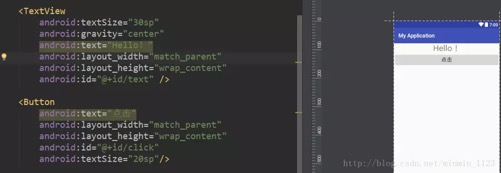
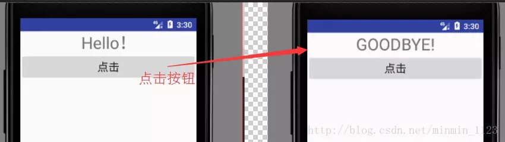
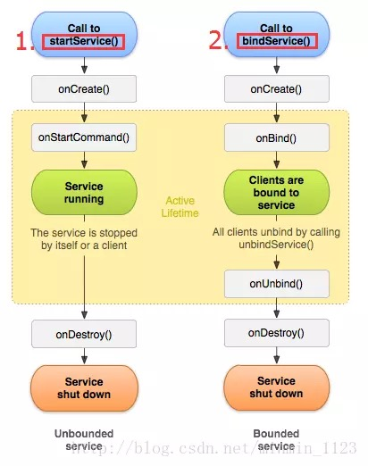
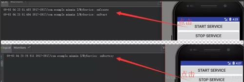
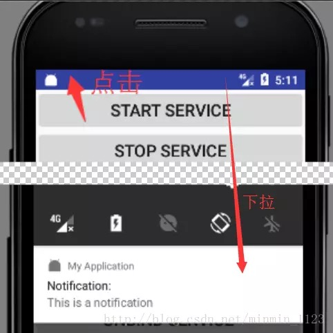
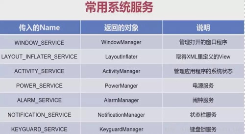
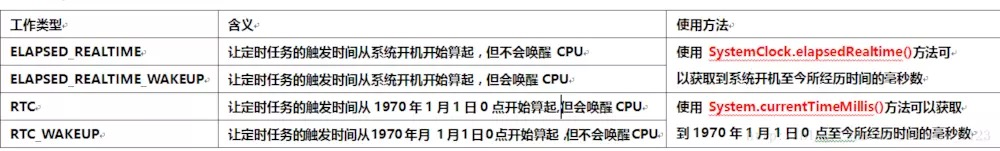
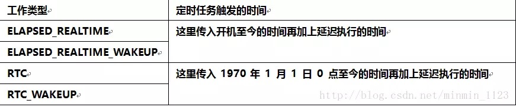
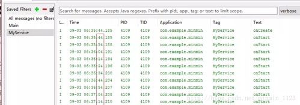
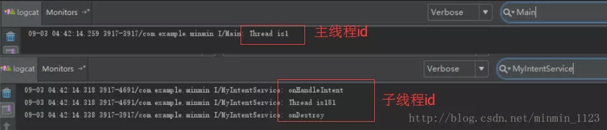

# 四大组件篇—>Service

Service（服务）是Android中实现程序后台运行的解决办法，它非常适合用于去执行那些不需要和用户交互而且还要求长期运行的任务。Service主要负责与UI无关的工作，比如耗时操作。

### 1. Service概要

Service的运行不依赖于任何用户界面，因此即便程序被切换到后台或者用户打开了另一个应用程序，Service仍然能够保持正常运行，但当某个应用程序进程被杀掉时，所有依赖于该进程的服务也会停止运行。

实际上Service默认并不会运行在子线程中，也不运行在一个独立的进程中，它同样执行在主线程中（UI线程）。换句话说，不要在Service里执行耗时操作，除非你手动打开一个子线程，否则可能出现主线程被阻塞（ANR）的情况。首先来学习如何打开一个子线程。

（1） 开启子线程

常用方法是，用Thread类的匿名类的形式并且实现Runnable接口，再调用它的start()方法，就使得被重写的run()方法中的耗时操作运行在子线程当中了，代码如下：

```
new Thread(new Runnable() {
          @Override
          public void run() {
          //耗时操作的逻辑
          }
}).start();
```

（2）异步消息处理机制

还要注意一点：Android不允许在子线程中进行UI操作，但有时候，在子线程里执行一些耗时任务之后需要根据任务的执行结果来更新相应的UI控件，在这里Android提供了一套异步消息处理机制，它可以很好地解决在子线程中更新UI的问题，主要用到两个类：**Handler**（处理者，主要用于发送和处理消息）和**Message**(消息，可携带少量信息用于在不同线程之间交换)。下图展示了如何用他们实现从子线程到主线程的转换：


可以看到，只要在需要转换到主线程进行UI操作的子线程中实例化一个Message对象并携带相关数据，再由Handler的sendMessage()将它发送出去，之后这个数据就会被在主线程中实例化的Handler对象的重写方法handleMessage()收到并处理，现在在子线程中更新UI就很容易了。

现在来个具体的例子感受一下，新建布局，这里就放一个文本和按钮：



在主活动中按钮的点击事件开启一个子线程，但又希望点击按钮改变文本内容，此时就用异步消息处理机制，代码如下：

```
public class MainActivity extends AppCompatActivity {


    private int CHANGE_TEXT = 1;

    private Handler handler = new Handler() {
        @Override
        public void handleMessage(Message msg) {
            if (msg.what == CHANGE_TEXT) {
                text.setText("GOODBYE!");
            }
        }
    };
    private Button click;
    private TextView text;

    @Override
    protected void onCreate(Bundle savedInstanceState) {
        super.onCreate(savedInstanceState);
        setContentView(R.layout.activity_main);
        click = ((Button) findViewById(R.id.click));
        text = ((TextView) findViewById(R.id.text));
        click.setOnClickListener(new View.OnClickListener() {
            @Override
            public void onClick(View v) {
                new Thread(new Runnable() {
                    @Override
                    public void run() {
                        Message message = new Message();
                        message.what = CHANGE_TEXT;
                        handler.sendMessage(message);
                    }
                }).start();

            }
        });
    }
}
```


效果如图：




### 2. Service生命周期

官方文档提供的Service生命周期图如下：



- **onCreate()**：服务第一次被创建时调用
- onStartCommand：服务启动时调用
- onBind()：服务被绑定时调用
- onUnBind()：服务被解绑时调用
- onDestory()：服务停止时调用

从上图可看到有两种方法启动Service，下面分别介绍：

- 第一种：其他组件调用Content的**startService**()方法可以启动一个Service，并回调服务中的onStartCommand()，如果该服务之前还没创建，那么回调顺序时onCreate()->onStartCommand()。服务启动了之后会一直保持运行状态，知道stopService()或stopSelf()方法被调用，服务停止并回调onDestory()，另外，无论调用多少次startService()方法，只需调用一次stopService或stopSelf，服务就停止了。
- 第二种：其他组件调用Context的**bindService()**可以绑定一个Service，并回调服务中的onBind()方法，类似地，如果该服务之前还没创建，那么回调的顺序是onCreate()->onBind()。之后，调用方可以获取到onBind()方法里返回的IBinder对象的实例，从而实现和服务进行通信，只要调用房和服务之间的连接没有断开，服务就会一直保持运行状态，直到调用了unbindService()方法服务会停止，回调顺序onUnBind()->onDestory()

注意，这两种启动方式并不冲突，当使用startService()启动Service之后，还可再使用bindService()绑定，只不过需要同时调用stopService()和unbindService()方法才能让服务销毁掉。

### 3. Service的基本用法

介绍完Service生命周期和启动方法之后，下面具体学习一下如何在Activity中启动一个Service。

**（1）普通Service**

- 第一步：新建类并继承Service且必须重写onBind()方法，有选择的重写onCreate()、onStartCommand()及onDestory()方法

  ```
  public class MyService extends Service {
      public static final String TAG = "MyService";
  
      public MyService() {
      }
  
      @Override
      public IBinder onBind(Intent intent) {
          Log.i(TAG, "onBind");
          throw new UnsupportedOperationException("Not yet implemented");
      }
  
      @Override
      public void onCreate() {
          super.onCreate();
          Log.i(TAG, "onCreate");
      }
  
      @Override
      public int onStartCommand(Intent intent, int flags, int startId) {
          Log.i(TAG, "onStartCommand");
          return super.onStartCommand(intent, flags, startId);
      }
  
      @Override
      public void onDestroy() {
          super.onDestroy();
          Log.i(TAG, "onDestroy");
      }
  }
  ```

- 第二步：在配置文件中进行注册。

  ```
  <service android:name=".MyService">
  ```

  

- 第三步：在活动中利用Intent可实现Service的启动，代码如下

  ```
   Intent intent = new Intent(this, MyService.class);// MyService是刚刚定义好的Service
   startService(intent);
  ```

  对应的，停止Service方法：

  ```
  Intent intent = new Intent(this, MyService.class);
  stopService(intent);
  ```

  ```
      @Override
      public void onClick(View v) {
          switch (v.getId()){
              case R.id.start_service:
                  Intent startIntent = new Intent(this, MyService.class);
                  startService(startIntent);
                  break;
              case R.id.stop_service:
                  Intent stopIntent = new Intent(this, MyService.class);
                  stopService(stopIntent);
                  break;
          }
      }
  ```

  

运行效果：



**（2）前台Service**

前台服务和普通服务最大的区别是，前者会一直有一个正在运行的图标在系统的状态栏显示，下拉状态栏后可以看到更加详细的信息，非常类似于通知的效果。使用前台服务或者为了阻止服务被回收掉，比如听歌，或者由于特殊的需求，比如实时天气状况。

想要实现一个前台服务非常简单，它和之前学过的发送一个通知非常类似，只不过在构建好一个Notification之后，不需要NotificationManager将通知显示出来，而是调用了startForeground()方法。

修改MyService的onCreate()方法：

```
    @Override
    public void onCreate() {
        super.onCreate();
        Log.i(TAG, "onCreate");
        //使用前台服务
        Notification.Builder builder = new Notification.Builder(this);
        builder.setSmallIcon(R.mipmap.ic_launcher);
        builder.setContentText("This is a notification");
        builder.setContentTitle("Notification");
        Notification notification = builder.build();
        startForeground(1,notification);
    }
```

现在重新运行应用程序，然后点击START SERVICE的按钮，一个前台服务就出现了：



**（3）系统Service**

除了自定义一个Service，当然还有现有的系统服务，比如之前接触过的NotificationManage，通过getSystemService()方法并传入一个Name就可以得到相应的服务对象了，常用的系统服务如下表：



下面用AlarmMananger来实现一个后台定时任务。非常简单，调用AlarmManager的set()方法就可以设置一个定时任务，并提供三个参数（工作类型，定时任务触发的时间，PendingInten对象）。下面一一解释以上三个参数：

- 工作类型：有四个值可选，见下图：

  

- 定时任务触发的时间

  

- PendingIntent对象：一般会调用它的getBroadcast()方法来获取一个能够执行广播的PendingInten。这样当定时任务被触发的时候，广播接收器的onReceive方法就可以得到执行

接着实战，修改MyService，将前台服务代码都删掉，重写onStartCommand()方法，这里显示获取到了AlarmMananger的实例，然后定义任务的触发时间为10s后，再使用PendingInten指定处理定时任务的广播接收器为MyReceiver，最后调用set()方法完成设定，代码如图：

```
    @Override
    public int onStartCommand(Intent intent, int flags, int startId) {
        Log.i(TAG, "onStartCommand");
        AlarmManager manager = (AlarmManager) getSystemService(Context.ALARM_SERVICE);
        long time = (SystemClock.elapsedRealtime()+10*1000);
        Intent i = new Intent(this, MyBroadcast.class);
        PendingIntent pi = PendingIntent.getBroadcast(this, 0, i, 0);
        manager.set(AlarmManager.ELAPSED_REALTIME_WAKEUP,time,pi);
        return super.onStartCommand(intent, flags, startId);
    }
```

然后定义一个广播接收器为MyReceiver，这里利用Intent对象去启动MyService这个服务，这样做的目的是，一旦启动MyService，就会在onStartCommand()方法里设定一个定时任务，10s后MyReceiver的onReceive()方法将得到执行，紧接着又启动MyService，反复循环，从而一个能长期在后台进行定时任务的服务就完成了。

```
public class MyBroadcast extends BroadcastReceiver {
    @Override
    public void onReceive(Context context, Intent intent) {
        Intent i = new Intent(context, MyService.class);
        context.startService(i);
    }
}
```

MyReceiver也在配置文件中注册好之后，重新运行，点击START SERVICE的按钮，观察日志的情况：




> 另外，从Android 4.4版本开始，由于系统在耗电性能方面进行了优化使得Alarm任务的触发时间会变得不准确。如果一定要求Alarm任务的执行时间准确，把AlarmMananger的setExact()方法代替set()方法就可以了。

**（4）IntentService**

为了简单地创建一个异步的、会自动停止的服务，Android专门提供了一个IntentService类，它的使用和普通Service非常像，下面来学习一下：

- 第一步：新建类并继承IntentService，在这里需要提供一个无参的构造函数且必须在其内部调用父类的有参构造函数，然后具体实现onHandleIntent() 方法，在这里可以处理一些耗时操作而不用担心ANR的问题，因为这个方法已经是在子线程中运行的了

  ```
  public class MyIntentService extends IntentService {
  
      public static final String TAG = "MyIntentService";
      public MyIntentService() {
          super("MyIntentService");
      }
  
  
      @Override
      protected void onHandleIntent(Intent intent) {
          Log.i(TAG,"onHandleIntent");
          Log.i(TAG,"Thread is "+Thread.currentThread().getId());
      }
  
  
      @Override
      public void onDestroy() {
          super.onDestroy();
          Log.i(TAG,"onDestroy");
      }
  }
  ```

- 第二步：在配置文件中进行注册

  ```
  <service android:name=".MyIntentService">
  ```

- 第三步：在活动中利用Intent实现IntentService的启动，和Service用的方法是完全一样的

  ```
  case R.id.intent_service:
                  Intent intentService = new Intent(this, MyIntentService.class);
                  startService(intentService);
                  Log.i("Main","Thread is "+Thread.currentThread());
                  break;
  ```

运行程序，打印的日志结果证实了IntentService异步和自动停止：




### 4. Service与Activity的通信

Service与Activity的通信需要借助服务的onBind()方法，比如希望在MyService里提供一个下载功能，然后在活动中可以决定何时开始下载，以及随时查看下载进度，具体实现如下：

- 第一步：在MyService里定义一个类MyBinder并继承Binder，在它的内部提供了开始下载以及查看下载进度的方法，为了模拟一下，这里就分别打印了一行日志

  ```
      class MyBinder extends Binder{
          public static final String TAG = "MyBinder";
          void createProgressDialog(){
              Log.i(TAG,"createProgressDialog()");
          }
          void onProgressUpdate(){
              Log.i(TAG,"onProgressUpdate()");
  
          }
      }
  ```

  

- 第二步：在MyService的onBind()方法里返回刚刚定义好的MyBinder类

  ```
  public class MyService extends Service {
      public static final String TAG = "MyService";
      MyBinder binder = new MyBinder();
      
      @Override
      public IBinder onBind(Intent intent) {
          Log.i(TAG, "onBind");
          return binder;
      }
  ```

  

- 第三步：在活动中实例化一个ServiceConnection类，并重写它的onServiceConnection()和onServiceDisconnection()方法，这两个方法分别会在活动与服务成功绑定以及接触绑定的时候调用，在onServiceConnected()方法中，又通过向下转型得到了MyBinder的实例，有了它活动和服务之间的关系就变得非常紧密了。现在可以在活动中根据具体的场景来调用MyBinder中的任何非private方法了，这里简单调用MyBinder中的两个模拟方法。

  ```
      private MyService.MyBinder binder;
      private  ServiceConnection connection = new ServiceConnection() {
          @Override
          public void onServiceConnected(ComponentName name, IBinder service) {
              binder = (MyService.MyBinder) service;
              binder.createProgressDialog();
              binder.onProgressUpdate();
          }
  
          @Override
          public void onServiceDisconnected(ComponentName name) {
  
          }
      };
  ```

  

- 第四步：在活动布局里在准备两个按钮用于绑定和解绑服务，在他们的点击事件里利用Intent对象实现活动和服务的绑定和解绑。方法是：bindService()实现绑定，她接受三个参数（Intent对象，ServiceConnection对象，标志位）这里传入BIND _AUTO_CREATE表示在活动和服务进行绑定后自动创建服务，unbindService（）实现解绑，传入ServiceConnection对象就可以了

  ```
  case R.id.bind_service:
      Intent bindIntent = new Intent(this, MyService.class);
      bindService(bindIntent,connection,BIND_AUTO_CREATE);
      break;
  case R.id.unbind_service:
      Intent unbindIntent = new Intent(this, MyService.class);
      unbindService(connection);
      break;
  ```

  

运行程序，点击一下Bind Service按钮：


可以看到MyService的两个模拟方法都得到了执行，说明确实已经在活动里成功调用了服务里提供的方法了。