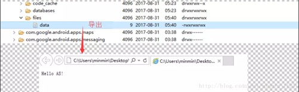

# 数据存储篇

在Android平台实现数据存储的方式有以下三种：

- File文件存储
- SharedPreferences存储
- SQLite数据库存储

在介绍之前，先要知道以上三种方式的数据文件都默认存储在哪里，方便后续验证，如图：

| 数据存储方式      | 文件保存目录                            |
| ----------------- | --------------------------------------- |
| File              | /data/data/<包名>/files/<文件名>        |
| SharedPreferences | /data/data/<包名>/shared_prefs/<文件名> |
| SQLite            | /data/data/<包名>/databases/<数据库名>  |

### 1. 文件存储

在Android中写入和读取文件的方法，和Java中实现I/O的程序是一样的，Context类中提供了openFileInput()和openFileOutput()方法来打开数据文件里的文件IO流。下面直接通过一个demo学习如果通过文件来保存数据。

**（1）写入数据**

​	在布局activity_my.xml中计入一个EditText用于输入文本内容：

```
<?xml version="1.0" encoding="utf-8"?>
<android.support.constraint.ConstraintLayout xmlns:android="http://schemas.android.com/apk/res/android"
    xmlns:app="http://schemas.android.com/apk/res-auto"
    xmlns:tools="http://schemas.android.com/tools"
    android:layout_width="match_parent"
    android:layout_height="match_parent"
    tools:context=".MyActivity">

    <EditText
        android:id="@+id/edit"
        android:layout_width="match_parent"
        android:layout_height="wrap_content"
        android:hint="请输入要保存在文件里的内容" />

    <Button
        android:id="@+id/save"
        android:layout_width="wrap_content"
        android:layout_height="wrap_content"
        android:text="保存到文件"
        android:textAllCaps="false"
        app:layout_constraintLeft_toLeftOf="parent"
        app:layout_constraintRight_toRightOf="parent"
        app:layout_constraintTop_toBottomOf="@id/edit" />
</android.support.constraint.ConstraintLayout>
```

>  EditText为需要保存到数据，点击Button，进行数据的保存。

MyActivity.java中的具体逻辑：

```
public class MyActivity extends AppCompatActivity {

    private EditText edit;

    @Override
    protected void onCreate(Bundle savedInstanceState) {
        super.onCreate(savedInstanceState);
        setContentView(R.layout.activity_my);
        edit = ((EditText) findViewById(R.id.edit));
        findViewById(R.id.save).setOnClickListener(new View.OnClickListener() {
            @Override
            public void onClick(View v) {
                String text = edit.getText().toString();
                BufferedWriter bufferedWriter = null;
                if (!text.isEmpty()){
                    try {
                        FileOutputStream fileOutputStream = openFileOutput("data", Context.MODE_PRIVATE);
                        bufferedWriter = new BufferedWriter(new OutputStreamWriter(fileOutputStream));
                        bufferedWriter.write(text);
                    } catch (FileNotFoundException e) {
                        e.printStackTrace();
                    } catch (IOException e) {
                        e.printStackTrace();
                    }finally {
                        if (bufferedWriter != null){
                            try {
                                bufferedWriter.close();
                            } catch (IOException e) {
                                e.printStackTrace();
                            }
                        }
                    }
                }
            }
        });
    }
}

```

关键步骤：

```
FileOutputStream fileOutputStream = openFileOutput("data", Context.MODE_PRIVATE);
bufferedWriter = new BufferedWriter(new OutputStreamWriter(fileOutputStream));
bufferedWriter.write(text);
```

> 这里强调openFileOutput()方法里的两个参数，表示是文件的操作模式，常用的可选值含义见下图：
>
> - MODE_PRIVATE
>
>   为默认操作模式，代表该文件是私有数据，只能被应用本身访问，在该模式下，写入的内容会覆盖原文件的内容。
>
> - MODE_APPEND
>
>   模式会检查文件是否存在，存在就网文件追加内容，否则就创建新文件。
>
> - MODE_WORLD_READABLE和MODE_WORLD_WRITEABLE
>
>   用来控制其他应用是否有权限读写该文件

运行程序，在输入框里输入Hello AS!然后退出程序。查看DDMS，发现导出后的内容与输入完全一致，证实了内容确实成功保存到文件了。



**（2）读取数据**

```

    @Override
    protected void onCreate(Bundle savedInstanceState) {
        super.onCreate(savedInstanceState);
        setContentView(R.layout.activity_my);
        edit = ((EditText) findViewById(R.id.edit));
        StringBuilder content = new StringBuilder();
        BufferedReader bufferedReader = null;
        try {
            FileInputStream fileInputStream = openFileInput("data");
            bufferedReader = new BufferedReader(new InputStreamReader(fileInputStream));
            String line;
            while ((line = bufferedReader.readLine()) != null) {
                content.append(line);
            }
        } catch (FileNotFoundException e) {
            e.printStackTrace();
        } catch (IOException e) {
            e.printStackTrace();
        } finally {
            if (bufferedReader != null) {
                try {
                    bufferedReader.close();
                } catch (IOException e) {
                    e.printStackTrace();
                }
            }
        }

        String input = content.toString();
        if (!TextUtils.isEmpty(input)){
            edit.setText(input);
            edit.setSelection(input.length());
            Toast.makeText(this, "数据加载成功", Toast.LENGTH_SHORT).show();
        }
```


### 2. SharedPreferences存储

SharedPreferences是一种轻型的数据存储方式，常用来存储一些简单的配置信息，如int、string、boolean、float和long，它的本质是基于XML文件存储key-value键值对数据。

实现SharedPreferences存储的步骤如下：

（1）调用getSharedPreferences()方法获得SharedPreferences对象，提供两个参数，指定文件名和操作模式；

（2）调用SharedPreference对象的edit()方法获得SharedPreferences.Editor引用对象

（3）调用Edit接口的形如putXXX()方法以键值对形式保存XXX类型的数据

（4）调用Edit接口的apply()方法提交键值对

**注意：**不用SharedPreferences对象去存储或修改数据，而是通过Editor对象，但获取数据时需要调用SharedPreferences对象的getXXX()方法。

写入的具体代码：

```
        SharedPreferences sharedPreferences = getSharedPreferences("MyPres", MODE_PRIVATE);
        SharedPreferences.Editor editor = sharedPreferences.edit();
        editor.putString("key","value");
        editor.apply();
```

读取的具体代码：

```
 SharedPreferences sharedPreferences = getSharedPreferences("MyPres", MODE_PRIVATE);
 sharedPreferences.getString("key","defaultValue");    
```

下图是SharedPreferences对应文件的内容：


### 3. SQLite数据库

SQLite是一款轻量级的关系型数据库，它的运算速度非常快，占用资源少，在存储大量复杂的关系型数据的时候可以使用，比前面学过的只适用于存储简单数据的两种方式要好很多，接下来学习如何创建、升级数据库以及对数据库进行增删改查，并穿插一个完整的例子更好的掌握这些知识点。

**（1）创建数据库**

SQLiteOpenHelper用于管理数据库的创建和升级，SQLiteOpenHelper的使用步骤：

- 第一步：自定义帮助类并继承SQLiteOpenHelper，并重写两个方法：**onCreate()**和**onUpgrade()**,分别在这两个方法中去实现创建、升级数据库的逻辑，还需要一个构造方法，这里用含有四个参数的构造方法就可以。

  ```
  SQLiteOpenHelper(context:Context,name:String,factor:CursorFactory,version:int)
  ```

- 第二步：创建数据库时，先实例化一个自定义的帮助类，并提供四个参数，含义是（上下文，数据库名，创建Coursor的工厂类，版本号）

- 第三步：用帮助类对象的**getReadableDatabase()**和**getWritableDatabase()**去创建或打开一个现有的数据库（如果数据库已存在直接打开，否则创建一个新的数据库），并返回一个数据库**SQLiteDatabase**

- 第四部：之后就可以利用得到的数据库进行增删改查去操作了

接下来是具体的demo：

- 创建SQLiteOpenHelper

  ```
  public class MyHelper extends SQLiteOpenHelper {
      public static final String CREATE_STUDENT = "create table student(" +
              "id integer primary key autoincrement," +
              "name text," +
              "age integer," +
              "grade text)";
      public Context mContext;
  
      public MyHelper(Context context, String name, SQLiteDatabase.CursorFactory factory, int version) {
          super(context, name, factory, version);
          mContext = context;
      }
  
      @Override
      public void onCreate(SQLiteDatabase db) {
          db.execSQL(CREATE_STUDENT);
          Toast.makeText(mContext, "创建student表成功", Toast.LENGTH_SHORT).show();
      }
  
      @Override
      public void onUpgrade(SQLiteDatabase db, int oldVersion, int newVersion) {
  
      }
  }
  ```

  

- 在activity_main.xml布局里添加五个按钮

  

- 在MainActivity.java里获取按钮实例并注册点击事件，在onCreate()中实例化MaHelper，指定数据库名为student.db，版本号为1，ContentValues类线跳过

  ```
  public class MainActivity extends AppCompatActivity implements View.OnClickListener {
  
      private MyHelper myHelper;
      private ContentValues values;
  
      @Override
      protected void onCreate(Bundle savedInstanceState) {
          super.onCreate(savedInstanceState);
          setContentView(R.layout.activity_main);
          myHelper = new MyHelper(this, "student.db", null, 1);
          values = new ContentValues();
          
          ((Button) findViewById(R.id.button1)).setOnClickListener(this);
          ((Button) findViewById(R.id.button2)).setOnClickListener(this);
          ((Button) findViewById(R.id.button3)).setOnClickListener(this);
          ((Button) findViewById(R.id.button4)).setOnClickListener(this);
          ((Button) findViewById(R.id.button5)).setOnClickListener(this);
      }
  ```

  

- 创建数据库

  ```
   case R.id.button1:
       db = myHelper.getReadableDatabase();
       break;
  ```

  到DDMS下找文件，确实有student.db数据库，但想要查看它需要别的工具，所以换一种查看方式，用adb shell来检查，命令如下：

  

  **（2）增加数据**

  ​	之前在onCreate()方法中初始化的ContentValues类，常用它put()方法以键值对的形式存储基本类型数据，在增和改会用到它，可以理解为键就是一表中属性名，值就是表中数据，还常用方法clear()清空所有数据。

  再来学习SQLiteDatabase用于增添数据的辅助性方法insert()，三个参数含义(被操作的表明，空值字段的名称，数据即ContentValues对象)，第二个参数一般传入null。

  ```
  case R.id.button2:
      values.put("name", "Lucy");
      values.put("age", "17");
      values.put("grade", "Grade2");
      db.insert("student", null, values);
      values.clear();
      values.put("name", "Susan");
      values.put("age", "18");
      values.put("grade", "Grade3");
      db.insert("student", null, values);
      values.clear();
      Toast.makeText(this, "添加成功", Toast.LENGTH_SHORT).show();
      break;
  ```

  运行程序，数据确实插入成功！

  

  **（3）删除数据**

  删除数据的方法是delete()，第一个参数是表名，第二第三个参数用于约束删除某一行或几行的数据，比如需要删除student表中年龄大于17的记录

  ```
  case R.id.button3:
      db.delete("student","age>?",new String[]{"17"});
      Toast.makeText(this, "删除成功", Toast.LENGTH_SHORT).show();
      break;
  ```

  运行，发现表中第二条记录果然被删除了！

  

  **（4）修改数据**

  ```
  case R.id.button4:
      values.put("grade", "Grade3");
      db.update("student", values, "name=?", new String[]{"Lucy"});
      Toast.makeText(this, "更改成功", Toast.LENGTH_SHORT).show();
      values.clear();
      break;
  ```

  更改成功!

  

  **（5）查询数据**

  查询**query()**复杂一些，需要至少七个参数(table, columns,selection,selectionArgs,groupBy,having,orderBy)，对应的含义是(表名，要查询出的列，查询条件子句，对应于selection语句中占位符的值，要分组的列名，分组后过滤条件，排序方式)。

  query()方法会返回一个Cursor，查询到的数据都会从它取出，Cursor常用方法：

  - **moveToFirst()**：将指针移动到结果集的第一行；
  - **getColumnIndex()**：获取某一列在表中对应位置的索引；
  - **getXXX()**：传入索引以获取相应位置的XXX类型的数据，
  - **close()**：关闭指针

  ```
  Cursor cursor = db.query("student", null, null, null, null, null, null);
  if (cursor != null) {
      while (cursor.moveToNext()) {
          String name = cursor.getString(cursor.getColumnIndex("name"));
          int age = cursor.getInt(cursor.getColumnIndex("age"));
          String grade = cursor.getString(cursor.getColumnIndex("grade"));
          Log.i("Main", "name = " + name);
          Log.i("Main", "age = " + age);
          Log.i("Main", "grade = " + grade);
      }
      cursor.close();
  }
  Toast.makeText(this, "查询成功", Toast.LENGTH_SHORT).show();
  ```

  打印出日志结果：

  


**（6）升级数据库**

MyHelper里需要重写的第二个方法**onUpdate()**用于帮助数据库进行版本更新，比如此刻需要在数据库中添加一张表course，只要在update()写好创建course的操作，然后想办法让他被调用就好了，还记得在实例化帮助类是需要传入的第四个参数版本号吗？之前传入的是1，只要传入一个比1大大书就可以让update()执行了，在下面代码里利用了**oldVersion**去判断旧版本号，如果是1就只需要再创建course表，如果初次运行程序，就只会执行onCreate()方法然后两张表就一起建立了，这样做的好处是无论app更新到第几代都不会影响之前操作的数据，也能保证当前版本是最新的。

```
public class MyHelper extends SQLiteOpenHelper {
    public static final String CREATE_STUDENT = "create table student(" +
            "id integer primary key autoincrement," +
            "name text," +
            "age integer," +
            "grade text)";
    public static final String CREATE_COURSE = "create table course(" +
            "id integer primary key autoincrement," +
            "name text," +
            "credit text)";

    public Context mContext;

    public MyHelper(Context context, String name, SQLiteDatabase.CursorFactory factory, int version) {
        super(context, name, factory, version);
        mContext = context;
    }

    @Override
    public void onCreate(SQLiteDatabase db) {
        db.execSQL(CREATE_STUDENT);
        Toast.makeText(mContext, "创建student表成功!", Toast.LENGTH_SHORT).show();
        db.execSQL(CREATE_COURSE);
        Toast.makeText(mContext, "创建course表成功!", Toast.LENGTH_SHORT).show();
    }

    @Override
    public void onUpgrade(SQLiteDatabase db, int oldVersion, int newVersion) {
        switch (oldVersion) {
            case 1:
                db.execSQL(CREATE_COURSE);
                Toast.makeText(mContext, "创建course表成功!", Toast.LENGTH_SHORT).show();

            default:
        }
    }
}
```

修改版本号为2:

```
    @Override
    protected void onCreate(Bundle savedInstanceState) {
        super.onCreate(savedInstanceState);
        setContentView(R.layout.activity_main);
        myHelper = new MyHelper(this, "student.db", null, 2);
        values = new ContentValues();
```

重新运行程序，点击创建，student表不会再创建而只会创建course表！

