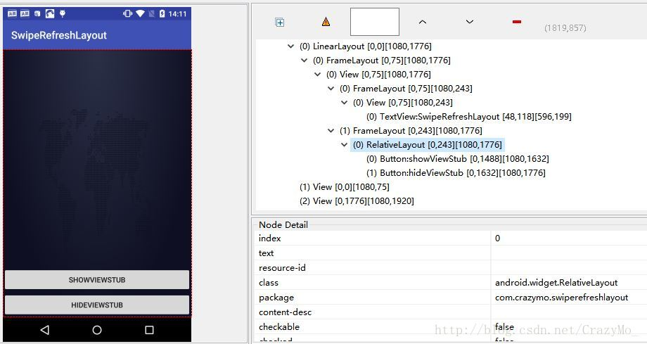
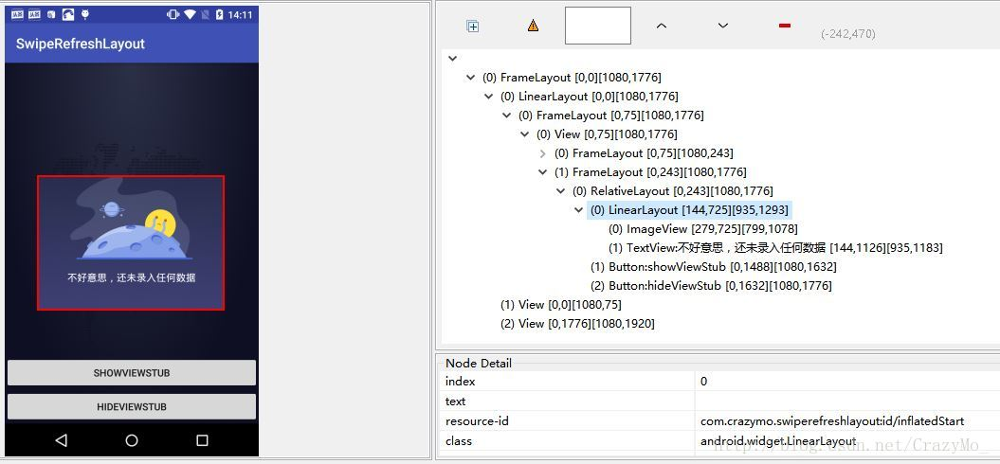

# 布局优化之借助ViewStub实现懒加载

在开发Android App的过程中，我们经常会有遇到这样的业务需求，需要在运行时根据数据动态决定显示或隐藏某个View的布局，通常就是把可能用到的View先写死在布局里，再初始化其可见性都设为View.GONE，然后再代码中根据数据动态的更改它的可见性，虽然这样的实现，逻辑简单而且控制起来比较灵活，但是也存在一定的缺点耗费资源，即使把View的初始可见View.GONE但是在Inflate布局的时候View仍然会被Inflate，即仍然会创建对象，会被实例化，会被设置属性从而导致消耗内存等资源，本文推荐一种新的机制——ViewStub，但要根据自己的业务需求来灵活使用。

### 1. ViewStub概述

**ViewStub直接继承自View，是一种不可见，0大小的可以在运行的时候在加载的View**。仅只有在调用inflate()进行映射内容布局之后（值得注意的是ViewStub只能inflate一次，再进行inflate的时候会报异常），或者设置为Visibility时才可见，功能上可以看成是高级的<include>标签（一个把其他布局资源包含进某个特定的布局中，有点类似其他开发者语言中的模版概念）。

### 2. ViewStub的特点、适用场景及注意事项

#### 2.1 ViewStub的一些特点

- **ViewStub只能被inflate一次，inflate之后ViewStub对象就会被置为空**。即某个被ViewStub指定的布局被Inflate后就不能够通过ViewStub来控制它了。
- **ViewStub只能用来Inflate一个布局文件，而不是某个具体的View**，当然也可以把View写在某个布局文件中。

#### 2.2 ViewStub的适用场景及注意事项

- 在程序的运行期间，某个布局在被inflate后，就不会有变化，除非重新启动，因为ViewStub只能Inflate一次，inflate之后就不能直接使用ViewStub来控制布局。
- 想要控制显示与隐藏的是一个布局文件，而非某个View，因为设置给ViewStub的只能是某个布局文件的id，所以无法让它来直接控制某个View，所以，如果想要控制某个View的显示和隐藏，抑或想要运行时不断的显示与隐藏某个布局或View，只能使用View的可见性来控制。

### 3. ViewStub的使用步骤

**ViewStub支持在程序运行的过程中通过懒加载的模式inflate布局资源中，只有当一个ViewStub的inflate方法被调用或者被设为View.VISIBILITY时，此时ViewStub会把设定的布局才会被创建对应的对象和实例化，并替换当前ViewStub的位置，显示相应的效果**。虽然一开始ViewStub就存在于视图树中，但是知道setVisibility(int)或inflate方法被调用时才消耗资源，否则时不加载空间的，因此消耗的资源少。这就是所谓的懒加载。和<include>标签一样可以看成是一个“占位符”，可以看成自身时不呈现任何UI效果的视图容器，主要就是用于存放真实的布局和视图，所以除了设置必要的尺寸属性和位置之外，通常必须设置三个重要属性和一个回调监听接口：

- **android:id**——ViewStub自身的id，无论是否被inflate，都可以通过findViewById拿到对应的ViewStub控件本身。
- **android:inflatedId）**——ViewStub设置的被映射的布局文件中的根结点的id，inflate之后可以通过findViewById获取到对应的被映射的布局对象。
- **android:layout**——将要映射的布局文件名，注意和include标签里的区分（include标签是layout）
- **ViewStub.OnInflateListener**——当ViewStub成功映射预先设置的布局会触发毁掉

ViewStub的优势在于在某些场景中，并不一定需要把所有的内容都展示出来，可以隐藏一些View视图，待用户需要展示的时候再加载到当前的Layout中，这个时候就可以用到ViewStub这个控件了，这样可以减少资源的消耗，是最初的加载速度变快。

**使用步骤：**

**（1）首先建立将要被映射的布局**(layout.xml)

```
<?xml version="1.0" encoding="utf-8"?>
<LinearLayout

    xmlns:android="http://schemas.android.com/apk/res/android"
    android:layout_width="wrap_content"
    android:layout_height="wrap_content"
    android:id="@+id/container_error_layout"
    android:background="@color/colorPrimary"
    android:layout_gravity="center"
    android:orientation="vertical"
    >

    <ImageView
        android:layout_gravity="center"
        android:layout_width="150dp"
        android:layout_height="150dp"
        android:src="@mipmap/ic_launcher"
        android:layout_marginBottom="16dp"/>

    <TextView
        android:id="@+id/tv_error_tips"
        android:gravity="center"
        android:textColor="#ffffff"
        android:layout_width="match_parent"
        android:layout_height="wrap_content" />
</LinearLayout>
```


**（2）建立住布局引入ViewStub**

```
<?xml version="1.0" encoding="utf-8"?>
<RelativeLayout
    xmlns:android="http://schemas.android.com/apk/res/android"
    xmlns:app="http://schemas.android.com/apk/res-auto"
    xmlns:tools="http://schemas.android.com/tools"
    android:layout_width="match_parent"
    android:layout_height="match_parent"
    tools:context=".MainActivity">

    <ViewStub
        android:id="@+id/contentPanel"
        android:layout_width="wrap_content"
        android:layout_height="wrap_content"
        android:inflatedId="@+id/inflatedStart"
        android:layout="@layout/layout"
        android:layout_centerInParent="true"/>
    <Button
        android:onClick="showViewStub"
        android:layout_alignParentBottom="true"
        android:layout_marginBottom="48dp"
        android:textAllCaps="false"
        android:text="showViewStub"
        android:layout_width="match_parent"
        android:layout_height="wrap_content" />

    <Button
        android:onClick="hideViewStub"
        android:layout_alignParentBottom="true"
        android:text="hideViewStub"
        android:textAllCaps="false"
        android:layout_width="match_parent"
        android:layout_height="wrap_content" />

</RelativeLayout>
```


**（3）实现MainActivity**

```
package com.gjj.practiceandroiddemo;

import android.support.v7.app.AppCompatActivity;
import android.os.Bundle;
import android.util.Log;
import android.view.View;
import android.view.ViewStub;
import android.widget.LinearLayout;
import android.widget.TextView;

public class MainActivity extends AppCompatActivity implements ViewStub.OnInflateListener {

    private ViewStub viewStub;
    private LinearLayout parentContainer;
    private TextView textView;

    @Override
    protected void onCreate(Bundle savedInstanceState) {
        super.onCreate(savedInstanceState);
        setContentView(R.layout.activity_main);
        init();
    }

    private void init() {
        viewStub = findViewById(R.id.contentPanel);
        viewStub.setOnInflateListener(this);
    }

    @Override
    public void onInflate(ViewStub stub, View inflated) {
        Log.e("VS", "ViewStub is loaded!viewStub == null" + (viewStub == null));
    }

    public void showViewStub(View view) {
        showViewStub();
    }

    private void showViewStub() {
        try {
            Log.e("VS", "ViewStub load before!viewStub == null" + (viewStub == null));
            parentContainer = ((LinearLayout) viewStub.inflate());
            textView = parentContainer.findViewById(R.id.tv_error_tips);
            textView.setText("不好意思，还未录入任何数据");
        } catch (Exception e) {
            if (parentContainer == null) {
                parentContainer = findViewById(R.id.inflatedStart);
            }
            if (textView == null) {
                textView = parentContainer.findViewById(R.id.tv_error_tips);
            }
            textView.setText("不好意思，还未录入任何数据");
            viewStub.setVisibility(View.VISIBLE);
        }
    }

    public void hideViewStub(View view) {
        viewStub.setVisibility(View.GONE);
    }
}
```


初始化和隐藏ViewStub之后MainActivity的布局层次机构




显示ViewStub之后

