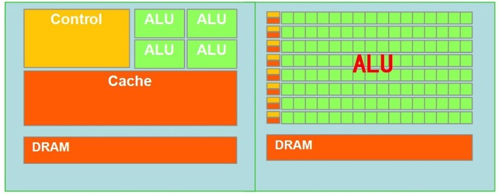
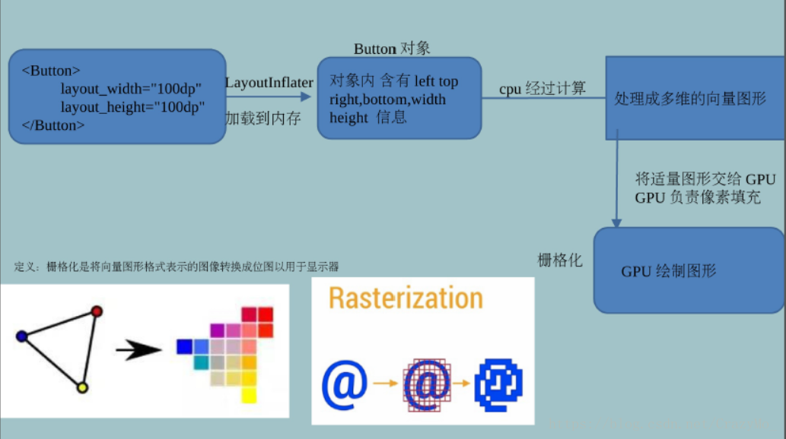
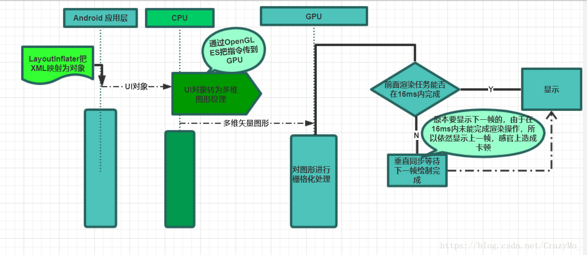
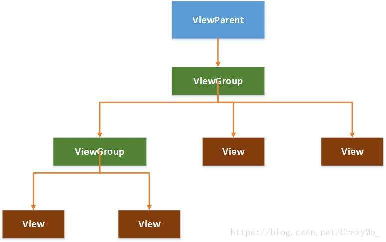
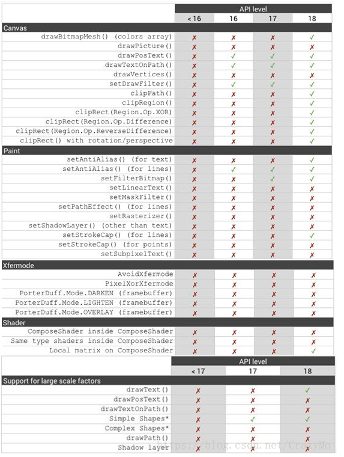
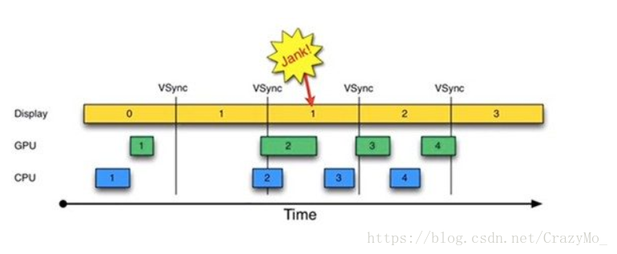
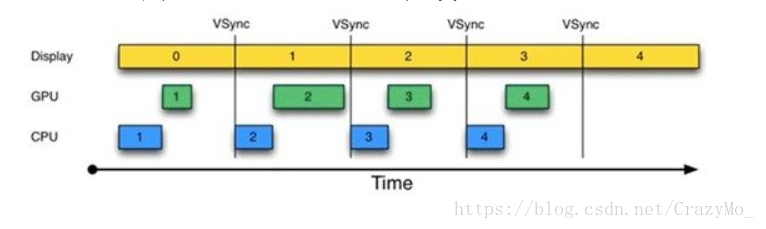

# 布局渲染原理和底层机制详解

### 1. CPU与GPU概述

目前一般的计算机系统内都会包含两大重要组件：CPU（中央处理器）和GPU（图形处理器），现在还有一块NPU，虽然他们仅仅一字之差，但是由所应用的场景不同：CPU需要很强的通用性来处理各种不同的数据类型，同时又要进行复杂的数学和逻辑运算，这些都使得CPU的内部结构异常复杂；而GPU面对的则是类型高度统一的、相互无依赖的大规模和不需要被打断的纯净的计算环境，自然结构也大不相同。

> 其中绿色的是计算单元（ALU），橙红色的是存储单元，橙黄色的是控制单元。

GPU采用了数量众多的计算单元和超长的流水线，但只有非常简单的控制逻辑并省去了Cache，而CPU不仅被Cache占据了大量空间，而且还有复杂的控制逻辑和诸多优化电路，相比之下计算能力只是CPU很小的一部分，以前CPU除了**逻辑计算**外，还负责**内存管理、图像显示**操作，因此在实际运算的时候性能会大打折扣，在没有GPU的时代，不能显示复杂的图形，其运算速度远比不上今天三维游戏的要求，即使CPU的工作频率超过2GHz或更高，对它绘制图形提高也不大，于是GPU应运而生，GPU是将**计算机系统所需要的信息进行转换驱动，并向显示器提供扫描信号，控制显示器的正确显示，是连接显示器和主办的重要元件**，简而言之主要负责**图形显示**部分的工作，而CPU只是负责把**图形绘制指令传达给GPU**，由GPU完成绘制后再反馈给CPU。比如说CPU向画一个二维图形，只需要发个指令给GPU，如“在坐标位置（x，y）处画一个长和宽为axb大小的长方形”，GPU就可以迅速计算出该图形的所有像素，并在显示器指定位置画出相应的图形，画完后就通知CPU“我画完了”，然后等待CPU发出下一条图形指令。总而言之，在一个典型的显示系统中通常包含CPU、GPU和显示器三个部分，其中**CPU进行负责进行Measure、Layout、Record和Execute等计算操作，把计算好的数据交给GPU，由GPU进行渲染，栅格化操作并进行驱动转化，最后显示器负责把buffer里的数据呈现到屏幕上**。

### 2. Android系统的绘制机制

Android系统每隔16ms就重新绘制一次Activity，即要求应用必须在16ms内完成屏幕刷新的全部逻辑操作，这样才能达到每秒60帧，然后这个每秒帧数的参数由手机硬件所决定，现在大多数书籍屏幕刷新频率是60赫兹（

赫兹是国际单位制中频率的单位，它是每秒中的周期性变动重复次数的计量），也就是说我们有**16ms（1000ms/60次=16.66ms）的时间去完成每帧的绘制逻辑操作**，如果超过了就会出现所谓的**丢帧**（比如说我们话费27ms才完成逻辑计算就可能造成丢帧）。

在Android应用层通过LayoutInflater把布局XML文件映射成对象加载到内存中，CPU经过运算处理成多维的矢量图形，然后交给GPU一个个像素去填充。

### 3. Android卡顿的底层的根源探究

#### 3.1 60Hz和16ms

在了解这两个名次之前，先去熟悉一些非软件专业的生物学的常识

- **12fps——**由于人类眼睛的特殊生理结构，如果所看画面之帧率高于每秒约10-12帧的时候，就认为是连贯的
- **24fps——**有声电影的拍摄及播放帧率均为每秒24帧，对一般人而言已算可接受
- **60fps——**在与手机交互过程中，如触摸和反馈60帧以下人是能感觉出来的，60帧以上不能察觉变化当帧率低于60帧时感觉的画面的卡顿和迟滞现象

由于人体眼睛生理结构的特殊性，于是这就是60Hz的由来，而1000ms/60=16.66ms这就是16ms的由来。

#### 3.2 SuifaceFlinger服务概述

SurfaceFlinger服务和其他系统服务一样是在Android系统的Systen进程里被启动并运行在其中的，主要负责**统一管理设备中Android系统的帧缓冲区（Frame Buffer，简单理解为屏幕所显示出来的所有图形效果都是由它统一管理的）**，在**SurfaceFlinger服务启动的过程中会自动创建两个线程：**其中一个线程用于监控控制台事件；另一个线程则用于渲染系统的UI，而**Android应用程序为了能够将自己的UI绘制在系统的帧缓冲区，他就需要将UI数据传递（每个Android应用程序与SuifaceFlinger服务之间，都会通过一块匿名共享内存来传递UI数据）SuifaceFlinger服务并告知自己具体的UI数据（例如要绘制UI的区域、位置等信息），那它就必须要与SurfaceFlinger服务进行通信**，但Android应用程序约SuifaceFlinger服务是运行在不同的进程中的，Android应用程序请求SurfaceFlinger服务渲染自己的UI可以分为三部曲：**首先是创建一个到SurfaceFlinger服务的连接，接着再通过这个链接来创建一个Surface，最后请求SurfaceFlinger服务渲染该Surface**（在Android应用的每个窗口对应一个画布（Canvas），也可以理解为Android应用程序的一个窗口），他们之间通过Binder机制进行通信，其实SuifaceFlinger服务本质上是一个Binder，至于细节方面不在这篇文章讨论范围内，因为SurfaceFlinger实在太复杂了，而且在App层我们对于这部分无法进行任何的优化，这是ROOM做的工作。

#### 3.3 Android APP从开始构建UI到显示在屏幕上背后的故事

简而言之，**Android应用程序调用SurfaceFlinger服务把经过测量、布局和绘制后的Surface渲染到显示屏幕上**，这基本的流程按照各自的分工还可以分为：

##### **3.3.1 APP的UI在应用层进行渲染**

在Android应用程序窗口里面包含了很多视图（view）元素，这些元素是以树形机构来组织的构成最终的所谓视图树的结构：

因此，在绘制一个Android应用程序窗口的UI之前，我们首先要去定它里面的各个子VIew元素在父元素里面的大小以及位置，确定各个子View元素在父VIew元素里面的大小以及位置的过程又称为测量过程和布局过程。Android应用程序窗口的UI渲染过程可以分为**Measure测量、Layout布局和Draw绘制**三个阶段（由ViewRootImpl类的performTraversals方法发起）

- 测量——递归（深度优先）确定所有视图的大小（高、宽）
- 布局——递归（深度优先）确定所有视图的位置（左上角坐标）
- 绘制——在画布canvas上绘制应用程序窗口所有的视图

其中Android目前支持两种绘制模型：**基于软件的绘制模型**和**硬件加速的绘制模型**（从Android3.0开始）

- 在基于**软件的绘制模型**下，由CPU依次按照**让View层次结构失效、绘制VIew层析结构**两个步骤主导绘图。当应用程序需要更新它的部分UI时，都会自动调用内容发生改变的View对象的invalidate()方法（在View对象的属性发生变化时，如背景色或TextVIew对象中的文本等，Android系统也会自动的调用该View对象的invalidate()方法）。无效（invalidation）消息请求会在View对象层次结构中传递，以便计算出需要重绘的屏幕区域（脏区），所以这种方式存在两个显著缺点：**绘制了不需要重绘的视图**（与脏区域相交的区域）和**掩盖了一些应用的bug**（由于会重绘与脏区域相交的区域）
- 在基于**硬件加速的绘制**模式下，由GPU按照**让VIew层次失效、记录、更新显示列表、绘制显示列表**三个步骤主导绘制，虽然Android系统依然会使用invalidate()方法和draw()方法来请求屏幕更新和展现View对象，但**Android系统并不是立即执行绘制指令，而是首先把这些View的绘制函数作为绘制指令记录一个显示列表，然后再读区显示列表中的绘制指令调用OpenGL相关函数完成绘制**，另一个优化是，**Android系统只需要针对由invalidate（）方法调用所标记的View对象的脏区进行记录和更新显示列表，没有失效的View对象则能重放线钱显示列表揭露的绘制指令来进行简单的重绘工作**。使用显示列表的目的是，把视图的各种绘制函数翻译成绘制指令保存起来，对于没有发生改变的视图把冤死犴保存的操作指令重新读取出来重放一次就可以了，提高了视图的显示速度，而对于需要重绘的View，则更新显示列表，以便下次重用，然后再调用OpenGL完成绘制。虽然硬件加速提高了Android系统显示和刷新的速度，但它有三个缺陷：**兼容性（部分绘制函数不支持或不完全硬件加速，见下图）、内存消耗（OpenGL API调用就会占用8MB，而实际上会占用更多内存）、电量消耗（GPU耗电）**

##### 3.3.2Android Framework层通过SurfaceFilnger服务把Surface上的UI数据渲染到硬件帧缓冲区中

当Android应用层在图形缓冲区中绘制好View层次结构后，应用层通过Binder机制与SurfaceFilnger通信并借助一块匿名共享内存会把这个图形缓冲区交给SurfaceFinger服务，因为单纯的匿名共享内存在传递多个窗口数据时缺乏有效的管理，所以匿名共享内存就被抽象为一个更上流的数据结构SharedClient，在每个SharedClient中，最多有31个SharedBufferStack都对应一个Surface即一个窗口。

##### 3.3.3 UI显示刷新机制和Vsync

**Android系统每隔16ms发出Vsync信号，触发对UI进行渲染（即每16ms一帧）**，如果每次渲染都成功这样就能够达到流畅画面所需要的60帧，为了能够实现60帧，这意味着计算渲染的大多数操作都必须在16ms内完成。一般我们在绘制UI的时候，都会采用一种称为“双缓冲”的技术。双缓冲意味着要使用两个缓冲区（SharedBufferStack中），其中一个称为Front Buffer，另外一个称为Back Buffer，UI总是先在Back Buffer中绘制，然后再和Front Buffer交换，渲染到显示设备中，其中Display处理Fron Buffer，CPU、GPU处理Back Buffer，如下图可以看出在16ms内需要完成两项任务：**将UI对象转换为一系列多边形和纹理**和**CPU传递处理数据到GPU**

在所有渲染任务都在16ms内完成的理想情况下，所有的UI显示刷新都很完美，但是假如时间从0开始，进入第一个16ms，此时Display显示第0帧，CPU处理完第1帧后，GPU紧接其后处理第一帧，三者互不干扰，一切正常；时间进入第二个16ms，因为在第一个16ms内，第1帧已经由CPU、GPU处理完毕，故Display可以直接显示第1帧，显示没问题，但在本16ms期间，CPU和GPU却并未及时去绘制第2帧数据（注意前面的空白区），而是在本周去快结束，CPU和GPU才去处理第2帧数据，时间进入第3个16ms，此时Display应该显示第2帧数据，但由于CPU和GPU还没处理完第2帧数据，故Display只能继续显示第1帧的数据，结果使的第1帧多画了一次（对应时间段上标注了一个Jank），于是给人视觉上就造成了卡顿的感受，这根本原因是在第2个16ms段内，CPU/GPU没有及时处理第2帧数据，可能是因为CPU在忙别的事情，不知道该到处理UI绘制的时间了，当CPU在想要去处理第2帧数据，时间又错过了，于是Android4.1中引入了类似于时钟终端的Vsync机制，每收到Vsync信号，CPU就开始处理各帧数据。

但这也是不是说就绝对的完美，假如在第二个16ms时间段，Display本应显示B帧，但却因为GPU还在处理B帧，导致A帧被重复显示，同理，在第二个16ms时间段内，CPU无所事事，因为A Buffer被Display在使用，而B Buffer被GPU在使用，一旦过了Vsync时间点，CPU就不能被触发以处理绘制工作了，可以类比到等高铁等情况下，以上就是卡顿的基本原因，一句话总结就是**CPU和GPU的处理时间因为各种原因都大于一个Vsync的间隔**造成了该显示下一帧的时候却还是显示上一帧。