# Android基本知识点

### 1、常规知识点

#### 1、Android类加载器

在Android开发中，不管是插件化还是组件化，都是基于Android系统的类加载器ClassLoader来设计的。只不过Android平台上虚拟机运行的是Dex字节码，一种对class文件优化的产物，传统Class文件是一个Java源码文件会生成一个.class文件，而Android是把所有Class文件进行合并、优化，然后再生成一个最终的class.dex，目的是把不同class文件重复的东西只需保留一份，在早期的Android应用开发中，如果不对Android应用进行分dex处理，那么最后一个应用的apk只会有一个dex文件。

Android中常用的类加载器有两种，DexClassLoader和PathClassLoader，它们都继承于BaseDexClassLoader。区别在于调用父类构造器时，DexClassLoader多传了一个optimizedDirectory参数，这个目录必须是内部存储路径，用来缓存系统创建的Dex文件。而PathClassLoader该参数为null，只能加载内部存储目录的Dex文件。所以我们可以用DexClassLoader去加载外部的apk文件，这也是很多插件化技术的基础。 


### 2、 Service

理解Android的Service，可以从以下几个方面来理解：

- Service是在main Thread中执行，Service中不能执行耗时操作（网络请求，拷贝数据库，大文件）。
- 可以在xml中设置Service所在的进程，让Service在另外的进程中执行。
- Service执行的操作最多是20s，BroadcastReceiver是10s，Activity是5s。
- Activity通过bindService（Intent，ServiceConnection，flag）与Service绑定。
- Activity可以通过startService和bindService启动Service。

#### IntentService

IntentService是一个抽象类，继承自Service，内部存在一个ServiceHandler（Handler）和HandlerThread（Thread）。IntentService是处理异步请求的一个类，在IntentService中有一个工作线程（HandlerThread）来处理耗时操作，启动IntentService的方式和普通的一样，不过当执行完任务之后，IntentService会自动停止。另外可以多次启动IntentService，每一个耗时操作都会以工作队列的形式在IntentService的onHandleIntent回调中执行，并且每次执行一个工作线程。IntentService的本质是：封装了一个HandlerThread和Handler的异步框架。

#### 2.1、生命周期示意图

Service 作为 Android四大组件之一，应用非常广泛。和Activity一样，Service 也有一系列的生命周期回调函数，具体如下图。 

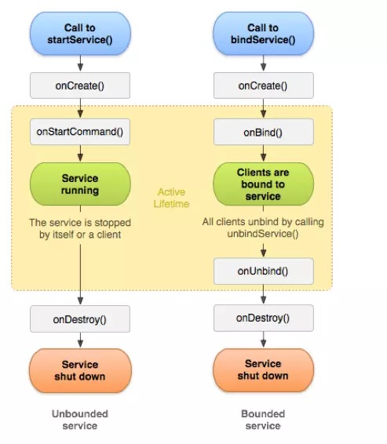


通常，启动Service有两种方式，startService和bindService方式。

#### 2.2、startService生命周期

当我们通过调用了Context的startService方法后，我们便启动了Service，通过startService方法启动的Service会一直无限期地运行下去，只有在外部调用Context的stopService或Service内部调用Service的stopSelf方法时，该Service才会停止运行并销毁。

##### onCreate

onCreate: 执行startService方法时，如果Service没有运行的时候会创建该Service并执行Service的onCreate回调方法；如果Service已经处于运行中，那么执行startService方法不会执行Service的onCreate方法。也就是说如果多次执行了Context的startService方法启动Service，Service方法的onCreate方法只会在第一次创建Service的时候调用一次，以后均不会再次调用。我们可以在onCreate方法中完成一些Service初始化相关的操作。

##### onStartCommand

onStartCommand: 在执行了startService方法之后，有可能会调用Service的onCreate方法，在这之后一定会执行Service的onStartCommand回调方法。也就是说，如果多次执行了Context的startService方法，那么Service的onStartCommand方法也会相应的多次调用。onStartCommand方法很重要，我们在该方法中根据传入的Intent参数进行实际的操作，比如会在此处创建一个线程用于下载数据或播放音乐等。

```java
public @StartResult int onStartCommand(Intent intent, @StartArgFlags int flags, int startId) {
}
```

当Android面临内存匮乏的时候，可能会销毁掉你当前运行的Service，然后待内存充足的时候可以重新创建Service，Service被Android系统强制销毁并再次重建的行为依赖于Service中onStartCommand方法的返回值。我们常用的返回值有三种值，`START_NOT_STICKY`、`START_STICKY`和`START_REDELIVER_INTENT`，这三个值都是Service中的静态常量。

###### `START_NOT_STICKY`

如果返回START_NOT_STICKY，表示当Service运行的进程被Android系统强制杀掉之后，不会重新创建该Service，当然如果在其被杀掉之后一段时间又调用了startService，那么该Service又将被实例化。那什么情境下返回该值比较恰当呢？如果我们某个Service执行的工作被中断几次无关紧要或者对Android内存紧张的情况下需要被杀掉且不会立即重新创建这种行为也可接受，那么我们便可将 onStartCommand的返回值设置为START_NOT_STICKY。举个例子，某个Service需要定时从服务器获取最新数据：通过一个定时器每隔指定的N分钟让定时器启动Service去获取服务端的最新数据。当执行到Service的onStartCommand时，在该方法内再规划一个N分钟后的定时器用于再次启动该Service并开辟一个新的线程去执行网络操作。假设Service在从服务器获取最新数据的过程中被Android系统强制杀掉，Service不会再重新创建，这也没关系，因为再过N分钟定时器就会再次启动该Service并重新获取数据。

###### `START_STICKY`

如果返回START_STICKY，表示Service运行的进程被Android系统强制杀掉之后，Android系统会将该Service依然设置为started状态（即运行状态），但是不再保存onStartCommand方法传入的intent对象，然后Android系统会尝试再次重新创建该Service，并执行onStartCommand回调方法，但是onStartCommand回调方法的Intent参数为null，也就是onStartCommand方法虽然会执行但是获取不到intent信息。如果你的Service可以在任意时刻运行或结束都没什么问题，而且不需要intent信息，那么就可以在onStartCommand方法中返回START_STICKY，比如一个用来播放背景音乐功能的Service就适合返回该值。

###### `START_REDELIVER_INTENT`

如果返回START_REDELIVER_INTENT，表示Service运行的进程被Android系统强制杀掉之后，与返回START_STICKY的情况类似，Android系统会将再次重新创建该Service，并执行onStartCommand回调方法，但是不同的是，Android系统会再次将Service在被杀掉之前最后一次传入onStartCommand方法中的Intent再次保留下来并再次传入到重新创建后的Service的onStartCommand方法中，这样我们就能读取到intent参数。只要返回START_REDELIVER_INTENT，那么onStartCommand重的intent一定不是null。如果我们的Service需要依赖具体的Intent才能运行（需要从Intent中读取相关数据信息等），并且在强制销毁后有必要重新创建运行，那么这样的Service就适合返回START_REDELIVER_INTENT。

##### onBind

Service中的onBind方法是抽象方法，所以Service类本身就是抽象类，也就是onBind方法是必须重写的，即使我们用不到。在通过startService使用Service时，我们在重写onBind方法时，只需要将其返回null即可。onBind方法主要是用于给bindService方法调用Service时才会使用到。

##### onDestroy

onDestroy: 通过startService方法启动的Service会无限期运行，只有当调用了Context的stopService或在Service内部调用stopSelf方法时，Service才会停止运行并销毁，在销毁的时候会执行Service回调函数。

#### 2.3、bindService生命周期

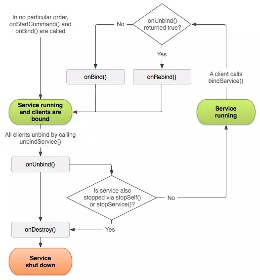

 bindService方式启动Service主要有以下几个生命周期函数：


##### onCreate()：

首次创建服务时，系统将调用此方法。如果服务已在运行，则不会调用此方法，该方法只调用一次。

##### onStartCommand()：

当另一个组件通过调用startService()请求启动服务时，系统将调用此方法。

##### onDestroy()：

当服务不再使用且将被销毁时，系统将调用此方法。

##### onBind()：

当另一个组件通过调用bindService()与服务绑定时，系统将调用此方法。

##### onUnbind()：

当另一个组件通过调用unbindService()与服务解绑时，系统将调用此方法。

##### onRebind()：

当旧的组件与服务解绑后，另一个新的组件与服务绑定，onUnbind()返回true时，系统将调用此方法。

### 3、fragemnt

#### 3.1、创建方式

###### （1）静态创建

首先我们需要创建一个xml文件，然后创建与之对应的java文件，通过onCreatView()的返回方法进行关联，最后我们需要在Activity中进行配置相关参数即在Activity的xml文件中放上fragment的位置。

```java
 <fragment
        android:name="xxx.BlankFragment"
        android:layout_width="match_parent"
        android:layout_height="match_parent">
    </fragment>
```

###### （2）动态创建

动态创建Fragment主要有以下几个步骤：

1. 创建待添加的fragment实例。
2. 获取FragmentManager，在Activity中可以直接通过调用 getSupportFragmentManager（）方法得到。
3. 开启一个事务，通过调用beginTransaction()方法开启。
4. 向容器内添加或替换fragment，一般使用repalce()方法实现，需要传入容器的id和待添加的fragment实例。
5. 提交事务，调用commit()方法来完成。

#### 3.2、Adapter对比

FragmnetPageAdapter在每次切换页面时，只是将Fragment进行分离，适合页面较少的Fragment使用以保存一些内存，对系统内存不会多大影响。

FragmentPageStateAdapter在每次切换页面的时候，是将Fragment进行回收，适合页面较多的Fragment使用，这样就不会消耗更多的内存

#### 3.3、Activity生命周期

Activity的生命周期如下图： 

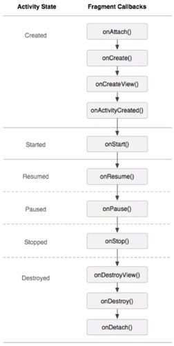


###### （1）动态加载：

动态加载时，Activity的onCreate()调用完，才开始加载fragment并调用其生命周期方法，所以在第一个生命周期方法onAttach()中便能获取Activity以及Activity的布局的组件；

##### （2）静态加载：

1.静态加载时，Activity的onCreate()调用过程中，fragment也在加载，所以fragment无法获取到Activity的布局中的组件，但为什么能获取到Activity呢？

2.原来在fragment调用onAttach()之前其实还调用了一个方法onInflate()，该方法被调用时fragment已经是和Activity相互结合了，所以可以获取到对方，但是Activity的onCreate()调用还未完成，故无法获取Activity的组件；

3.Activity的onCreate()调用完成是，fragment会调用onActivityCreated()生命周期方法，因此在这儿开始便能获取到Activity的布局的组件；

#### 3.4、与Activity通信

fragment不通过构造函数进行传值的原因是因为横屏切换的时候获取不到值。

##### Activity向Fragment传值：

Activity向Fragment传值，要传的值放到bundle对象里； 在Activity中创建该Fragment的对象fragment，通过调用setArguments()传递到fragment中； 在该Fragment中通过调用getArguments()得到bundle对象，就能得到里面的值。

##### Fragment向Activity传值：

###### 第一种：

在Activity中调用getFragmentManager()得到fragmentManager,，调用findFragmentByTag(tag)或者通过findFragmentById(id)，例如：

```java
FragmentManager fragmentManager = getFragmentManager()；

Fragment fragment = fragmentManager.findFragmentByTag(tag)；
```

###### 第二种：

通过回调的方式，定义一个接口（可以在Fragment类中定义），接口中有一个空的方法，在fragment中需要的时候调用接口的方法，值可以作为参数放在这个方法中，然后让Activity实现这个接口，必然会重写这个方法，这样值就传到了Activity中

##### Fragment与Fragment之间是如何传值的：

###### 第一种：

通过findFragmentByTag得到另一个的Fragment的对象，这样就可以调用另一个的方法了。

###### 第二种：

通过接口回调的方式。

###### 第三种：

通过setArguments，getArguments的方式。

#### 3.5、api区别

##### add

一种是add方式来进行show和add，这种方式你切换fragment不会让fragment重新刷新，只会调用onHiddenChanged(boolean isHidden)。

##### replace

而用replace方式会使fragment重新刷新，因为add方式是将fragment隐藏了而不是销毁再创建，replace方式每次都是重新创建。

##### commit/commitAllowingStateLoss

两者都可以提交fragment的操作，唯一的不同是第二种方法，允许丢失一些界面的状态和信息，几乎所有的开发者都遇到过这样的错误：无法在activity调用了onSaveInstanceState之后再执行commit（），这种异常时可以理解的，界面被系统回收（界面已经不存在），为了在下次打开的时候恢复原来的样子，系统为我们保存界面的所有状态，这个时候我们再去修改界面理论上肯定是不允许的，所以为了避免这种异常，要使用第二种方法。

#### 3.懒加载

我们经常在使用fragment时，常常会结合着viewpager使用，那么我们就会遇到一个问题，就是初始化fragment的时候，会连同我们写的网络请求一起执行，这样非常消耗性能，最理想的方式是，只有用户点开或滑动到当前fragment时，才进行请求网络的操作。因此，我们就产生了懒加载这样一个说法。

Viewpager配合fragment使用，默认加载前两个fragment。很容易造成网络丢包、阻塞等问题。

在Fragment中有一个setUserVisibleHint这个方法，而且这个方法是优于onCreate()方法的，它会通过isVisibleToUser告诉我们当前Fragment我们是否可见，我们可以在可见的时候再进行网络加载。

从log上看setUserVisibleHint（）的调用早于onCreateView，所以如果在setUserVisibleHint（）要实现懒加载的话，就必须要确保View以及其他变量都已经初始化结束，避免空指针。

使用步骤：

申明一个变量isPrepare=false，isVisible=false,标明当前页面是否被创建了 在onViewCreated周期内设置isPrepare=true 在setUserVisibleHint（boolean isVisible）判断是否显示，设置isVisible=true 判断isPrepare和isVisible，都为true开始加载数据，然后恢复isPrepare和isVisible为false，防止重复加载。

关于Android Fragment的懒加载，可以参考下面的链接：[Fragment的懒加载](https://link.juejin.im?target=https%3A%2F%2Fblog.csdn.net%2Fu011315960%2Farticle%2Fdetails%2F71404177)

### 4、Activity

#### 4.1、 Activity启动流程

用户从Launcher程序点击应用图标可启动应用的入口Activity，Activity启动时需要多个进程之间的交互，Android系统中有一个zygote进程专用于孵化Android框架层和应用层程序的进程。还有一个system_server进程，该进程里运行了很多binder service。例如ActivityManagerService，PackageManagerService，WindowManagerService，这些binder service分别运行在不同的线程中，其中ActivityManagerService负责管理Activity栈，应用进程，task。

##### 点击Launcher图标来启动Activity

用户在Launcher程序里点击应用图标时，会通知ActivityManagerService启动应用的入口Activity，ActivityManagerService发现这个应用还未启动，则会通知Zygote进程孵化出应用进程，然后在这个dalvik应用进程里执行ActivityThread的main方法。应用进程接下来通知ActivityManagerService应用进程已启动，ActivityManagerService保存应用进程的一个代理对象，这样ActivityManagerService可以通过这个代理对象控制应用进程，然后ActivityManagerService通知应用进程创建入口Activity的实例，并执行它的生命周期方法。

[Android绘制流程窗口启动流程分析](https://link.juejin.im?target=https%3A%2F%2Fwww.cnblogs.com%2Ftiger-wang-ms%2Fp%2F6517048.html)

#### 4.2、Activity生命周期 

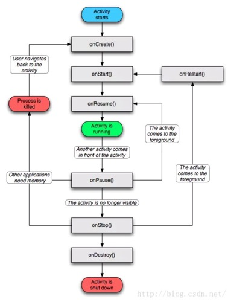


#### （1）Activity的形态

##### Active/Running:

Activity处于活动状态，此时Activity处于栈顶，是可见状态，可与用户进行交互。

##### Paused：

当Activity失去焦点时，或被一个新的非全屏的Activity，或被一个透明的Activity放置在栈顶时，Activity就转化为Paused状态。但我们需要明白，此时Activity只是失去了与用户交互的能力，其所有的状态信息及其成员变量都还存在，只有在系统内存紧张的情况下，才有可能被系统回收掉。

##### Stopped：

当一个Activity被另一个Activity完全覆盖时，被覆盖的Activity就会进入Stopped状态，此时它不再可见，但是跟Paused状态一样保持着其所有状态信息及其成员变量。

##### Killed：

当Activity被系统回收掉时，Activity就处于Killed状态。

Activity会在以上四种形态中相互切换，至于如何切换，这因用户的操作不同而异。了解了Activity的4种形态后，我们就来聊聊Activity的生命周期。

#### Activity的生命周期

所谓的典型的生命周期就是在有用户参与的情况下，Activity经历从创建，运行，停止，销毁等正常的生命周期过程。

##### onCreate

该方法是在Activity被创建时回调，它是生命周期第一个调用的方法，我们在创建Activity时一般都需要重写该方法，然后在该方法中做一些初始化的操作，如通过setContentView设置界面布局的资源，初始化所需要的组件信息等。

##### onStart

此方法被回调时表示Activity正在启动，此时Activity已处于可见状态，只是还没有在前台显示，因此无法与用户进行交互。可以简单理解为Activity已显示而我们无法看见摆了。

##### onResume

当此方法回调时，则说明Activity已在前台可见，可与用户交互了（处于前面所说的Active/Running形态），onResume方法与onStart的相同点是两者都表示Activity可见，只不过onStart回调时Activity还是后台无法与用户交互，而onResume则已显示在前台，可与用户交互。当然从流程图，我们也可以看出当Activity停止后（onPause方法和onStop方法被调用），重新回到前台时也会调用onResume方法，因此我们也可以在onResume方法中初始化一些资源，比如重新初始化在onPause或者onStop方法中释放的资源。

##### onPause

此方法被回调时则表示Activity正在停止（Paused形态），一般情况下onStop方法会紧接着被回调。但通过流程图我们还可以看到一种情况是onPause方法执行后直接执行了onResume方法，这属于比较极端的现象了，这可能是用户操作使当前Activity退居后台后又迅速地再回到到当前的Activity，此时onResume方法就会被回调。当然，在onPause方法中我们可以做一些数据存储或者动画停止或者资源回收的操作，但是不能太耗时，因为这可能会影响到新的Activity的显示——onPause方法执行完成后，新Activity的onResume方法才会被执行。

#### onStop

一般在onPause方法执行完成直接执行，表示Activity即将停止或者完全被覆盖（Stopped形态），此时Activity不可见，仅在后台运行。同样地，在onStop方法可以做一些资源释放的操作（不能太耗时）。

##### onRestart

表示Activity正在重新启动，当Activity由不可见变为可见状态时，该方法被回调。这种情况一般是用户打开了一个新的Activity时，当前的Activity就会被暂停（onPause和onStop被执行了），接着又回到当前Activity页面时，onRestart方法就会被回调。

##### onDestroy

此时Activity正在被销毁，也是生命周期最后一个执行的方法，一般我们可以在此方法中做一些回收工作和最终的资源释放。

#### 小结

到这里我们来个小结，当Activity启动时，依次会调用onCreate(),onStart(),onResume()，而当Activity退居后台时（不可见，点击Home或者被新的Activity完全覆盖），onPause()和onStop()会依次被调用。当Activity重新回到前台（从桌面回到原Activity或者被覆盖后又回到原Activity）时，onRestart()，onStart()，onResume()会依次被调用。当Activity退出销毁时（点击back键），onPause()，onStop()，onDestroy()会依次被调用，到此Activity的整个生命周期方法回调完成。现在我们再回头看看之前的流程图，应该是相当清晰了吧。嗯，这就是Activity整个典型的生命周期过程。

## 2、 View部分知识点

Android的Activity、PhoneWindow和DecorView的关系可以用下面的图表示： 


### 2.1、DecorView浅析

例如，有下面一个视图，DecorView为整个Window界面的最顶层View，它只有一个子元素LinearLayout。代表整个Window界面，包含通知栏、标题栏、内容显示栏三块区域。其中LinearLayout中有两个FrameLayout子元素。 


##### DecorView的作用

DecorView是顶级View，本质是一个FrameLayout它包含两部分，标题栏和内容栏，都是FrameLayout。内容栏id是content，也就是activity中设置setContentView的部分，最终将布局添加到id为content的FrameLayout中。 获取content：ViewGroup content=findViewById（android.id.content） 获取设置的View：getChildAt(0).

##### 使用总结

每个Activity都包含一个Window对象，Window对象通常是由PhoneWindow实现的。 PhoneWindow：将DecorView设置为整个应用窗口的根View，是Window的实现类。它是Android中的最基本的窗口系统，每个Activity均会创建一个PhoneWindow对象，是Activity和整个View系统交互的接口。 DecorView：是顶层视图，将要显示的具体内容呈现在PhoneWindow上，DecorView是当前Activity所有View的祖先，它并不会向用户呈现任何东西。

#### 2.2、View的事件分发

View的事件分发机制可以使用下图表示： 

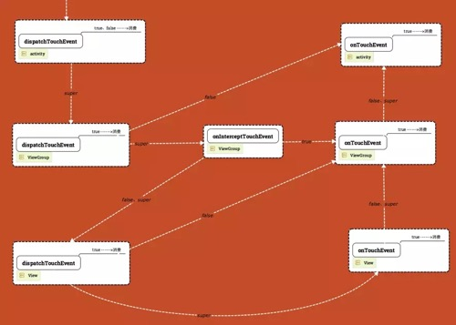

 如上图，图分为3层，从上往下依次是Activity、ViewGroup、View。


1. 事件从左上角那个白色箭头开始，由Activity的dispatchTouchEvent做分发
2. 箭头的上面字代表方法返回值，（return true、return false、return super.xxxxx(),super 的意思是调用父类实现。
3. dispatchTouchEvent和 onTouchEvent的框里有个【true---->消费】的字，表示的意思是如果方法返回true，那么代表事件就此消费，不会继续往别的地方传了，事件终止。
4. 目前所有的图的事件是针对ACTION_DOWN的，对于ACTION_MOVE和ACTION_UP我们最后做分析。
5. 之前图中的Activity 的dispatchTouchEvent 有误（图已修复），只有return super.dispatchTouchEvent(ev) 才是往下走，返回true 或者 false 事件就被消费了（终止传递）。

#### ViewGroup事件分发

当一个点击事件产生后，它的传递过程将遵循如下顺序：

Activity -> Window -> View

事件总是会传递给Activity，之后Activity再传递给Window，最后Window再传递给顶级的View，顶级的View在接收到事件后就会按照事件分发机制去分发事件。如果一个View的onTouchEvent返回了FALSE，那么它的父容器的onTouchEvent将会被调用，依次类推，如果所有都不处理这个事件的话，那么Activity将会处理这个事件。

对于ViewGroup的事件分发过程，大概是这样的：如果顶级的ViewGroup拦截事件即onInterceptTouchEvent返回true的话，则事件会交给ViewGroup处理，如果ViewGroup的onTouchListener被设置的话，则onTouch将会被调用，否则的话onTouchEvent将会被调用，也就是说：两者都设置的话，onTouch将会屏蔽掉onTouchEvent，在onTouchEvent中，如果设置了onClickerListener的话，那么onClick将会被调用。如果顶级ViewGroup不拦截的话，那么事件将会被传递给它所在的点击事件的子view，这时候子view的dispatchTouchEvent将会被调用

#### View的事件分发

dispatchTouchEvent -> onTouch(setOnTouchListener) -> onTouchEvent -> onClick

onTouch和onTouchEvent的区别 两者都是在dispatchTouchEvent中调用的，onTouch优先于onTouchEvent，如果onTouch返回true，那么onTouchEvent则不执行，及onClick也不执行。

### 2.3、View的绘制

在xml布局文件中，我们的layout_width和layout_height参数可以不用写具体的尺寸，而是wrap_content或者是match_parent。这两个设置并没有指定真正的大小，可是我们绘制到屏幕上的View必须是要有具体的宽高的，正是因为这个原因，我们必须自己去处理和设置尺寸。当然了，View类给了默认的处理，但是如果View类的默认处理不满足我们的要求，我们就得重写onMeasure函数啦~。

onMeasure函数是一个int整数，里面放了测量模式和尺寸大小。int型数据占用32个bit，而google实现的是，将int数据的前面2个bit用于区分不同的布局模式，后面30个bit存放的是尺寸的数据。 onMeasure函数的使用如下图： 


 MeasureSpec有三种测量模式： 


match_parent—>EXACTLY。怎么理解呢？match_parent就是要利用父View给我们提供的所有剩余空间，而父View剩余空间是确定的，也就是这个测量模式的整数里面存放的尺寸。

wrap_content—>AT_MOST。怎么理解：就是我们想要将大小设置为包裹我们的view内容，那么尺寸大小就是父View给我们作为参考的尺寸，只要不超过这个尺寸就可以啦，具体尺寸就根据我们的需求去设定。

固定尺寸（如100dp）—>EXACTLY。用户自己指定了尺寸大小，我们就不用再去干涉了，当然是以指定的大小为主啦。


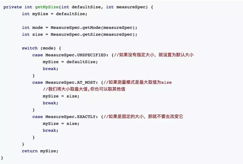

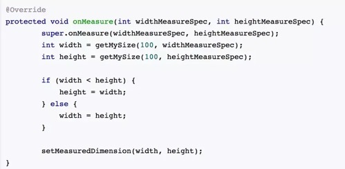


### 2.4、ViewGroup的绘制

自定义ViewGroup可就没那么简单啦~，因为它不仅要管好自己的，还要兼顾它的子View。我们都知道ViewGroup是个View容器，它装纳child View并且负责把child View放入指定的位置。

1. 首先，我们得知道各个子View的大小吧，只有先知道子View的大小，我们才知道当前的ViewGroup该设置为多大去容纳它们。

2. 根据子View的大小，以及我们的ViewGroup要实现的功能，决定出ViewGroup的大小

3. ViewGroup和子View的大小算出来了之后，接下来就是去摆放了吧，具体怎么去摆放呢？这得根据你定制的需求去摆放了，比如，你想让子View按照垂直顺序一个挨着一个放，或者是按照先后顺序一个叠一个去放，这是你自己决定的。

4. 已经知道怎么去摆放还不行啊，决定了怎么摆放就是相当于把已有的空间”分割”成大大小小的空间，每个空间对应一个子View，我们接下来就是把子View对号入座了，把它们放进它们该放的地方去。 

   

   

   

自定义ViewGroup可以参考：[Android自定义ViewGroup](https://link.juejin.im?target=https%3A%2F%2Fblog.csdn.net%2Fldld1717%2Farticle%2Fdetails%2F80458917)

## 3、系统原理

### 3.1、打包原理

Android的包文件APK分为两个部分：代码和资源，所以打包方面也分为资源打包和代码打包两个方面，这篇文章就来分析资源和代码的编译打包原理。

具体说来：

1. 通过AAPT工具进行资源文件（包括AndroidManifest.xml、布局文件、各种xml资源等）的打包，生成R.java文件。

2. 通过AIDL工具处理AIDL文件，生成相应的Java文件。

3. 通过Javac工具编译项目源码，生成Class文件。

4. 通过DX工具将所有的Class文件转换成DEX文件，该过程主要完成Java字节码转换成Dalvik字节码，压缩常量池以及清除冗余信息等工作。

5. 通过ApkBuilder工具将资源文件、DEX文件打包生成APK文件。

6. 利用KeyStore对生成的APK文件进行签名。

7. 如果是正式版的APK，还会利用ZipAlign工具进行对齐处理，对齐的过程就是将APK文件中所有的资源文件举例文件的起始距离都偏移4字节的整数倍，这样通过内存映射访问APK文件的速度会更快。

   


### 3.2、安装流程

Android apk的安装过程主要氛围以下几步：

1. 复制APK到/data/app目录下，解压并扫描安装包。
2. 资源管理器解析APK里的资源文件。
3. 解析AndroidManifest文件，并在/data/data/目录下创建对应的应用数据目录。
4. 然后对dex文件进行优化，并保存在dalvik-cache目录下。
5. 将AndroidManifest文件解析出的四大组件信息注册到PackageManagerService中。
6. 安装完成后，发送广播。

可以使用下面的图表示： 

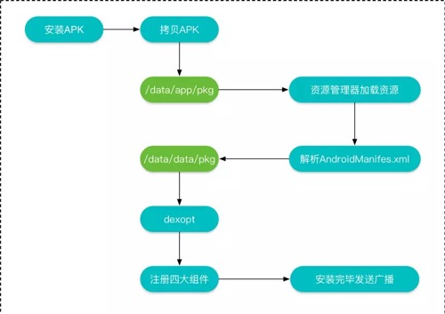


## 4、 第三方库解析

### 4.1、Retrofit网络请求框架

概念：Retrofit是一个基于RESTful的HTTP网络请求框架的封装，其中网络请求的本质是由OKHttp完成的，而Retrofit仅仅负责网络请求接口的封装。

原理：App应用程序通过Retrofit请求网络，实际上是使用Retrofit接口层封装请求参数，Header、URL等信息，之后由OKHttp完成后续的请求，在服务器返回数据之后，OKHttp将原始的结果交给Retrofit，最后根据用户的需求对结果进行解析。

#### retrofit使用

1.在retrofit中通过一个接口作为http请求的api接口

```java
public interface NetApi {
    @GET("repos/{owner}/{repo}/contributors")
    Call<ResponseBody> contributorsBySimpleGetCall(@Path("owner") String owner, @Path("repo") String repo);
}
```

2.创建一个Retrofit实例

```java
Retrofit retrofit = new Retrofit.Builder()
        .baseUrl("https://api.github.com/")
        .build();
```

3.调用api接口

```java
NetApi repo = retrofit.create(NetApi.class);

//第三步：调用网络请求的接口获取网络请求
retrofit2.Call<ResponseBody> call = repo.contributorsBySimpleGetCall("username", "path");
call.enqueue(new Callback<ResponseBody>() { //进行异步请求
    @Override
    public void onResponse(Call<ResponseBody> call, Response<ResponseBody> response) {
        //进行异步操作
    }

    @Override
    public void onFailure(Call<ResponseBody> call, Throwable t) {
        //执行错误回调方法
    }
});
```

#### retrofit动态代理

retrofit执行的原理如下： 1.首先，通过method把它转换成ServiceMethod。 2.然后，通过serviceMethod，args获取到okHttpCall对象。 3.最后，再把okHttpCall进一步封装并返回Call对象。 首先，创建retrofit对象的方法如下：

```java
Retrofit retrofit = new Retrofit.Builder()
        .baseUrl("https://api.github.com/")
        .build();
```

在创建retrofit对象的时候用到了build()方法，该方法的实现如下：

```java
public Retrofit build() {
  if (baseUrl == null) {
    throw new IllegalStateException("Base URL required.");
  }

  okhttp3.Call.Factory callFactory = this.callFactory;
  if (callFactory == null) {
    callFactory = new OkHttpClient(); //设置kHttpClient
  }

  Executor callbackExecutor = this.callbackExecutor;
  if (callbackExecutor == null) {
    callbackExecutor = platform.defaultCallbackExecutor(); //设置默认回调执行器
  }

  // Make a defensive copy of the adapters and add the default Call adapter.
  List<CallAdapter.Factory> adapterFactories = new ArrayList<>(this.adapterFactories);
  adapterFactories.add(platform.defaultCallAdapterFactory(callbackExecutor));

  // Make a defensive copy of the converters.
  List<Converter.Factory> converterFactories = new ArrayList<>(this.converterFactories);

  return new Retrofit(callFactory, baseUrl, converterFactories, adapterFactories,
      callbackExecutor, validateEagerly); //返回新建的Retrofit对象
}
```

该方法返回了一个Retrofit对象，通过retrofit对象创建网络请求的接口的方式如下：

```java
NetApi repo = retrofit.create(NetApi.class);
```

retrofit对象的create()方法的实现如下：‘

```java
public <T> T create(final Class<T> service) {
  Utils.validateServiceInterface(service);
  if (validateEagerly) {
    eagerlyValidateMethods(service);
  }
  return (T) Proxy.newProxyInstance(service.getClassLoader(), new Class<?>[] { service },
      new InvocationHandler() {
        private final Platform platform = Platform.get();

        @Override public Object invoke(Object proxy, Method method, Object... args)
            throws Throwable {
          // If the method is a method from Object then defer to normal invocation.
          if (method.getDeclaringClass() == Object.class) {
            return method.invoke(this, args); //直接调用该方法
          }
          if (platform.isDefaultMethod(method)) {
            return platform.invokeDefaultMethod(method, service, proxy, args); //通过平台对象调用该方法
          }
          ServiceMethod serviceMethod = loadServiceMethod(method); //获取ServiceMethod对象
          OkHttpCall okHttpCall = new OkHttpCall<>(serviceMethod, args); //传入参数生成okHttpCall对象
          return serviceMethod.callAdapter.adapt(okHttpCall); //执行okHttpCall
        }
      });
}
```

### 4.2、图片加载库对比

Picasso：120K

Glide：475K

Fresco：3.4M

Android-Universal-Image-Loader：162K

图片函数库的选择需要根据APP的具体情况而定，对于严重依赖图片缓存的APP，例如壁纸类，图片社交类APP来说，可以选择最专业的Fresco。对于一般的APP，选择Fresco会显得比较重，毕竟Fresco3.4M的体量摆在这。根据APP对图片的显示和缓存的需求从低到高，我们可以对以上函数库做一个排序。

Picasso < Android-Universal-Image-Loader < Glide < Fresco

#### 2.介绍:

Picasso ：和Square的网络库一起能发挥最大作用，因为Picasso可以选择将网络请求的缓存部分交给了okhttp实现。

Glide：模仿了Picasso的API，而且在他的基础上加了很多的扩展(比如gif等支持)，Glide默认的Bitmap格式是RGB_565，比 Picasso默认的ARGB_8888格式的内存开销要小一半；Picasso缓存的是全尺寸的(只缓存一种)，而Glide缓存的是跟ImageView尺寸相同的(即56*56和128*128是两个缓存) 。

FB的图片加载框架Fresco：最大的优势在于5.0以下(最低2.3)的bitmap加载。在5.0以下系统，Fresco将图片放到一个特别的内存区域(Ashmem区)。当然，在图片不显示的时候，占用的内存会自动被释放。这会使得APP更加流畅，减少因图片内存占用而引发的OOM。为什么说是5.0以下，因为在5.0以后系统默认就是存储在Ashmem区了。

#### 3.总结：

Picasso所能实现的功能，Glide都能做，无非是所需的设置不同。但是Picasso体积比起Glide小太多如果项目中网络请求本身用的就是okhttp或者retrofit(本质还是okhttp)，那么建议用Picasso，体积会小很多(Square全家桶的干活)。Glide的好处是大型的图片流，比如gif、Video，如果你们是做美拍、爱拍这种视频类应用，建议使用。

Fresco在5.0以下的内存优化非常好，代价就是体积也非常的大，按体积算Fresco>Glide>Picasso

不过在使用起来也有些不便（小建议：他只能用内置的一个ImageView来实现这些功能，用起来比较麻烦，我们通常是根据Fresco自己改改，直接使用他的Bitmap层）

### 4.3、各种json解析库使用

参考链接：[www.cnblogs.com/kunpengit/p…](https://link.juejin.im?target=https%3A%2F%2Fwww.cnblogs.com%2Fkunpengit%2Fp%2F4001680.html)

#### （1）Google的Gson

Gson是目前功能最全的Json解析神器，Gson当初是为因应Google公司内部需求而由Google自行研发而来，但自从在2008年五月公开发布第一版后已被许多公司或用户应用。Gson的应用主要为toJson与fromJson两个转换函数，无依赖，不需要例外额外的jar，能够直接跑在JDK上。而在使用这种对象转换之前需先创建好对象的类型以及其成员才能成功的将JSON字符串成功转换成相对应的对象。类里面只要有get和set方法，Gson完全可以将复杂类型的json到bean或bean到json的转换，是JSON解析的神器。Gson在功能上面无可挑剔，但是性能上面比FastJson有所差距。

#### （2）阿里巴巴的FastJson

Fastjson是一个Java语言编写的高性能的JSON处理器,由阿里巴巴公司开发。

无依赖，不需要例外额外的jar，能够直接跑在JDK上。FastJson在复杂类型的Bean转换Json上会出现一些问题，可能会出现引用的类型，导致Json转换出错，需要制定引用。FastJson采用独创的算法，将parse的速度提升到极致，超过所有json库。

综上Json技术的比较，在项目选型的时候可以使用Google的Gson和阿里巴巴的FastJson两种并行使用，如果只是功能要求，没有性能要求，可以使用google的Gson，如果有性能上面的要求可以使用Gson将bean转换json确保数据的正确，使用FastJson将Json转换Bean

## 5、热点技术

参考链接- [Android组件化方案](https://link.juejin.im?target=https%3A%2F%2Fblog.csdn.net%2Fguiying712%2Farticle%2Fdetails%2F55213884)

### 5.1、组件化

#### （1）概念：

组件化：是将一个APP分成多个module，每个module都是一个组件，也可以是一个基础库供组件依赖，开发中可以单独调试部分组件，组件中不需要相互依赖但是可以相互调用，最终发布的时候所有组件以lib的形式被主APP工程依赖打包成一个apk。

#### （2）由来：

1. APP版本迭代，新功能不断增加，业务变得复杂，维护成本高
2. 业务耦合度高，代码臃肿，团队内部多人协作开发困难
3. Android编译代码卡顿，单一工程下代码耦合严重，修改一处需要重新编译打包，耗时耗力。
4. 方便单元测试，单独改一个业务模块，不需要着重关注其他模块。

#### （3）优势：

1. 组件化将通用模块独立出来，统一管理，以提高复用，将页面拆分为粒度更小的组件，组件内部出了包含UI实现，还可以包含数据层和逻辑层
2. 每个组件度可以独立编译、加快编译速度、独立打包。
3. 每个工程内部的修改，不会影响其他工程。
4. 业务库工程可以快速拆分出来，集成到其他App中。
5. 迭代频繁的业务模块采用组件方式，业务线研发可以互不干扰、提升协作效率，并控制产品质量，加强稳定性。
6. 并行开发，团队成员只关注自己的开发的小模块，降低耦合性，后期维护方便等。

#### （4）考虑问题：

##### 模式切换：如何使得APP在单独调试跟整体调试自由切换

组件化后的每一个业务的module都可以是一个单独的APP（isModuleRun=false）， release 包的时候各个业务module作为lib依赖，这里完全由一个变量控制，在根项目 gradle.properties里面isModuleRun=true。isModuleRun状态不同，加载application和AndroidManifest都不一样，以此来区分是独立的APK还是lib。

##### 在build.grade里面配置：

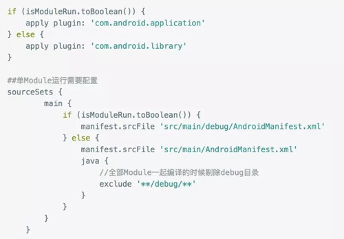


##### 资源冲突

当我们创建了多个Module的时候，如何解决相同资源文件名合并的冲突，业务Module和BaseModule资源文件名称重复会产生冲突，解决方案在于：

每个 module 都有 app_name，为了不让资源名重名，在每个组件的 build.gradle 中增加 resourcePrefix “xxx_强行检查资源名称前缀。固定每个组件的资源前缀。但是 resourcePrefix 这个值只能限定 xml 里面的资源，并不能限定图片资源。

##### 依赖关系

多个Module之间如何引用一些共同的library以及工具类

##### 组件通信

组件化之后，Module之间是相互隔离的，如何进行UI跳转以及方法调用，具体可以使用阿里巴巴ARouter或者美团的WMRouter等路由框架。

各业务Module之前不需要任何依赖可以通过路由跳转，完美解决业务之间耦合。

##### 入口参数

我们知道组件之间是有联系的，所以在单独调试的时候如何拿到其它的Module传递过来的参数

#### Application

当组件单独运行的时候，每个Module自成一个APK，那么就意味着会有多个Application，很显然我们不愿意重复写这么多代码，所以我们只需要定义一个BaseApplication即可，其它的Application直接继承此BaseApplication就OK了，BaseApplication里面还可定义公用的参数。

关于如何进行组件化，可以参考：[安居客Android项目架构演进](https://link.juejin.im?target=https%3A%2F%2Fwww.jianshu.com%2Fp%2F6fcff2abf468)

### 5.2、插件化

参考链接- [插件化入门](https://link.juejin.im?target=https%3A%2F%2Fwww.jianshu.com%2Fp%2Fb6d0586aab9f)

（1）概述

提到插件化，就不得不提起方法数超过65535的问题，我们可以通过Dex分包来解决，同时也可以通过使用插件化开发来解决。插件化的概念就是由宿主APP去加载以及运行插件APP。

（2）优点

在一个大的项目里面，为了明确的分工，往往不同的团队负责不同的插件APP，这样分工更加明确。各个模块封装成不同的插件APK，不同模块可以单独编译，提高了开发效率。 解决了上述的方法数超过限制的问题。可以通过上线新的插件来解决线上的BUG，达到“热修复”的效果。 减小了宿主APK的体积。

（3）缺点

插件化开发的APP不能在Google Play上线，也就是没有海外市场。

## 6、屏幕适配

### 6.1、基本概念

#### 屏幕尺寸

含义：手机对角线的物理尺寸 单位：英寸（inch），1英寸=2.54cm

Android手机常见的尺寸有5寸、5.5寸、6寸，6.5寸等等

#### 屏幕分辨率

含义：手机在横向、纵向上的像素点数总和

一般描述成屏幕的”宽x高”=AxB 含义：屏幕在横向方向（宽度）上有A个像素点，在纵向方向

（高）有B个像素点 例子：1080x1920，即宽度方向上有1080个像素点，在高度方向上有1920个像素点

单位：px（pixel），1px=1像素点

UI设计师的设计图会以px作为统一的计量单位

Android手机常见的分辨率：320x480、480x800、720x1280、1080x1920

#### 屏幕像素密度

含义：每英寸的像素点数 单位：dpi（dots per ich）

假设设备内每英寸有160个像素，那么该设备的屏幕像素密度=160dpi

### 6.2、适配方法

1.支持各种屏幕尺寸： 使用wrap_content, match_parent, weight.要确保布局的灵活性并适应各种尺寸的屏幕，应使用 “wrap_content”、“match_parent” 控制某些视图组件的宽度和高度。

2.使用相对布局，禁用绝对布局。

3.使用LinearLayout的weight属性

假如我们的宽度不是0dp(wrap_content和0dp的效果相同)，则是match_parent呢？

android:layout_weight的真实含义是:如果View设置了该属性并且有效，那么该 View的宽度等于原有宽度(android:layout_width)加上剩余空间的占比。

从这个角度我们来解释一下上面的现象。在上面的代码中，我们设置每个Button的宽度都是match_parent，假设屏幕宽度为L，那么每个Button的宽度也应该都为L，剩余宽度就等于L-（L+L）= -L。

Button1的weight=1，剩余宽度占比为1/(1+2)= 1/3，所以最终宽度为L+1/3*(-L)=2/3L，Button2的计算类似，最终宽度为L+2/3(-L)=1/3L。

4.使用.9图片

### 6.3、今日头条屏幕适配

参考链接：[今日头条屏幕适配方案终极版](https://juejin.im/post/5bce688e6fb9a05cf715d1c2)

## 7、性能优化

参考链接：[Android 性能监测工具，优化内存、卡顿、耗电、APK大小的方法](https://link.juejin.im?target=https%3A%2F%2Fblog.csdn.net%2Fcsdn_aiyang%2Farticle%2Fdetails%2F74989318) Android的性能优化，主要是从以下几个方面进行优化的： 稳定（内存溢出、崩溃） 流畅（卡顿） 耗损（耗电、流量） 安装包（APK瘦身） 影响稳定性的原因很多，比如内存使用不合理、代码异常场景考虑不周全、代码逻辑不合理等，都会对应用的稳定性造成影响。其中最常见的两个场景是：Crash 和 ANR，这两个错误将会使得程序无法使用。所以做好Crash全局监控，处理闪退同时把崩溃信息、异常信息收集记录起来，以便后续分析;合理使用主线程处理业务，不要在主线程中做耗时操作，防止ANR程序无响应发生。

### （一）稳定——内存优化

#### （1）Memory Monitor 工具：

它是Android Studio自带的一个内存监视工具，它可以很好地帮助我们进行内存实时分析。通过点击Android Studio右下角的Memory Monitor标签，打开工具可以看见较浅蓝色代表free的内存，而深色的部分代表使用的内存从内存变换的走势图变换，可以判断关于内存的使用状态，例如当内存持续增高时，可能发生内存泄漏；当内存突然减少时，可能发生GC等，如下图所示。

LeakCanary工具： LeakCanary是Square公司基于MAT开发的一款监控Android内存泄漏的开源框架。其工作的原理是： 监测机制利用了Java的WeakReference和ReferenceQueue，通过将Activity包装到WeakReference中，被WeakReference包装过的Activity对象如果被回收，该WeakReference引用会被放到ReferenceQueue中，通过监测ReferenceQueue里面的内容就能检查到Activity是否能够被回收（在ReferenceQueue中说明可以被回收，不存在泄漏；否则，可能存在泄漏，LeakCanary是执行一遍GC，若还未在ReferenceQueue中，就会认定为泄漏）。

如果Activity被认定为泄露了，就抓取内存dump文件(Debug.dumpHprofData)；之后通过HeapAnalyzerService.runAnalysis进行分析内存文件分析；接着通过HeapAnalyzer (checkForLeak—findLeakingReference---findLeakTrace)来进行内存泄漏分析。最后通过DisplayLeakService进行内存泄漏的展示。

#### （3）Android Lint 工具：

Android Lint Tool 是Android Sutido种集成的一个Android代码提示工具，它可以给你布局、代码提供非常强大的帮助。硬编码会提示以级别警告，例如：在布局文件中写了三层冗余的LinearLayout布局、直接在TextView中写要显示的文字、字体大小使用dp而不是sp为单位，就会在编辑器右边看到提示。

### （二）流畅——卡顿优化

卡顿的场景通常是发生在用户交互体验最直接的方面。影响卡顿的两大因素，分别是界面绘制和数据处理。

界面绘制：主要原因是绘制的层级深、页面复杂、刷新不合理，由于这些原因导致卡顿的场景更多出现在 UI 和启动后的初始界面以及跳转到页面的绘制上。

数据处理：导致这种卡顿场景的原因是数据处理量太大，一般分为三种情况，一是数据在处理 UI 线程，二是数据处理占用 CPU 高，导致主线程拿不到时间片，三是内存增加导致 GC 频繁，从而引起卡顿。

#### （1）布局优化

在Android种系统对View进行测量、布局和绘制时，都是通过对View数的遍历来进行操作的。如果一个View数的高度太高就会严重影响测量、布局和绘制的速度。Google也在其API文档中建议View高度不宜哦过10层。现在版本种Google使用RelativeLayout替代LineraLayout作为默认根布局，目的就是降低LineraLayout嵌套产生布局树的高度，从而提高UI渲染的效率。

布局复用，使用标签重用layout； 提高显示速度，使用延迟View加载； 减少层级，使用标签替换父级布局； 注意使用wrap_content，会增加measure计算成本； 删除控件中无用属性；

#### （2）绘制优化

过度绘制是指在屏幕上的某个像素在同一帧的时间内被绘制了多次。在多层次重叠的 UI 结构中，如果不可见的 UI 也在做绘制的操作，就会导致某些像素区域被绘制了多次，从而浪费了多余的 CPU 以及 GPU 资源。如何避免过度绘制？

布局上的优化。移除 XML 中非必须的背景，移除 Window 默认的背景、按需显示占位背景图片

自定义View优化。使用 canvas.clipRect() 帮助系统识别那些可见的区域，只有在这个区域内才会被绘制。

#### （3）启动优化

应用一般都有闪屏页SplashActivity，优化闪屏页的 UI 布局，可以通过 Profile GPU Rendering 检测丢帧情况。

### （三）节省——耗电优化

在 Android5.0 以前，关于应用电量消耗的测试即麻烦又不准确，而5.0 之后Google专门引入了一个获取设备上电量消耗信息的API—— Battery Historian。Battery Historian 是一款由 Google 提供的 Android 系统电量分析工具，直观地展示出手机的电量消耗过程，通过输入电量分析文件，显示消耗情况。

最后提供一些可供参考耗电优化的方法：

#### （1）计算优化。算法、for循环优化、Switch..case替代if..else、避开浮点运算。

浮点运算：计算机里整数和小数形式就是按普通格式进行存储，例如1024、3.1415926等等，这个没什么特点，但是这样的数精度不高，表达也不够全面，为了能够有一种数的通用表示法，就发明了浮点数。浮点数的表示形式有点像科学计数法（*.**×10^），它的表示形式是0.×10^，在计算机中的形式为 .*** e ±***），其中前面的星号代表定点小数，也就是整数部分为0的纯小数，后面的指数部分是定点整数。利用这样的形式就能表示出任意一个整数和小数，例如1024就能表示成0.1024×10^4，也就是 .1024e+004，3.1415926就能表示成0.31415926×10^1，也就是 .31415926e+001，这就是浮点数。浮点数进行的运算就是浮点运算。浮点运算比常规运算更复杂，因此计算机进行浮点运算速度要比进行常规运算慢得多。

#### （2）避免 Wake Lock 使用不当。

Wake Lock是一种锁的机制，主要是相对系统的休眠而言的，,只要有人拿着这个锁，系统就无法进入休眠意思就是我的程序给CPU加了这个锁那系统就不会休眠了，这样做的目的是为了全力配合我们程序的运行。有的情况如果不这么做就会出现一些问题，比如微信等及时通讯的心跳包会在熄屏不久后停止网络访问等问题。所以微信里面是有大量使用到了Wake_Lock锁。系统为了节省电量，CPU在没有任务忙的时候就会自动进入休眠。有任务需要唤醒CPU高效执行的时候，就会给CPU加Wake_Lock锁。大家经常犯的错误，我们很容易去唤醒CPU来工作，但是很容易忘记释放Wake_Lock。

#### （3）使用 Job Scheduler 管理后台任务。

在Android 5.0 API 21 中，google提供了一个叫做JobScheduler API的组件，来处理当某个时间点或者当满足某个特定的条件时执行一个任务的场景，例如当用户在夜间休息时或设备接通电源适配器连接WiFi启动下载更新的任务。这样可以在减少资源消耗的同时提升应用的效率。

### （四）安装包——APK瘦身

#### （1）安装包的组成结构

assets文件夹。存放一些配置文件、资源文件，assets不会自动生成对应的 ID，而是通过 AssetManager 类的接口获取。

res。res 是 resource 的缩写，这个目录存放资源文件，会自动生成对应的 ID 并映射到 .R 文件中，访问直接使用资源 ID。

META-INF。保存应用的签名信息，签名信息可以验证 APK 文件的完整性。

AndroidManifest.xml。这个文件用来描述 Android 应用的配置信息，一些组件的注册信息、可使用权限等。

classes.dex。Dalvik 字节码程序，让 Dalvik 虚拟机可执行，一般情况下，Android 应用在打包时通过 Android SDK 中的 dx 工具将 Java 字节码转换为 Dalvik 字节码。

resources.arsc。记录着资源文件和资源 ID 之间的映射关系，用来根据资源 ID 寻找资源。

#### （2）减少安装包大小

代码混淆。使用IDE 自带的 proGuard 代码混淆器工具 ，它包括压缩、优化、混淆等功能。 资源优化。比如使用 Android Lint 删除冗余资源，资源文件最少化等。 图片优化。比如利用 PNG优化工具 对图片做压缩处理。推荐目前最先进的压缩工具Googlek开源库zopfli。如果应用在0版本以上，推荐使用 WebP图片格式。 避免重复或无用功能的第三方库。例如，百度地图接入基础地图即可、讯飞语音无需接入离线、图片库Glide\Picasso等。 插件化开发。比如功能模块放在服务器上，按需下载，可以减少安装包大小。 可以使用微信开源资源文件混淆工具——AndResGuard。一般可以压缩apk的1M左右大。

### 7.1、冷启动与热启动

参考链接：[www.jianshu.com/p/03c0fd3fc…](https://link.juejin.im?target=https%3A%2F%2Fwww.jianshu.com%2Fp%2F03c0fd3fc245)

**冷启动** 在启动应用时，系统中没有该应用的进程，这时系统会创建一个新的进程分配给该应用；

**热启动** 在启动应用时，系统中已有该应用的进程（例：按back键、home键，应用虽然会退出，但是该应用的进程还是保留在后台）；

**区别** 冷启动：系统没有该应用的进程，需要创建一个新的进程分配给应用，所以会先创建和初始化Application类，再创建和初始化MainActivity类（包括一系列的测量、布局、绘制），最后显示在界面上。 热启动： 从已有的进程中来启动，不会创建和初始化Application类，直接创建和初始化MainActivity类（包括一系列的测量、布局、绘制），最后显示在界面上。

**冷启动流程** Zygote进程中fork创建出一个新的进程； 创建和初始化Application类、创建MainActivity； inflate布局、当onCreate/onStart/onResume方法都走完； contentView的measure/layout/draw显示在界面上。

**冷启动优化** 减少在Application和第一个Activity的onCreate()方法的工作量； 不要让Application参与业务的操作； 不要在Application进行耗时操作； 不要以静态变量的方式在Application中保存数据； 减少布局的复杂性和深度；

## 8、MVP模式架构

### 8.1、MVP模式

MVP架构由MVC发展而来。在MVP中，M代表Model，V代表View，P代表Presenter。

模型层（Model）:主要是获取数据功能，业务逻辑和实体模型。

视图层（View）：对应于Activity或Fragment，负责视图的部分展示和业务逻辑用户交互

控制层（Presenter）:负责完成View层与Model层间的交互，通过P层来获取M层中数据后返回给V层，使得V层与M层间没有耦合。

在MVP中 ，Presenter层完全将View层和Model层进行了分离，把主要程序逻辑放在Presenter层实现，Presenter与具体的View层（Activity）是没有直接的关联，是通过定义接口来进行交互的，从而使得当View层（Activity）发生改变时，Persenter依然可以保持不变。View层接口类只应该只有set/get方法，及一些界面显示内容和用户输入，除此之外不应该有多余的内容。绝不允许View层直接访问Model层，这是与MVC最大区别之处，也是MVP核心优点。

## 9、虚拟机

### 9.1、Android Dalvik虚拟机和ART虚拟机对比

#### Dalvik

Android4.4及以前使用的都是Dalvik虚拟机，我们知道Apk在打包的过程中会先将java等源码通过javac编译成.class文件，但是我们的Dalvik虚拟机只会执行.dex文件，这个时候dx会将.class文件转换成Dalvik虚拟机执行的.dex文件。Dalvik虚拟机在启动的时候会先将.dex文件转换成快速运行的机器码，又因为65535这个问题，导致我们在应用冷启动的时候有一个合包的过程，最后导致的一个结果就是我们的app启动慢，这就是Dalvik虚拟机的JIT特性（Just In Time）。

#### ART

ART虚拟机是在Android5.0才开始使用的Android虚拟机，ART虚拟机必须要兼容Dalvik虚拟机的特性，但是ART有一个很好的特性AOT（ahead of time），这个特性就是我们在安装APK的时候就将dex直接处理成可直接供ART虚拟机使用的机器码，ART虚拟机将.dex文件转换成可直接运行的.oat文件，ART虚拟机天生支持多dex，所以也不会有一个合包的过程，所以ART虚拟机会很大的提升APP冷启动速度。

ART优点：

加快APP冷启动速度

提升GC速度

提供功能全面的Debug特性

ART缺点：

APP安装速度慢，因为在APK安装的时候要生成可运行.oat文件

APK占用空间大，因为在APK安装的时候要生成可运行.oat文件

arm处理器

关于ART更详细的介绍，可以参考[Android ART详解](https://link.juejin.im?target=https%3A%2F%2Fblog.csdn.net%2Fbiaozige%2Farticle%2Fdetails%2F81171637)

#### 总结

熟悉Android性能分析工具、UI卡顿、APP启动、包瘦身和内存性能优化

熟悉Android APP架构设计，模块化、组件化、插件化开发

熟练掌握Java、设计模式、网络、多线程技术

# Java基本知识点

## 1、Java的类加载过程

jvm将.class类文件信息加载到内存并解析成对应的class对象的过程，注意：jvm并不是一开始就把所有的类加载进内存中，只是在第一次遇到某个需要运行的类才会加载，并且只加载一次

主要分为三部分：1、加载，2、链接（1.验证，2.准备，3.解析），3、初始化

### 1：加载

类加载器包括 BootClassLoader、ExtClassLoader、APPClassLoader

### 2：链接

验证：（验证class文件的字节流是否符合jvm规范）

准备：为类变量分配内存，并且进行赋初值

解析：将常量池里面的符号引用（变量名）替换成直接引用（内存地址）过程，在解析阶段，jvm会把所有的类名、方法名、字段名、这些符号引用替换成具体的内存地址或者偏移量。

### 3：初始化

主要对类变量进行初始化，执行类构造器的过程，换句话说，只对static修试的变量或者语句进行初始化。

范例：Person person = new Person();为例进行说明。

Java编程思想中的类的初始化过程主要有以下几点：

1. 找到class文件，将它加载到内存
2. 在堆内存中分配内存地址
3. 初始化
4. 将堆内存地址指给栈内存中的p变量

## 2、String、StringBuilder、StringBuffer

StringBuffer里面的很多方法添加了synchronized关键字，是可以表征线程安全的，所以多线程情况下使用它。

执行速度：

```java
StringBuilder > StringBuffer > String
```

StringBuilder牺牲了性能来换取速度的，这两个是可以直接在原对象上面进行修改，省去了创建新对象和回收老对象的过程，而String是字符串常量（final）修试，另外两个是字符串变量，常量对象一旦创建就不可以修改，变量是可以进行修改的，所以对于String字符串的操作包含下面三个步骤：

1. 创建一个新对象，名字和原来的一样
2. 在新对象上面进行修改
3. 原对象被垃圾回收掉

### 3、JVM内存结构

Java对象实例化过程中，主要使用到虚拟机栈、Java堆和方法区。Java文件经过编译之后首先会被加载到jvm方法区中，jvm方法区中很重的一个部分是运行时常量池，用以存储class文件类的版本、字段、方法、接口等描述信息和编译期间的常量和静态常量。

#### 3.1、JVM基本结构

类加载器classLoader，在JVM启动时或者类运行时将需要的.class文件加载到内存中。 执行引擎，负责执行class文件中包含的字节码指令。 本地方法接口，主要是调用C/C++实现的本地方法及返回结果。 内存区域（运行时数据区），是在JVM运行的时候操作所分配的内存区， 主要分为以下五个部分，如下图： 

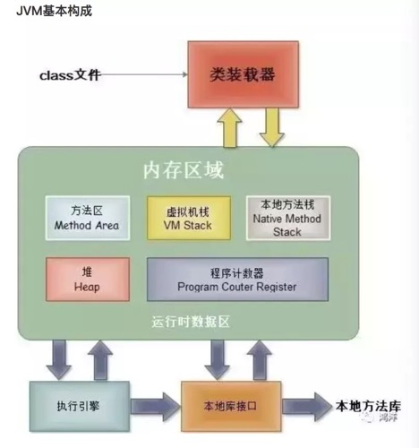


- **方法区**：用于存储类结构信息的地方，包括常量池、静态变量、构造函数等。
- **Java堆（heap）**：存储Java实例或者对象的地方。这块是gc的主要区域。
- **Java栈（stack）**：Java栈总是和线程关联的，每当创建一个线程时，JVM就会为这个线程创建一个对应的Java栈。在这个java栈中又会包含多个栈帧，每运行一个方法就创建一个栈帧，用于存储局部变量表、操作栈、方法返回值等。每一个方法从调用直至执行完成的过程，就对应一个栈帧在java栈中入栈到出栈的过程。所以java栈是线程私有的。
- **程序计数器**：用于保存当前线程执行的内存地址，由于JVM是多线程执行的，所以为了保证线程切换回来后还能恢复到原先状态，就需要一个独立的计数器，记录之前中断的地方，可见程序计数器也是线程私有的。
- **本地方法栈**：和Java栈的作用差不多，只不过是为JVM使用到的native方法服务的。

### 3.2、JVM源码分析

[www.jianshu.com/nb/12554212](https://link.juejin.im?target=https%3A%2F%2Fwww.jianshu.com%2Fnb%2F12554212)

### 4、GC机制

垃圾收集器一般完成两件事

1. 检测出垃圾；
2. 回收垃圾；

#### 4.1 Java对象引用

通常，Java对象的引用可以分为4类：强引用、软引用、弱引用和虚引用。 **强引用**：通常可以认为是通过new出来的对象，即使内存不足，GC进行垃圾收集的时候也不会主动回收。

```java
Object obj = new Object();
```

**软引用**：在内存不足的时候，GC进行垃圾收集的时候会被GC回收。

```java
Object obj = new Object();
SoftReference<Object> softReference = new SoftReference<>(obj);
```

**弱引用**：无论内存是否充足，GC进行垃圾收集的时候都会回收。

```java
Object obj = new Object();
WeakReference<Object> weakReference = new WeakReference<>(obj);
```

**虚引用**：和弱引用类似，主要区别在于虚引用必须和引用队列一起使用。

```java
Object obj = new Object();
ReferenceQueue<Object> referenceQueue = new ReferenceQueue<>();
PhantomReference<Object> phantomReference = new PhantomReference<>(obj, referenceQueue);
```

**引用队列**：如果软引用和弱引用被GC回收，JVM就会把这个引用加到引用队列里，如果是虚引用，在回收前就会被加到引用队列里。

#### 垃圾检测方法：

**引用计数法**：给每个对象添加引用计数器，每个地方引用它，计数器就+1，失效时-1。如果两个对象互相引用时，就导致无法回收。 **可达性分析算法**：以根集对象为起始点进行搜索，如果对象不可达的话就是垃圾对象。根集（Java栈中引用的对象、方法区中常量池中引用的对象、本地方法中引用的对象等。JVM在垃圾回收的时候，会检查堆中所有对象是否被这些根集对象引用，不能够被引用的对象就会被垃圾回收器回收。）

#### 垃圾回收算法：

常见的垃圾回收算法有：

##### 标记-清除

标记：首先标记所有需要回收的对象，在标记完成之后统计回收所有被标记的对象，它的标记过程即为上面的可达性分析算法。 清除：清除所有被标记的对象 缺点： 效率不足，标记和清除效率都不高 空间问题，标记清除之后会产生大量不连续的内存碎片，导致大对象分配无法找到足够的空间，提前进行垃圾回收。

**复制回收算法** 将可用的内存按容量划分为大小相等的2块，每次只用一块，当这一块的内存用完了，就将存活的对象复制到另外一块上面，然后把已使用过的内存空间一次清理掉。

缺点：

将内存缩小了原本的一般，代价比较高 大部分对象是“朝生夕灭”的，所以不必按照1：1的比例划分。 现在商业虚拟机采用这种算法回收新生代，但不是按1：1的比例，而是将内存区域划分为eden 空间、from 空间、to 空间 3 个部分。 其中 from 空间和 to 空间可以视为用于复制的两块大小相同、地位相等，且可进行角色互换的空间块。from 和 to 空间也称为 survivor 空间，即幸存者空间，用于存放未被回收的对象。

在垃圾回收时，eden 空间中的存活对象会被复制到未使用的 survivor 空间中 (假设是 to)，正在使用的 survivor 空间 (假设是 from) 中的年轻对象也会被复制到 to 空间中 (大对象，或者老年对象会直接进入老年带，如果 to 空间已满，则对象也会直接进入老年代)。此时，eden 空间和 from 空间中的剩余对象就是垃圾对象，可以直接清空，to 空间则存放此次回收后的存活对象。这种改进的复制算法既保证了空间的连续性，又避免了大量的内存空间浪费。

##### 标记-整理

在老年代的对象大都是存活对象，复制算法在对象存活率教高的时候，效率就会变得比较低。根据老年代的特点，有人提出了“标记-压缩算法(Mark-Compact)”

标记过程与标记-清除的标记一样，但后续不是对可回收对象进行清理，而是让所有的对象都向一端移动，然后直接清理掉端边界以外的内存。

这种方法既避免了碎片的产生，又不需要两块相同的内存空间，因此，其性价比比较高。

##### 分带收集算法

根据对象存活的周期不同将内存划分为几块，一般是把Java堆分为老年代和新生代，这样根据各个年代的特点采用适当的收集算法。

新生代每次收集都有大量对象死去，只有少量存活，那就选用复制算法，复制的对象数较少就可完成收集。 老年代对象存活率高，使用标记-压缩算法，以提高垃圾回收效率。

## 5、类加载器

程序在启动的时候，并不会一次性加载程序所要用的所有class文件，而是根据程序的需要，通过Java的类加载机制（ClassLoader）来动态加载某个class文件到内存当中的，从而只有class文件被载入到了内存之后，才能被其它class所引用。所以ClassLoader就是用来动态加载class文件到内存当中用的。

### 5.1、双亲委派原理

每个ClassLoader实例都有一个父类加载器的引用（不是继承关系，是一个包含的关系），虚拟机内置的类加载器（Bootstrap ClassLoader）本身没有父类加载器，但是可以用做其他ClassLoader实例的父类加载器。

当一个ClassLoader 实例需要加载某个类时，它会试图在亲自搜索这个类之前先把这个任务委托给它的父类加载器，这个过程是由上而下依次检查的，首先由顶层的类加载器Bootstrap CLassLoader进行加载，如果没有加载到，则把任务转交给Extension CLassLoader视图加载，如果也没有找到，则转交给AppCLassLoader进行加载，还是没有的话，则交给委托的发起者，由它到指定的文件系统或者网络等URL中进行加载类。还没有找到的话，则会抛出CLassNotFoundException异常。否则将这个类生成一个类的定义，并将它加载到内存中，最后返回这个类在内存中的Class实例对象。

### 5.2、 为什么使用双亲委托模型

JVM在判断两个class是否相同时，不仅要判断两个类名是否相同，还要判断是否是同一个类加载器加载的。

避免重复加载，父类已经加载了，则子CLassLoader没有必要再次加载。 考虑安全因素，假设自定义一个String类，除非改变JDK中CLassLoader的搜索类的默认算法，否则用户自定义的CLassLoader如法加载一个自己写的String类，因为String类在启动时就被引导类加载器Bootstrap CLassLoader加载了。

关于Android的双亲委托机制，可以参考[android classloader双亲委托模式](https://link.juejin.im?target=https%3A%2F%2Fblog.csdn.net%2Fxiangzhihong8%2Farticle%2Fdetails%2F65446152)

## 6、集合

Java集合类主要由两个接口派生出：Collection和Map，这两个接口是Java集合的根接口。

Collection接口是集合类的根接口，Java中没有提供这个接口的直接的实现类。但是却让其被继承产生了两个接口，就是 Set和List。Set中不能包含重复的元素。List是一个有序的集合，可以包含重复的元素，提供了按索引访问的方式。

Map是Java.util包中的另一个接口，它和Collection接口没有关系，是相互独立的，但是都属于集合类的一部分。Map包含了key-value对。Map不能包含重复的key，但是可以包含相同的value。

### 6.1、区别

List,Set都是继承自Collection接口，Map则不是; List特点：元素有放入顺序，元素可重复; Set特点：元素无放入顺序，元素不可重复，重复元素会覆盖掉，（注意：元素虽然无放入顺序，但是元素在set中的位置是有该元素的HashCode决定的，其位置其实是固定的，加入Set 的Object必须定义equals()方法; LinkedList、ArrayList、HashSet是非线程安全的，Vector是线程安全的; HashMap是非线程安全的，HashTable是线程安全的;

### 6.2、List和Vector比较

Vector是多线程安全的，线程安全就是说多线程访问同一代码，不会产生不确定的结果。而ArrayList不是，这个可以从源码中看出，Vector类中的方法很多有synchronized进行修饰，这样就导致了Vector在效率上无法与ArrayList相比； 两个都是采用的线性连续空间存储元素，但是当空间不足的时候，两个类的增加方式是不同。 Vector可以设置增长因子，而ArrayList不可以。 Vector是一种老的动态数组，是线程同步的，效率很低，一般不赞成使用。

### 6.3、HashSet如何保证不重复

HashSet底层通过HashMap来实现的，在往HashSet中添加元素是

```java
public boolean add(E e) {
return map.put(e, PRESENT)==null;
}


// Dummy value to associate with an Object in the backing Map
private static final Object PRESENT = new Object();
```

在HashMap中进行查找是否存在这个key，value始终是一样的，主要有以下几种情况：

- 如果hash码值不相同，说明是一个新元素，存；
- 如果hash码值相同，且equles判断相等，说明元素已经存在，不存；
- 如果hash码值相同，且equles判断不相等，说明元素不存在，存；
- 如果有元素和传入对象的hash值相等，那么，继续进行equles()判断，如果仍然相等，那么就认为传入元素已经存在，不再添加，结束，否则仍然添加；

### 6.4、HashSet与Treeset的适用场景

- HashSet是基于Hash算法实现的，其性能通常都优于TreeSet。为快速查找而设计的Set，我们通常都应该使用HashSet，在我们需要排序的功能时，我们才使用TreeSet。
- TreeSet 是二叉树（红黑树的树据结构）实现的,Treeset中的数据是自动排好序的，不允许放入null值
- HashSet是哈希表实现的,HashSet中的数据是无序的，可以放入null，但只能放入一个null，两者中的值都不能重复，就如数据库中唯一约束。
- HashSet是基于Hash算法实现的，其性能通常都优于TreeSet。为快速查找而设计的Set，我们通常都应该使用HashSet，在我们需要排序的功能时，我们才使用TreeSet。

### 6.5、HashMap与TreeMap、HashTable的区别及适用场景

HashMap 非线程安全，基于哈希表(散列表)实现。使用HashMap要求添加的键类明确定义了hashCode()和equals()[可以重写hashCode()和equals()]，为了优化HashMap空间的使用，您可以调优初始容量和负载因子。其中散列表的冲突处理主要分两种，一种是开放定址法，另一种是链表法。HashMap的实现中采用的是链表法。 TreeMap：非线程安全基于红黑树实现，TreeMap没有调优选项，因为该树总处于平衡状态

## 7、 常量池

### 7.1、Interger中的128(-128~127)

当数值范围为-128~127时：如果两个new出来Integer对象，即使值相同，通过“==”比较结果为false，但两个对象直接赋值，则通过“==”比较结果为“true，这一点与String非常相似。 当数值不在-128~127时，无论通过哪种方式，即使两个对象的值相等，通过“==”比较，其结果为false； 当一个Integer对象直接与一个int基本数据类型通过“==”比较，其结果与第一点相同； Integer对象的hash值为数值本身；

```java
@Override
public int hashCode() {
return Integer.hashCode(value);
}
```

### 7.2、为什么是-128-127?

在Integer类中有一个静态内部类IntegerCache，在IntegerCache类中有一个Integer数组，用以缓存当数值范围为-128~127时的Integer对象。

## 8、泛型

泛型是Java SE 1.5的新特性，泛型的本质是参数化类型，也就是说所操作的数据类型被指定为一个参数。这种参数类型可以用在类、接口和方法的创建中，分别称为泛型类、泛型接口、泛型方法。 Java语言引入泛型的好处是安全简单。

**泛型的好处是在编译的时候检查类型安全，并且所有的强制转换都是自动和隐式的，提高代码的重用率。**

它提供了编译期的类型安全，确保你只能把正确类型的对象放入 集合中，避免了在运行时出现ClassCastException。

使用Java的泛型时应注意以下几点：

- 泛型的类型参数只能是类类型（包括自定义类），不能是简单类型。
- 同一种泛型可以对应多个版本（因为参数类型是不确定的），不同版本的泛型类实例是不兼容的。
- 泛型的类型参数可以有多个。
- 泛型的参数类型可以使用extends语句，例如。习惯上称为“有界类型”。
- 泛型的参数类型还可以是通配符类型。例如Class<?> classType = Class.forName("java.lang.String");

### 8.1 T泛型和通配符泛型

- ？ 表示不确定的java类型。
- T  表示java类型。
- K V 分别代表java键值中的Key Value。
- E 代表Element。

### 8.2 泛型擦除

Java中的泛型基本上都是在编译器这个层次来实现的。在生成的Java字节码中是不包含泛型中的类型信息的。使用泛型的时候加上的类型参数，会在编译器在编译的时候去掉。这个过程就称为类型擦除。

泛型是通过类型擦除来实现的，编译器在编译时擦除了所有类型相关的信息，所以在运行时不存在任何类型相关的信息。例如 List在运行时仅用一个List来表示。这样做的目的，是确保能和Java 5之前的版本开发二进制类库进行兼容。你无法在运行时访问到类型参数，因为编译器已经把泛型类型转换成了原始类型。

### 8.3 限定通配符

一种是<? extends T>它通过确保类型必须是T的子类来设定类型的上界， 另一种是<? super T>它通过确保类型必须是T的父类来设定类型的下界。 另一方面表 示了非限定通配符，因为可以用任意类型来替代。 例如List<? extends Number>可以接受List或List。

### 8.4 泛型面试题

##### 你可以把List传递给一个接受List参数的方法吗？ 对任何一个不太熟悉泛型的人来说，这个Java泛型题目看起来令人疑惑，因为乍看起来String是一种Object，所以 List应当可以用在需要List的地方，但是事实并非如此。真这样做的话会导致编译错误。如 果你再深一步考虑，你会发现Java这样做是有意义的，因为List可以存储任何类型的对象包括String, Integer等等，而List却只能用来存储Strings。 

##### Array中可以用泛型吗?

Array事实上并不支持泛型，这也是为什么Joshua Bloch在Effective Java一书中建议使用List来代替Array，因为List可以提供编译期的类型安全保证，而Array却不能。

## 9、反射

### 9.1、概念

JAVA反射机制是在运行状态中，对于任意一个类，都能够知道这个类的所有属性和方法；对于任意一个对象，都能够调用它的任意一个方法；这种动态获取的信息以及动态调用对象的方法的功能称为java语言的反射机制。

### 9.2、作用

Java反射机制主要提供了以下功能： 在运行时判断任意一个对象所属的类；在运行时构造任意一个类的对象；在运行时判断任意一个类所具有的成员变量和方法；在运行时调用任意一个对象的方法；生成动态代理。

# 数据结构与算法

[zhuanlan.zhihu.com/p/27005757?…](https://link.juejin.im?target=https%3A%2F%2Fzhuanlan.zhihu.com%2Fp%2F27005757%3Futm_source%3Dweibo%26utm_medium%3Dsocial)

[crazyandcoder.tech/2016/09/14/…](https://link.juejin.im?target=http%3A%2F%2Fcrazyandcoder.tech%2F2016%2F09%2F14%2Fandroid%2520%25E7%25AE%2597%25E6%25B3%2595%25E4%25B8%258E%25E6%2595%25B0%25E6%258D%25AE%25E7%25BB%2593%25E6%259E%2584-%25E6%258E%2592%25E5%25BA%258F%2F)

## 1、排序

排序有内部排序和外部排序，内部排序是数据记录在内存中进行排序，而外部排序是因排序的数据很大，一次不能容纳全部的排序记录，在排序过程中需要访问外存。

### 1.1、 直接插入排序

思想：

将第一个数和第二个数排序，然后构成一个有序序列 将第三个数插入进去，构成一个新的有序序列。 对第四个数、第五个数……直到最后一个数，重复第二步。 代码：

首先设定插入次数，即循环次数，for(int i=1;i<length;i++)，1个数的那次不用插入。 设定插入数和得到已经排好序列的最后一个数的位数。insertNum和j=i-1。

## 2、设计模式

参考：[Android开发中的一些设计模式](https://link.juejin.im?target=https%3A%2F%2Fxiangzhihong.blog.csdn.net%2Farticle%2Fdetails%2F53857371)

### 2.1、单例设计模式

单例主要分为：懒汉式单例、饿汉式单例、登记式单例。

特点：

1. 单例类只有一个实例
2. 单例类必须自己创建自己的唯一实例
3. 单例类必须给所有其他对象提供这一实例。

在计算机系统中，像线程池，缓存、日志对象、对话框、打印机等常被设计成单例。

#### 懒汉式单例：

Singleton通过将构造方法限定为private避免了类在外部被实例化，在同一个虚拟机范围内，Singleton的唯一实例只能通过getInstance()方法访问。（事实上，通过Java反射机制是能够实例化构造方法为private的类的，那基本上会使所有的Java单例实现失效。 

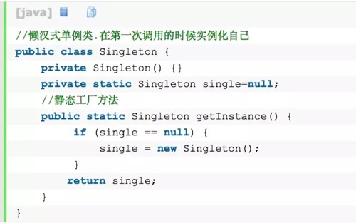

 它是线程不安全的，并发情况下很有可能出现多个Singleton实例，要实现线程安全，有以下三种方式： 1.在getInstance方法上加上同步 


 2.双重检查锁定 

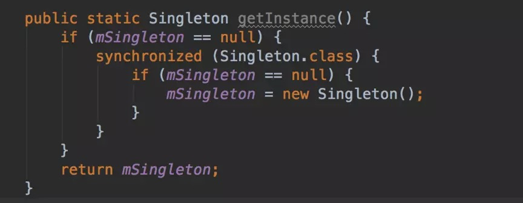

 3.静态内部类 

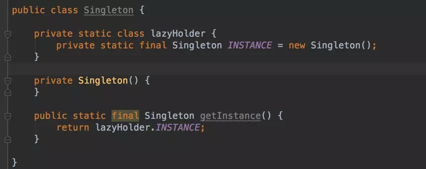

 这种方式对比前两种，既实现了线程安全，又避免了同步带来的性能影响。


#### 饿汉式单例：

饿汉式在创建类的同时就已经创建好了一个静态的对象供系统使用，以后不再改变，所以天生是系统安全。 


