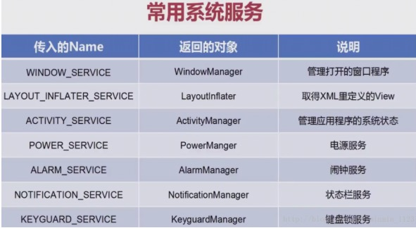
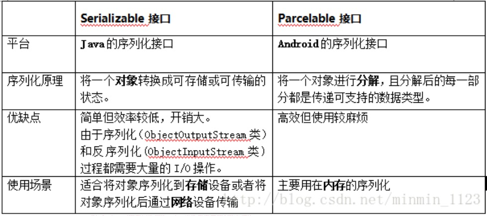
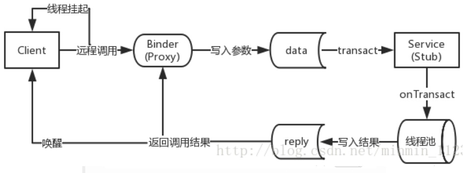
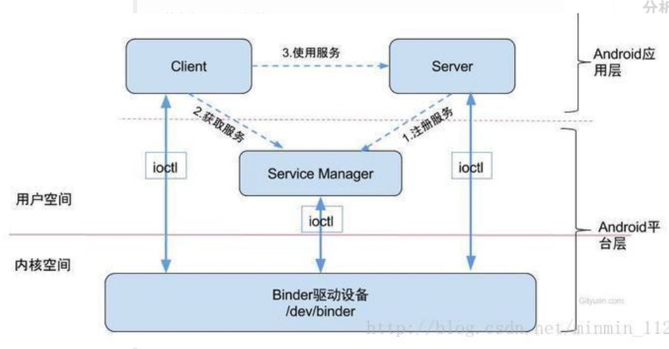
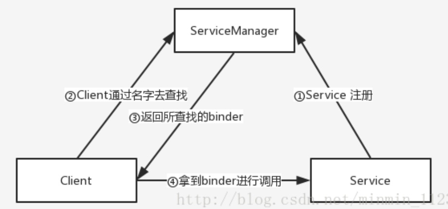
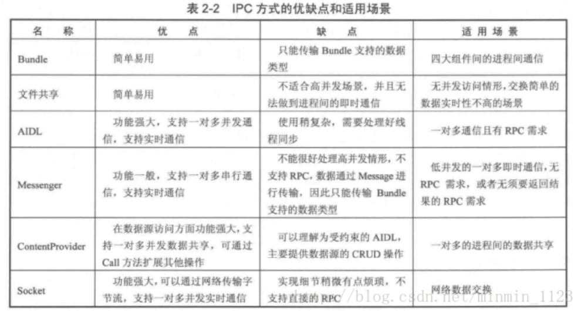
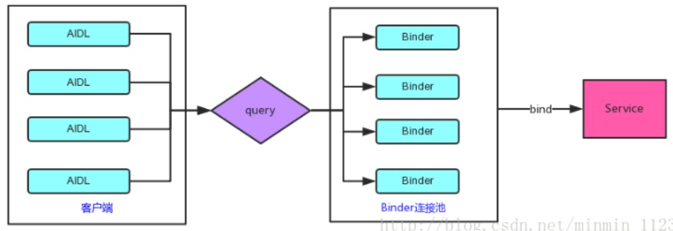
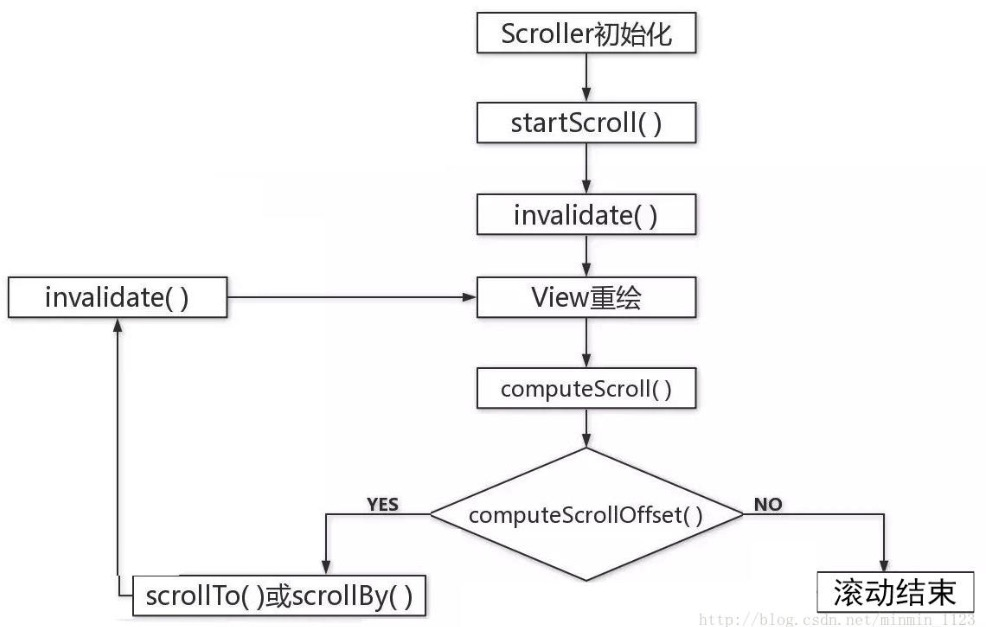

# 面试题—>上篇

### Activity

**Q：说下Activity的声明周期**

> - 技术点：Activity声明周期
> - 思路：分条解释Activity从创建到销毁整个生命周期中涉及到的方法及作用
> - 参考回答：在Activity的生命周期涉及到的七大方法，分别是：
>   - onCreate()表示Activity正在创建，常做初始化工作，如setContentView界面资源、初始化数据
>   - onStart()表示Activity正在启动，这时Activity可见但不在前台，无法和用户交互
>   - onResume()表示Activity获得焦点，此时Activity可见且在前台并开始活动
>   - onPause()表示Activity正在停止，可做**数据存储**、**停止动画**等操作
>   - onStop()表示Activity即将停止，可做**稍微重量级回收工作**，如取消网络连接、注册广播接收器等
>   - onDestory()表示Activity即将销毁，常做**回收工作**、**资源释放**
>   - onRestart()表示Activity重新启动，当Activity由后台切换到前台，由不可见到可见时会调用

**Q：onStart()和onResume/onPause()和onStop()的区别**

> - 技术点：Activity生命周期
> - 思路：可从使用细节出发
> - 参考回答：onStart()与onStop()是从Activity是否可见这个角度调用的，onResume()和onPause()是从Activity是否显示在前台这个角度来回调的，在实际使用没其他明显区别。

**Q：Activity A启动另一个Activity B会回调哪些方法？如果Activity B是完全透明呢？如果启动的是一个对话框Activity呢？**

> - 技术点：Activity生命周期
> - 参考回答：Activity A启动另一个Activity B会回调的方法：Activity A的onPause() -->Activity B的onCreate()-->onStart()-->onResume()-->Activity A的onStop()；如果Activity B是完全透明的，则最后不会调用Activity A的onStop()；如果是对话框Activity，同后种情况。

**Q：谈谈onSaveInstanceState()方法？何时会调用？**

> - 技术点：Activity重建
> - 思路：可从使用场景、调用次序上解释
> - 参考回答：当非人为终止Activity时，比如系统配置发生改变时导致Activity被杀死并重新创建、资源内存不足导致低优先级的Activity被杀死，会调用 **onSavaInstanceState()** 来保存状态。该方法调用在onStop之前，但和onPause没有时序关系。
> - 引申：可再谈谈它和onRestoreInstanceState()的关系以及后者的作用

**Q：onSaveInstanceState()与onPause()的区别？**

> - 技术点：Activity重建
> - 思路：可从适用场景出发
> - 参考回答：onSaveInstanceState()适用于对临时性状态的保存，而onPause()适用于对数据的持久化保存。

**Q：如何避免配置改变时Activity重建？**

> - 技术点：Activity重建
> - 思路：一种解决思路是设置配置文件中Activity的configChanges属性
> - 参考回答：为了避免由于配置改变导致Activity重建，可在AndroidManifest.xml中对应的Activity中设置**android:configChanges="orientation|screenSize"**。此时再次旋转屏幕时，该Activity不会被系统杀死和重建，只会调用onConfigurationChanged。因此，当配置程序需要响应配置改变，指定**configChanges属性**，重写onConfigurationChanged方法即可。

**Q：如何避免配置改变时Activity重建？**

> - 技术点：Activity重建
> - 思路：一种解决思路是设置配置文件中Activity的configChanges属性
> - 参考回答：为了避免由于配置改变导致Activity重建，可在AndroidManifest.xml中对应的Activity中设置**android:configChanges="orientation|screenSize"**。此时再次旋转屏幕时，该Activity不会被系统杀死和重建，只会调用onConfigurationChanged。因此，当配置程序需要响应配置改变，指定**configChanges属性**，重写onConfigurationChanged方法即可。

**Q：说下Activity的四种启动模式？（有时会出个实际问题来分析返回栈中Activity的情况）**

> - 技术点：Activity启动模式
> - 思路：分条解释四个启动模式的特点
> - 参考回答： 
>   - standard标准模式：每次启动一个Activity就会创建一个新的实例
>   - singleTop栈顶复用模式：如果新Activity已经位于任务栈的栈顶，就不会重新创建，并回调 **onNewIntent(intent)** 方法
>   - singleTask栈内复用模式：只要该Activity在一个任务栈中存在，都不会重新创建，并回调 **onNewIntent(intent)** 方法。如果不存在，系统会先寻找是否存在需要的栈，如果不存在该栈，就创建一个任务栈，并把该Activity放进去；如果存在，就会创建到已经存在的栈中
>   - singleInstance单实例模式：具有此模式的Activity只能单独位于一个任务栈中，且此任务栈中只有**唯一**一个实例

**Q：谈谈singleTop和singleTask的区别以及应用场景**

> - 技术点：Activity启动模式
> - 思路：可先解释两个启动模式的含义（见上一个问题），再总结不同点，最后给出应用实例
> - 参考回答：singleTop和singleTask的含义分别是......，可见两者大致区别有： 
>   - singleTop：同个Activity实例在栈中可以有多个，即可能重复创建；该模式的Activity会默认进入启动它所属的任务栈，即不会引起任务栈的变更；为防止快速点击时多次startActivity，可以将目标Activity设置为singleTop
>   - singleTask：同个Activity实例在栈中只有一个，即不存在重复创建；可通过android：taskAffinity设定该Activity需要的任务栈，即可能会引起任务栈的变更；常用于主页和登陆页

**Q：onNewIntent()调用时机？**

> - 技术点：Activity启动模式
> - 参考回答：启动模式为singleTop或singleTask的Activity在以下情况会回调onNewIntent()： 
>   - singleTop：如果新Activity已经位于任务栈的栈顶，就不会重新创建，并回调 **onNewIntent(intent)** 方法
>   - singleTask：只要该Activity在一个任务栈中存在，都不会重新创建，并回调 **onNewIntent(intent)** 方法

**Q：了解哪些Activity启动模式的标记位？**

> - 技术点：Activity启动模式
> - 参考回答：常见的两个标记为： 
>   -  **FLAG_ACTIVITY_SINGLE_TOP**:对应singleTop启动模式
>   -  **FLAG_ACTIVITY_NEW_TASK** ：对应singleTask模式
> - 引申：可再谈谈singleTop和singleTask具体效果

**Q：如何启动其他应用的Activity？**

> - 技术点：Activity启动、IntentFilter匹配
> - 思路：可从隐式Intent角度出发
> - 参考回答：在保证有权限访问的情况下，通过隐式Intent进行目标Activity的IntentFilter匹配，原则是： 
>   - 一个intent只有**同时**匹配某个Activity的intent-filter中的action、category、data才算**完全匹配**，才能启动该Activity。
>   - 一个Activity可以有**多个** intent-filter，一个 intent只要成功匹配**任意一组** intent-filter，就可以启动该Activity。
> - 引申：如有必要可展开说明action、category、data的具体匹配规则

**Q：Activity的启动过程？**

> - 技术点：Activity启动、ActivityManagerServie、ApplicationThread
> - 思路：可大致介绍Activity启动过程涉及到的类，尤其是ActivityManagerServie、ApplicationThread从中发挥的作用。
> - 参考回答：调用startActivity()后经过重重方法会转移到ActivityManagerService的startActivity()，并通过一个IPC回到ActivityThread的内部类**ApplicationThread**中，并调用其scheduleLaunchActivity()将启动Activity的消息发送并交由**Handler H**处理。Handler H对消息的处理会调用handleLaunchActivity()->performLaunchActivity()得以完成Activity对象的创建和启动。
> - 引申：由于ActivityManagerService是一个Binder对象，可引申谈谈Binder机制

### Fragment

**Q：谈一谈Fragment的生命周期？**

> - 技术点：Fragment生命周期
> - 思路：分条解释Fragment从创建到销毁整个生命周期中涉及到的方法及作用
> - 参考回答：Fragment从创建到销毁整个生命周期中涉及到的方法依次为：onAttach()->onCreate()-> onCreateView()->onActivityCreated()->onStart()->onResume()->onPause()->onStop()->onDestroyView()->onDestroy()->onDetach()，其中和Activity有不少名称相同作用相似的方法，而不同的方法有: 
>   -  **onAttach()**：当Fragment和Activity建立关联时调用
>   -  **onCreateView()**：当Fragment创建视图时调用
>   -  **onActivityCreated()**：当与Fragment相关联的Activity完成onCreate()之后调用
>   -  **onDestroyView()**：在Fragment中的布局被移除时调用
>   -  **onDetach()**：当Fragment和Activity解除关联时调用

**Q：Activity和Fragment的异同？**

> - 技术点：Fragment作用
> - 思路：分别解释“异”“同”
> - 参考回答： 
>   - Activity和Fragment的相似点在于，它们都可包含布局、可有自己的生命周期，Fragment可看似迷你活动。
>   - 不同点是，由于Fragment是依附在Activity上的，多了些和宿主Activity相关的生命周期方法，如onAttach()、onActivityCreated()、onDetach()；另外，Fragment的生命周期方法是由宿主Activity而不是操作系统调用的，Activity中生命周期方法都是protected，而Fragment都是public，也能印证了这一点，因为Activity需要调用Fragment那些方法并管理它。
> - 引申：可具体谈谈Activity和Fragment的关系

**Q：Activity和Fragment的关系？**

> - 技术点：Fragment作用
> - 思路：可从Fragment出现的目的、两者数量关系、调用关系展开
> - 参考回答： 
>   - 正如Fragment的名字“碎片”，它的出现是为了解决Android碎片化 ，它可作为Activity界面的组成部分，可在Activity运行中实现动态地加入、移除和交换。
>   - 一个Activity中可同时出现多个Fragment，一个Fragment也可在多个Activity中使用。
>   - 另外，Activity的**FragmentManager**负责调用队列中Fragment的生命周期方法，只要Fragment的状态与Activity的状态保持了同步，宿主Activity的FragmentManager便会继续调用其他生命周期方法以继续保持Fragment与Activity的状态一致。

**Q：何时会考虑使用Fragment?**

> - 技术点：Fragment作用
> - 思路：列举更适合使用Fragment的情况
> - 参考回答：非常经典的例子，即用两个Fragment封装两个界面模块，这样只使一套代码就能适配两种设备，达到两种界面效果；单一场景切换时使用Fragment更轻量化，如ViewPager和Fragment搭配使用

### Service

**Q：谈一谈Service的生命周期？**

> - 技术点：Service生命周期
> - 思路：分条解释Service从创建到销毁整个生命周期中涉及到的方法及作用
> - 参考回答：在Service的生命周期涉及到六大方法，分别是：
>   - onCreate()：服务第一次被创建时调用
>   - onStartCommand()：服务启动时调用
>   - onBind()：服务被绑定时调用
>   - onUnBind()：服务被解绑时调用
>   - onDestory()：服务停止时调用
> - 引申：谈谈相对应的两种启动方式

**Q：Service的两种启动方式？区别在哪？**

> - 技术点：Service生命周期
> - 思路：分别解释两种启动模式如何启动和停止service，并引起生命周期怎样的变化
> - 参考回答：
>   - 第一种，其他组件调用Context的startService()方法可以启动一个Service，并回调服务中的onStartCommand()。如果该服务之前还没创建，那么回调的顺序是onCreate()—>onStartCommand()。服务启动了之后会一直保持运行状态，知道stopService()或stopSelf()方法被调用，服务停止并回调OnDestory()。另外，无论调用多少次startService方法，只需调用一次stopService()或stopSelf()方法，服务就会停止了。
>   - 第二种，其他组件调用Contenxt的bindService()可以绑定一个Service，并回调服务中的onBind()方法，类似地，如果该服务之前还没创建，那么回调的顺序是onCreate()—>onBind()，之后，调用方法可以获取到onBind()方法里返回到IBinder对象的实例，从而实现和服务进行通信，只要调用方和服务之间的连接没有断开，服务就会一直保持运行状态，知道调用了unbindService()方法服务会停止，回调顺序onUnBind()—>onDestory()。

**Q：一个Activity先start一个Service后，再bind时会调用什么方法？此时如何做才能回调Service的destory()方法？**

> - 技术点：Service生命周期
> - 参考回答：startService()启动Service之后，再bindService()，此时只会回调onBind()方法；若想回调Service的destory()方法，需要同时调用stopService()和unBindService()方法才能让服务销毁掉。

**Q：Service如何和Activity进行通信？**

> - 技术点：Service信息传递
> - 思路：简单介绍Service如何和Activity双向通行的流程
> - 参考回答：通过bindService()可以实现Activity调用Service中的方法，具体步骤见[四大组件篇—>Service.md](../Android基础知识/四大组件篇—>Service.md)；通过广播实现Service向Activity发送消息。
> - 引申：谈谈底层的Binder机制

**Q：用过哪些系统Service?**

> - 技术点：Service类型（系统Service）
>
> - 参考回答：
>
>   

**Q：是否能再Service进行耗时操作？如果非要可以怎么做？**

> - 技术点：Service使用注意
> - Service默认并不会运行在子线程中，也不运行在一个独立的进程中，它同样执行在主线程中（UI线程）。换句话说，不要再Service里执行耗时操作，除非手动打开一个子线程，否则可能出现被阻塞（ANR）的情况。
> - 引申：可以引申谈谈开子线程的几种方法

**Q：AlarmManager能实现定时的原理吗？**

> - 技术点：系统服务（后台定时）
> - 思路：AlarmManager
> - 参考回答：通过调用AlarmManager的set()方法就可以设置一个定时任务，并提供三个参数（工作类型，定时任务触发的时间，PendingIntent对象），其中第三个PendingIntent对象是关键，一般会调用它的getBroadcast()方法来获取一个能够执行广播的PendingIntent，这样当定时任务被触发的时候，广播接收器的onReceive()方法就可以得到执行，即通过服务和广播的循环触发实现定时任务。
> - 引申：可以谈谈底层定时机制原理

**Q：前台服务是什么？和普通服务的不同？如何去开启一个前台服务？**

> - 技术点：Service类型（前台Service）
> - 参考回答：和一般运行在后台的服务不同，前台服务的服务状态可以被用户一眼看到，它和普通服务最大的区别是，前者会一直有一个正在运行的图标在系统的状态栏显示，下拉状态栏后可以看到更加详细的信息，非常类似于通知的效果，且当系统内存不足服务被杀死时，通知会被移除。实现一个前台服务非常简单，和发送一个通知非常类似，只不过在构建好一个Notification之后，不需要NotificationManager将通知显示出来，而是调用了startForeground()方法。

**Q：是否了解ActivityManangerService，谈谈它发挥的作用？**

> - 技术点：Service类型（ActivityManagerService）
> - 思路：可谈谈在四大组件创建中ActivityManagerService发挥的作用，详见[AMS在四大组件中的作用](../Android入门篇/AMS在四大组件中的作用.md)
> - 参考回答：ActivityManangerService是Android中最核心的服务，主要负责系统中四大组件的启动、切换、调度以及应用进程的管理和调度等工作，其职责与操作系统中的进程管理和调度模块类似。
> - 引申：看源码谈谈AMS启动过程：[AMS的启动流程](../Android入门篇知识/AMS的启动流程.md)

**Q：如何保证Service不被杀死？**

> - 技术点：Service应用
> - 思路：列举几种解决方法
> - 参考回答：可以采取以下几种解决办法：
>   - 在Service的onStartCommand()中设置flages值为START_STICKY，使得Service被杀死后尝试再次启动Service
>   - 提升Service优先级，比如设置为一个前台服务
>   - 在Activity的onDestory()通过发送广播，并在广播接收器的onReceive()中启动Service

### BoradcastReceiver

**Q：广播有几种形式？有什么特点？**

> - 技术点：Broadcast类型
> - 思路：分条解释每种广播类型的特点
> - 参考回答：常见以下四种广播：
>   - 普通广播：一种完全异步执行的广播，在广播发出之后，所有的广播接收器几乎都会在同一时刻接受到这条广播消息，因此他们接收的先后时随机的。
>   - 有序广播：一种同步执行的广播，在广播发出之后，同一时刻只会有一个广播接收器这条广播消息，当这个广播接收器中的逻辑执行完毕后，广播才会被继续传递，所以此时的广播接收器时有先后顺序的，且优先级高的广播接收器会先收到广播消息，有序广播可以被接收器截断使得后面的接收器无法收到它。
>   - 本地广播：发出的广播只能够在应用程序的内部进行传递，且广播接收器也只能接受本应用程序发出的广播。
>   - 粘性广播：这种广播会一直滞留，当有匹配该广播的接收器被注册后，该接收器就会收到此条广播。

**Q：广播的两种注册形式？区别在哪？**

> - 技术点：Boradcast的使用
> - 参考回答：广播注册有两种方式，
>   - 一种在Activity里通过代码动态注册，另一种在配置文件里静态注册
>   - 两种方式的相同点是都是完成了对接收器以及它能接受的广播值这两个值的定义，不同点是动态注册的广播接收器必须要在程序启动之后才能接收到广播，而静态注册的接收器即便程序未启动也能接受广播，比如详解收到手机开机完成后系统发出的广播就只能静态注册了。

### ContentProvider

**Q：ContentProvider了解多少？**

> - 技术点：ContentProvider
> - 思路：ContentProvider功能
> - 参考回答：作为四大组件之一，ContentProvider主要负责存储和共享数据。与文件存储、SharedPreferences存储、SQLite数据库存储这几种数据存储方法不同的是，后者保存下的数据只能被该应用程序使用，而前者可以让不同应用程序之间进行数据共享，它还可以选择只对那一部分数据进行分享，从而保证程序的隐私数据不会泄漏风险。
> - 引申：谈谈ContentProvider底层使用的Binder机制原理

### 数据存储

**Q：Android中提供哪些数据持久存储的方法？**

> - 技术点：数据持久化
> - 思路：分条解释每种数据持久存储的特点
> - 参考回答：Android平台实现数据存储的常见几种方式：
>   - File文件存储：写入和读取文件的方法和Java中实现I/O的程序一样；
>   - SharedPrefreences存储：一种轻型的数据存储方式，常用来存储一些简单的配置信息，本质上是基于XML文件存储key-value键值对数据；
>   - SQLite数据库存储：一款轻量级的关系型数据库，它的运算速度非常快，占用资源少，在存储大量复杂的关系型数据时可以使用；
>   - ContentProvider：四大组件之一，用于数据的存储和共享，不仅可以让不同的应用程序之间进行数据共享，还可以选择只对哪一部分数据进行共享，可保证程序中的隐私数据不会泄漏风险

**Q：Java中的I/O流读写怎么做？**

> - 技术点：数据持久化（文件存储）
> - 思路：大致介绍核心类和核心方法
> - 参考回答：和Java中实现I/O的程序是一样的，Context类中提供了openFileInput()和openFileOutput()方法来打开数据文件里的文件IO流，有关读写涉及的主要方法详见文章[数据存储篇](../Android入门篇/数据存储篇.md)

**Q：SharedPreferences使用情形？使用中需要注意什么？**

> - 技术点：数据持久化（SharedPreferences存储）
> - 参考回答：SharedPreferences是一种轻型的数据存储方式，适用于存储一些简单的配置信息，如int、string、boolean、float和long。由于系统对SharedPreferences的读写有一定的缓存策略，即在内存中有一份该文件的缓存，因此在多进程模式下，其读写会变得不可靠，甚至丢失数据，
> - 引申：谈谈Android中多进程通信（Binder）

**Q：了解SQLite中的事务处理吗？是如何做的？**

> - 技术点：数据持久化（SQLite）
> - 参考回答：SQLite在做CRDU操作时都默认开启了事务，然后把SQL语句翻译成对应的SQLiteStatement并调用其相应的CRDU方法，此时整个操作还是在rollback journal这个临时文件上进行，只有操作顺利完成才会更新.db数据库，否则会被回滚。
> - 引申：谈谈如何模仿SQLite中事务的思想更高效进行批量操作

**Q：使用SQLite做批量操作有什么好的办法吗？**

> - 技术点：数据持久化（SQLite）
> - 思路：模仿SQLite的事务处理
> - 参考回答：使用SQLiteDatabase的beginTransaction()方法开启一个事务，将批量操作SQL语句转换成SQLiteStaement并进行批量操作，结束后endTransaction()

**Q：如果现在需要删除SQLite中表的一个字段如何做？**

> - 技术点：数据持久化（SQLite）
> - 参考回答：SQLite数据库只允许增加表字段而不允许修改和删除表字段，只能采取复制表思想，即创建一个新表保留原表想要的字段、再将原表删除

**Q：使用SQLite时会有哪些优化操作？**

> - 技术点：数据持久化（SQLite）
> - 思路：列举可优化点
> - 参考回答：
>   - 使用事务做批量操作：具体操作见上
>   - 及时关闭Cursor，避免内存泄漏
>   - 耗时操作异步化：数据哭的操作属于本地IO，通常比较好使，建议将这些好事操作放入异步线程中处理
>   - ContentValues的容量调整：ContentValues内部采用HasMap来存储Key-Value数据，ContentValues初始容量为8，扩容时翻倍，因此建议对ContentValues填入对内容进行估量，设置合理的初始化容量，减少不必要的内容扩容操作
>   - 使用索引加快检索速度：对于查询操作量级较大、业务对要求查询要求高的推荐使用索引

### IPC

**Q：Android中线程和进程的关系？**

> - 技术点：线程、进程
> - 参考回答：
>   - 形象理解：如果把Android系统比喻成一片土壤，可以把App看做成扎根在这篇土壤上的工厂，每个APP一般对应一个一个进程，那么线程就像是工厂的生产线，其中主线程好比是主生产线，只有一条，子线程就像是副生产线，可以有很多条。
>   - 关系：一个APP一般对应一个进程和有限个线程
>     - 一般对应一个进程，当然，可以在AndroidMenfiest中给四大组件制定属性android:process开启多进程模式
>     - 有限个线程：线程是一种受限制的系统资源，不可无限制的产生且线程的创建和销毁都有一定的开销

**Q：为何需要进行IPC？多进程通信可能会出现什么问题？**

> - 技术点：多进程通信
>
> - 思路：讨论多进程通信会出现的问题得出IPC的必要性
>
> - 参考回答：
>
>   （1） 多进程造成的影响可总结为以下四方面：
>
>   - 静态变量和单例模式失效：由独立的虚拟机造成
>   - 线程同步机制失效：又独立的虚拟机造成
>   - SharedPreference的不可靠下降：不支持两个进程同时进行读写操作，即不支持并发读写，有一定几率导致数据丢失
>   - Application多次创建：Android系统会为新的进程分配独立虚拟机，相当于系统又把这个应用重新启动了一次
>
>   （2）需要进程间通信的必要性：所有运行在不同进程的四大组件，只要它们之间需要通过内存在共享数据，都会数据共享失败。这是由于Android为每个应用分配了独立的虚拟机，不同的虚拟机在内存分配上有不同的地址控件，这会导致在不同的虚拟机中访问同一个类的对象会产生多分副本。
>
> - 引申：谈谈IPC的使用场景

**Q：什么是序列化？Serializable接口和Parcelable接口的区别？为何推荐使用后者？**

> - 技术点：序列化
>
> - 参考回答：序列化表示将一个对象转换成可存储或可传输的状态，序列化后的对象可以在网络上进行传输，也可以存储到本地。
>
>   - 应用场景：需要通过Intent和Binder等传输类对象就必须完成对象的序列化
>
>   - 两种方式：实现Seralizable/Parcelable接口，不同点如图：
>
>     

**Q：Androd中为何新增Binder来作为主要的IPC方式？**

>- 技术点：Binder机制
>
>- 思路：回答Binder优点
>
>- 参考回答：关于进程间通信（IPC）有以下两个方面的因素，
>
>  - 一者性能方面，传输效率问题，传统的管道队列模式采用内存缓冲区的方式，数据先从发送方缓存区拷贝到内核开辟到缓存区中，然后再从内核缓存区拷贝到接收方缓存区，至少两次拷贝过程，而socket都知道传输效率低，开销大，用于跨网络进程交互比较多，共享内存虽无需拷贝，但控制复杂，难以使用。
>  - 二者是安全问题，Android作为一个开放式，拥有众多开发者的平台，应用程序的来源广泛，确保终端安全是非常重要的，传统的IPC通信方式没有任何措施，基本依靠上层协议，其一无法确认对方可靠的身份，Android为每个安装好的应用程序分配了自己的UID，故进程的UID是鉴别进程身份的重要标志，传统的IPC要发送类似的UID也只能放在数据包里，但也容易被拦截，恶意进攻，socket则需要暴露自己的ip和端口，知道这些的恶意程序则可以进行任意接入。
>
>  综上所示，Android需要一种高效率，安全性高的进程通信方式，也就是Binder，Binder只需要一次拷贝，性能仅次于共享内存，而且采用的传统的C/S结构，稳定性也是没得说，发送添加UID/PID，安全性高。

**Q：使用Binder进程数据传输的具体过程？**

> - 技术点：Binder机制
>
> - 思路：通过AIDL实现方式解释Binder数据传输的具体过程
>
> - 参考回答：服务端中的Service给予其绑定的客户端提供Binder对象，客户端通过AIDL接口中的asInterface()将这个Binder对象转换为代理Proxy，并通过它发起RPC请求，客户端发起请求时会挂起当前线程，并将参数写入data然后调用transact()，RPC请求会通过系统底层封装后由服务端的onTransact()处理，并将结果写入reply，最后返回调用接口并唤醒客户端线程。
>
>   

**Q：Binder框架中ServiceManager的作用？**

> - 技术点：Binder机制
>
> - 思路：从Binder框架触发讨论每个元素的作用
>
> - 参考回答：在Binder框架定义了四个角色：Server、Client、ServiceManager和Binder驱动。其中Server、Client、ServiceManager运行于用户空间，Binder驱动运行与内核空间。关系如故：
>
>   
>
>   - **Server&Client**：服务器&客户端。在Binder驱动和Service Manager提供的基础设施上，进行Client-Server之间的通信。
>
>   - **ServiceManager**服务的管理者，将Binder名字转换为Client中对该Binder的引用，使得Client可以通过Binder名字获得Server中Binder实体的引用。
>
>     流程如图：
>
>     
>
>   - **Binder**驱动
>
>     - 与硬件设备没有关系，其工作方式与设备驱动程序是一样的，工作与内核态。
>     - 提供open()、mmap()、poll()、ioctl()等标准文件操作。
>     - 以字符驱动设备中的misc设备注册在设备目录/dev下，用户通过/dev/binder访问该它。
>     - 负责进程之间binder通信的建立，传递，计数管理以及数据的传递交互等底层支持
>     - 驱动和应用程序之间定义了一套接口协议，主要功能有ioctl()接口实现，由于ioctl()灵活、方便且能够一次调用实现先写后读易满足同步交互，因此不必分别调用write()和read()接口
>     - 其代码位于linux目录等drivers/misc/binder.c中

**Q：Android中有哪些基于Binder的IPC方式？简单对比下？**

> - 技术点：IPC方式
>
> - 思路：分析每种IPC方式的优缺点和使用场景的差异
>
> - 参考回答：
>
>   

**Q：是否了解AIDL？原理是什么？如何优化多模块都使用AIDL的情况？**

> - 技术点：AIDL
>
> - 参考回答：
>
>   - AIDL（Android Interface Definition Language，Android接口定义语言）：
>
>     如果在一个进程中要调用另一个进程中对象的方法，可使用AIDL生成可序列化的参数，AIDL会生成一个服务端对象的代理类，通过它客户端实现间接调用服务器端对象的方法。
>
>   - AIDL的本质是系统提供了一套可快速实现Binder的工具，关键类和方法：
>
>     - **AIDL接口**：继承IInterface，服务器端提供给客户端的能力
>     - **Stub类**：Binder的实现类，服务端通过这个类来提供服务
>     - **Proxy类：**服务器的本地代理，客户端通过这个类调用服务器的方法
>     - **asInterface()：**客户端调用，将服务端返回的Binder对象，转换成客户端所需要的AIDL接口类型对象，返回对象：
>       - 若客户端和服务端位于同一进程，则直接返回Stub对象本身
>       - 否则，返回的是系统封装后的Stup.proxy对象
>     - **asBinder()：**根据当前调用情况返回代理Proxy的Binder对象
>     - **onTransact()：**运行服务端的Binder线程池中，当客户端发起跨进程请求时，远程请求会通过系统底层封装后交由此方法来处理。
>     - **transact()：**运行在客户端，当客户端发起远程请求的同时将当前线程挂起，之后调用服务端的onTransact()直到远程请求返回，当前线程才继续执行。
>
>   - 当有多个业务模块都需要AIDL来进行IPC，此时需要为每个模块创建特定的aidl文件，那么相应的Service就会很多，必然会出现系统资源耗费严重、应用过度重量级的问题。解决办法是建立Binder连接吃，即将每个业务模块的Binder请求统一转发到一个远程Service中去执行，从而避免重复创建Service
>
>     - 工作原理：每个业务模块创建自己的AIDL接口并实现此接口，然后向服务端提供自己的唯一标识和其对应的Binder对象，它会根据业务模块的特征来返回相应的Binder对象，不同的业务模块拿到所需的Binder对象后就可进行远程方法的调用了。流程如图：
>
>     

### View

**Q：MontionEvent是什么？包含几种事件？什么条件下会产生？**

> - 技术点：View触控
> - 参考回答：MontionEvent是手指触摸屏幕产生的一系列事件，包含的事件有：
>   - **ACTION_DOWN**：手指刚接触屏幕
>   - **ACTION_MOVE**：手指在屏幕上滑动
>   - **ACTION_UP**：手指在屏幕上松开的瞬间
>   - **ACTION_CANCEL**：手指保持按下操作，并从当前空间转移到外层控件时触发

**Q：scrollTo()和scrollBy()的区别？**

> - 技术点：View滑动
> - 参考回答：scrollBy内部调用了scrollTo，它是基于当前位置的相对滑动；而scrollTo是绝对滑动，因此如果利用相同输入参数多次调用scrollTo方法，由于View初始位置是不变只会出现一次View滚动的效果而不是多次。
> - 引申：两者都只能对view内容进行滑动，而不能使view本身滑动，且非平滑，可食用Scroller有过渡滑动的效果

**Q：Scroller中最重要的两个方法是什么？主要目的是？**

> - 技术点：View滑动
>
> - 思路：从Scroller实现滑动的具体过程出发
>
> - 参考回答：Scroller实现滑动的具体过程：
>
>   - 在MontionEvent.ACTION_UP事件触发时调用startScroll()方法，该方法并没有进行实际的滑动操作，而是记录滑动相关量
>
>   - 马上调用invalidate/postInvalidate()方法，请求View重绘，导致View.draw方法被执行
>
>   - 紧接着会调用View.computeScroll()方法，此方法是空实现，需要自己处理逻辑。具体逻辑是：先判断computeScrollOffset()，若为true(表示滚动未结束)，则执行scrollTo()方法，它会再次调用postInvalidate()，如此反复执行，知道返回值为false。流程图如下：
>
>     
>
>     其中，最重要的两个方法是startScroll()和computeScroll()。

**Q：谈一谈View的事件分发机制？**

> - 技术点：View事件分发
> - 思路：从分发本质、传递顺序、核心方法展开
> - 参考回答：
>   - 事件分发本质：就是对**MotionEvent事件**分发的过程，即当一个MontionEvent产生了以后，系统需要将这个点击事件传递到一个具体的View上。
>   - 点击事件的传递顺序：**Avtivity（Window）->ViewGroup->View**
>   - 三个主要方法：
>     - **dispatchTouchEvent**：进行事件的分发(传递)，返回值是boolean，受当前onTouchEvent和下级view的dispatchTouchEvent影响
>     - **onInterceptTouchEvent**：对事件进行拦截，该方法只在ViewGroup中有，View事没有的。一旦拦截则执行ViewGroup的onTouchEvent，在ViewGroup中处理事件，而不接着分发给View，且只调用一次，所以后面的事件都会交给ViewGroup处理
>     - **onTouchEvent**：进行事件处理

**Q：如何解决View的滑动冲突？**

> - 技术点：View滑动冲突
>
> - 思路：从处理规则和具体实现方法展开
>
> - 参考回答：
>
>   （1）处理规则：
>
>   - 对于由于外部滑动和内部滑动方向不一致导致的冲突，可以根据滑动的方向判断谁拦截事件
>   - 对于由于外部滑动方向和内部滑动方向一致导致的滑动冲突，可以根据业务需求，规定何时让外部View拦截事件何时有内部View拦截事件
>   - 对于上面两种情况的嵌套，相对复杂，可同样根据需求在业务上找到突破点
>
>   （2）实现方法
>
>   - 外部拦截发：指点击事件都先经过父容器的拦截处理，如果父容器需要此事件就拦截，否则就不拦截，具体方法：需要重写父容器的**onInterceptTouchEvent**方法，在内部作出相应的拦截。
>   - 内部拦截发：指父容器不拦截任何事件，而将所有的事件都传递给子容器，如果子容器需要此事件就直接消耗，否则就交由父容器进行处理。具体方法：需要配合**requestDisallowInterceptTouchEvent**方法。

**Q：谈一谈View的工作原理？**

> - 技术点：View工作流程
>
> - 思路：围绕三大流程展开
>
> - 参考回答：View工作流程简单来说就是，先measure测量，用于确定View的测量宽高，再layout布局，用于确定View的最终宽高和和四个顶点的位置，最后draw绘制，用于将View绘制到屏幕上。具体过程图见：
>
>   
>
>   - ViewRoot对应于ViewRootImpl类，它是连接WindowMananger和DecorView的纽带。
>   - View的绘制流程是从**ViewRoot**和**performTraversals**开始
>   - performTraversals()依次调用performMeasure()、performLayout()和performDraw()三个方法，分别完成顶级View的绘制
>   - 其中，performMeasure()会调用measure()，measure()中又调用onMeasure()，实现对其所有子元素的measure过程，这样就完成了一次measure过程；接着子元素会重复父容器的measure过程，如此反复至完成整个View树的遍历，layout和draw同理。

**Q：MeasureSpec是什么？有什么作用？**

> - 技术点：View的测量过程
>
> - 思路：从MeasureSpec作用、组成、模式和决定因素展开
>
> - 参考回答：
>
>   - 作用：通过宽测量值**widthMeasureSpec**和高测量值**heightMeasureSpec**决定View的大小
>
>   - 组成：一个32位int值，高2位代表**SpecMode**（测量模式），低30位代表**SpecSize**（某种测量模式下的规格大小）
>
>   - 三种模式：
>
>     - **UNSPECIFIED**：父容器不对View有任何限制，要多大有多大，常用药系统内部
>     - **EXACTLY**（精确模式）：父视图为子视图制定一个确切的尺寸SpecSize，对应LayoutParams中的match_paren或具体数值
>     - **AT_MOST**（最大模式）：父容器为子视图制定一个最大尺寸SpecSize，View的大小不能大雨这个值，对应LayoutParams中的wrap_content
>
>   - 决定因素：值由子View的布局参数LayoutParams和父容器的MeasureSpec值共同决定，具体规则见下图：
>
>     
>
> - 引申：直接继承View的自定义View需要重写onMeasure()并设置wrap_content时的自身大小，否则效果相当于match_parent

**Q：自定义View/ViewGroup需要注意什么？**

> - 技术点：自定义View
>
> - 参考回答：
>
>   

**Q：onTouch()、onTouchEvent()和onClick()关系？**

> - 技术点：View事件分发
> - 参考回答：优先度onTouch() > onTouchEvent() >onClick。因此onTouchListener的onTouch()方法会先触发；如果onTouch()返回false才会接着触发onTouchEvent()，同样的，内置诸如onClick()事件的实现等等基于onTouchEvent()；如果onTouch()返回true，这些事件将不会被触发。
> - 引申：[OnTouchListener、OnClickListener的冲突](../View事件分发机制/OnTouchListener、OnClickListener的冲突.md)

**Q：SurfaceView和View的区别？**

> - 技术点：View、SurfaceView
> - 参考回答：SurfaceView是从View基类中派生出来的显示类，它和View的区别有：
>   - View需要在UI线程对画面进行刷新，而SerfaceView可在子线程进行页面的刷新
>   - View适用于主动更新的情况，而SurfaceView适用于被动更新，如频繁刷新，这是因为如果使用View频繁刷新会阻塞主线程，导致界面卡顿
>   - SurfaceView在底层已实现双缓存即使，而View没有，因此SurfaceView更适合用于需要频繁刷新、刷新时数据处理量很大的页面

**Q：invalidate()和postInvalidate()的区别？**

> - 技术点：View刷新
> - 参考回答：invalidate()与postInvalidate()都用于刷新View，主要区别是invalidate()在主线程中调用，若在子线程中使用需要配合handler；而postInvalidate()可在子线程中直接调用

### Drawable

**Q：了解那些年Drawable？使用场景？**

> - 技术点：res资源
> - 参考回答：
>   - BitmapDrawable表示一张图片
>   - NinePatchDrawable可自动根据所需的宽/高对图片进行相应的缩放并保证不失真
>   - ShapeDrawable表示纯色、有渐变效果的基础几何图形
>   - StateListDrawable表示一个Drawable的集合且每个Drawable对应着View的一种状态
>   - LayerDrawable可通过将不同的Drawable放置在不同的

**Q：mipmap系列中xxxhdpi、xxhdpi、xhdpi、hdpi、mdpi和ldpi存在怎样的关系**

> - 技术点：res资源
> - 参考回答：表示不同密度的图片资源，像素从高到低依次排序为xxxhdpi>xxhdpi>xhdpi>hdpi>mdpi>ldpi,根据手机的dpi不同加载不同密度的图片

**Q：dp、dpi、px的区别？**

> - 技术点：Android适配
> - 参考回答：
>   - px：像素，如分辨率1920x1080表示高为1920个像素、宽为1080个像素
>   - dpi：每英寸的像素点，如分辨率为1920x1080的手机尺寸为4.95英寸，则该手机dpi为（1920x1920+1080x1080）开根号除以4.95≈445dpi
>   - dp：密度无关像素，是个相对值

**Q：res目录和assets目录的区别？**

> - 技术点：res，assets
> - 参考回答：
>   - res/raw中的文件会被映射到R.java文件中，访问时可直接使用资源ID，不可以有目录结构
>   - assets文件夹下的文件不会被映射到R.java中，访问时需要AssetMananger类，可以创建子文件夹

