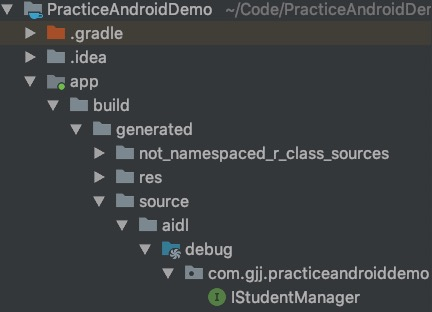

# Binder机制分析（一）——>AIDL的使用


### 1. AIDL简介

AIDL（Android 接口定义语言）是Android提供的一种进程间通信的（IPC）机制，可以利用它定义客户端和服务进行进程间通信时都认可的编程接口。

在Android上，一个进程无法访问另一个进程的内存，尽管如此，进程需要将其对象分解成操作系统能偶识别的原语，并将对象编组成跨越边界的对象，编写执行这一编组操作的代码是一项繁琐的工作，因此Android会使用AIDL来处理。

开发中，开发者只需要写好aidl接口文件，编译时系统会帮我们生成对应的Binder接口。

### 2. AIDL支持的语言类型

总共有四种：

- Java的基本数据类型
- List和Map
  - 元素必须是AIDL支持的数据类型
  - Server端具体的类里则必须是ArrayList或者HashMap
- 其他AIDL生成的接口
- 实现Parcelable的实体

### 3. AIDL的使用步骤

**第一步：创建需要操作的实体类**

```
package com.gjj.practiceandroiddemo;

import android.os.Parcel;
import android.os.Parcelable;

public class Student implements Parcelable {

    private  int s_id;
    private String s_name;
    private  String s_gender;

    public Student(int s_id, String s_name, String s_gender) {
        this.s_id = s_id;
        this.s_name = s_name;
        this.s_gender = s_gender;
    }

    protected Student(Parcel in) {
        s_id = in.readInt();
        s_name = in.readString();
        s_gender = in.readString();
    }

    @Override
    public void writeToParcel(Parcel dest, int flags) {
        dest.writeInt(s_id);
        dest.writeString(s_name);
        dest.writeString(s_gender);
    }

    @Override
    public int describeContents() {
        return 0;
    }

    public static final Creator<Student> CREATOR = new Creator<Student>() {
        @Override
        public Student createFromParcel(Parcel in) {
            return new Student(in);
        }

        @Override
        public Student[] newArray(int size) {
            return new Student[size];
        }
    };

    @Override
    public String toString() {
        return "Student{" +
                "s_id=" + s_id +
                ", s_name='" + s_name + '\'' +
                ", s_gender='" + s_gender + '\'' +
                '}';
    }
}

```


**第二步：新建aidl文件，使用的包名和应用的包名一致**

- 创建实体类对应的aidl文件

  ```
  // Student.aidl
  package com.gjj.practiceandroiddemo;
  
  
  parcelable Student;
  
  ```

  > Student.aidl的包名与Student.java的包名要一致

- 创建IStudentManager.aidl文件

  ```
  // IStudentManager.aidl
  package com.gjj.practiceandroiddemo;
  import com.gjj.practiceandroiddemo.Student;
  
  interface IStudentManager {
  
  
      List<Student> getStudentList();
      void addStudent(in Student student);
  }
  ```

  > IStudentManager.aidl文件中定义了将来要在跨进程进行的操作。
  >
  > 非基本类型的数据导入，必须引入它的全路径
  >
  > 方法参数重，除了基本类型，其他类型的参数都需要标上方向类型，in（输入）、out（输出）、inout（输入输出）

- Make Project或Rebuild Project，会生成Binder的Java文件

  

**第三步：编写服务端代码**

**创建Service，在其中创建上面生成的Binder对象实例，实现接口定义的方法，然后在onBind()中返回**。

- 创建一个和主Activity不在同一个进程的Service，在其中实现了AIDL接口中定义的方法：

```
package com.gjj.practiceandroiddemo;

import android.app.Service;
import android.content.Intent;
import android.os.IBinder;
import android.os.RemoteException;
import android.os.SystemClock;

import java.util.List;
import java.util.concurrent.CopyOnWriteArrayList;
import java.util.concurrent.atomic.AtomicBoolean;

public class StudentManagerService extends Service {

    private static final String TAG = "StudentManagerService";
    //判断当前Service是否销毁
    private AtomicBoolean mIsServiceDestoryed = new AtomicBoolean();
    //用于进程安全的传输列表类
    private CopyOnWriteArrayList<Student> mStudentList = new CopyOnWriteArrayList<>();
    @Override
    public void onCreate() {
        super.onCreate();
        //在服务端先添加两个学生
        mStudentList.add(new Student(1,"胡歌","男"));
        mStudentList.add(new Student(2,"闫妮","女"));
    }

    @Override
    public void onDestroy() {
        mIsServiceDestoryed.set(true);
        super.onDestroy();

    }

    @Override
    public IBinder onBind(Intent intent) {
        return new MyStudentManager();
    }

    class MyStudentManager extends IStudentManager.Stub{

        @Override
        public List<Student> getStudentList() throws RemoteException {
            SystemClock.sleep(2000);//休眠2m模拟服务端的耗时操作

            return mStudentList;
        }

        @Override
        public void addStudent(Student student) throws RemoteException {
            mStudentList.add(student);
        }
    }
}
```

> 上面代码主要是初始化了数据和创建对象IStudentManager.Stub

- 在清单文件中声明

  ```
  <service
              android:process=":remote"
              android:name=".StudentManagerService"/>
  ```

**第四步：编写客户端代码**

```
package com.gjj.practiceandroiddemo;

import android.content.ComponentName;
import android.content.Intent;
import android.content.ServiceConnection;
import android.os.IBinder;
import android.os.RemoteException;
import android.support.v7.app.AppCompatActivity;
import android.os.Bundle;
import android.util.Log;
import android.view.View;
import android.view.ViewStub;
import android.widget.LinearLayout;
import android.widget.TextView;
import android.widget.Toast;

import java.util.List;

public class MainActivity extends AppCompatActivity {


    public static final String TAG = "MainActivity";
    private IStudentManager mRemoteStudentManager;
    private int studentCount = 2;
    private ServiceConnection mConnection = new ServiceConnection() {
        @Override
        public void onServiceConnected(ComponentName name, IBinder service) {
            //获取到IStudentManager对象
            IStudentManager iStudentManager = IStudentManager.Stub.asInterface(service);
            mRemoteStudentManager = iStudentManager;
        }

        @Override
        public void onServiceDisconnected(ComponentName name) {

            mRemoteStudentManager = null;
            Log.e(TAG, "onServiceDisconnected.threadname" + Thread.currentThread().getName());
        }
    };

    @Override
    protected void onCreate(Bundle savedInstanceState) {
        super.onCreate(savedInstanceState);
        setContentView(R.layout.activity_main);
        Intent intent = new Intent(this, StudentManagerService.class);
        bindService(intent, mConnection, BIND_AUTO_CREATE);
    }

    //获取学生列表
    public void get_student_list(View view) {
        Toast.makeText(this, "正在获取学生列表", Toast.LENGTH_SHORT).show();
        new Thread(new Runnable() {
            @Override
            public void run() {
                if (mRemoteStudentManager != null) {
                    try {
                        List<Student> studentList = mRemoteStudentManager.getStudentList();

                        studentCount = studentList.size();
                        Log.e(TAG, "获取到到学生列表：" + studentList.toString());
                    } catch (RemoteException e) {
                        e.printStackTrace();
                    }
                }
            }
        }).start();
    }

    //添加学生
    public void addStudent(View view) {
        if (mRemoteStudentManager != null) {
            try {
                int studentId = studentCount + 1;
                Student newStudent = new Student(studentId, "老胡", "男");
                mRemoteStudentManager.addStudent(newStudent);
                Log.e(TAG, "添加一位学生：" + newStudent.toString());

            } catch (RemoteException e) {
                e.printStackTrace();
            }
        }
    }
}
```

