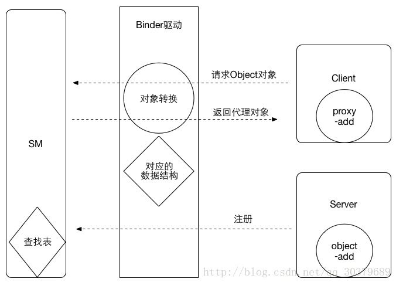

# Binder机制分析（二）——>Binder概述

### 1.Binder概述

#### 1.1 Android为什么选择Binder

Android是基于Linux内核的，所以Android要实现进程间的通行，其实大可使用linux原有的一些手段，比如**管道**、**共享内存**、**socket**等方式，但是Android还是采用了Binder作为主要机制，说明Binder具有无可比拟的优势。

其实进程通信大概就两个方面因素：

- 一者性能方面，传输效率问题，传统的管道队列模式采用内存缓冲区的方式，数据先从发送方缓存区拷贝到内核开辟到缓存区中，然后再从内核缓存区拷贝到接收方缓存区，至少两次考吧过程，而socket都知道传输效率低，开销大，用于跨网络进程交互比较多，共享内存虽无需拷贝，但控制复杂，难以使用。
- 二者是安全问题，Android作为一个开放式，拥有众多开发者的平台，应用程序的来源广泛，确保终端安全是非常重要的，传统的IPC通信方式没有任何措施，基本依靠上层协议，其一无法确认对方可靠的身份，Android为每个安装好的应用程序分配了自己的UID，故进程的UID是鉴别进程身份的重要标志，传统的IPC要发送类似的UID也只能放在数据包里，但也容易被拦截，恶意进攻，socket则需要暴露自己的ip和端口，知道这些的恶意程序则可以进行任意接入。

综上所示，Android需要一种高效率，安全性高的进程通信方式，也就是Binder，Binder只需要一次拷贝，性能仅次于共享内存，而且采用的传统的C/S结构，稳定性也是没得说，发送添加UID/PID，安全性高。

### 1.2 Binder机制

##### 1.2.1 进程隔离

我们知道进程之间是无法直接进行交互的，每个进程独享自己的数据，而且操作系统为了保证自身的安全稳定性，将系统内核控件和用户控件分离开来，保证用户程序进程崩溃时不影响到整个操作系统，简而言之就是，内核空间时系统内核运行到空间，用户控件时用户程序运行到空间，为了保证安全性，他们之间是隔离的，所以用户控件的进程要进行交互需要通过内核控件来驱动整个过程。

##### 1.2.2 C/S结构

Binder是基于C/S机制的，要实现这样的机制，server必须有特定的节点来接受到client的请求，也就是入口地址，像输入一个网址，通过DNS解析出对应的ip，然后进行访问，这个就是server提供出来的节点地址，而对Binder而言，与传统的C/S不太一样，Binder本身作为Server中提供的节点，client拿到Binder实体对象对应的地址去访问Server，对于client而言，怎么拿到这个地址并建立整个通道是整个交互的关键所在，而且Binder作为一个Server中的实体，对象提供一系列的方法来实现服务端与客户端的请求，只要client拿到这个引用就可以活着一个有着该方法代理对象的引用，就可以进行通信了。

>  面向对象思想的引入将进程间通信转换为通过对某个Binder对象的引用调用该对象的方法，而其独特之处在于Binder对象是一个可以跨进程引用的对象，它的实体位于一个进程中，而它的引用却遍布于系统的各个进程中，最诱人的是，这个引用和java里引用一样既可以是强类型，也可以是弱类型，而且可以从一个进程传给其他进程，让大家都能访问同一Server，就像将一个对象或引用赋值给另一个引用一样，Binder模糊了进程边界，淡化了进程间通信过程，整个系统仿佛运行于同一个面向对象的程序之中，形形色色的BInder对象以及星罗棋布的引用仿佛粘接各个应用程序的胶水，这也是Binder在英文里原意。

##### 1.2.3 Binder通信模型

Binder基于C/S的结构下，定义了4个角色：Server、Client、ServerManager、Binder驱动，其中前三者是在用户空间的，也就是彼此无法直接交互，Binder驱动是属于内核空间的，属于整个通信的核心，虽然叫驱动，但是实际上和硬件没有太大关系，只是实现的方式和驱动差不多，驱动负责进程之间Binder通信的建立，Binder在进程之间的传递，Binder引用计数管理，数据包在进程之间的传递和交互等一系列底层支持。

**ServerManager的作用？**

我们知道ServerManager也是属于用户空间的一个进程，主要作用就是作为Server和client的桥梁，client可以从ServerManager拿到Server中Binder实体的引用，这么说可能有点模糊，举个简单的例子，我们访问www.baidu.com，百度首页页面就显示出来了，首先我们知道，这个页面可定是发布在百度某个服务器上的，DNS通过你这个地址，解析出对应的ip地址，再去访问对应的页面，然后再把数据返回给客户端，完成交互，这个和Binder的C/S，这里的DNS就是对应的ServerManager，首先Server中的Binder实体对象，将自己的引用（也就是ip地址）注册到ServerManager中，client通过特定的key（也就是百度这个网址）和这个引用进行绑定，ServerManager内部自己维护一个类似MAP的表来一一对应，通过这个key就可以向ServerManager拿到Server中Binder的引用，对应到Android开发中，我们知道很多系统服务都是通过Binder去和AMS进行交互的，比如获取音量服务：

```
AudioManager am = (AudioManager)context.getSystemService(Context.AUDIO_SERVICE);
```

细心的朋友应该发现ServerManager和Server也是两个不同的进程呀，Server要向ServerManager去注册不是也要涉及到进程间的通信吗。当前实现进程通信又要用到进程间通信，你这不是扯犊子吗……莫急莫急，Binder的巧妙之处在于，当ServerManager作为Server端端时候，它提供的Binder比较特殊，它没有名字也不需要注册，当一个进程使用BINDER_SET_CONTEXT_MGR命令将自己注册成SMgr时Binder驱动会自动为它创建Binder实体，这个Binder实体，这个Binder的引用在所有client中都固定为0而无需通过其他手段获得，也就是说，一个Server若要向ServerManager注册自己Binder就必须通过0这个引用号和ServerManager的BInder通信，有朋友又问了，server和client属于两个不同的进程，client怎么拿到server中对象，不妨先看看下面的交互图



从上图很清晰的可以看出来整个的交互过程，原本从SM中拿到binder的引用，通过Binder驱动层的处理之后，返回给client一个代理对象，实际上如果client和server处于同一个进程，返回的就是当前binder对象，如果client和server不处于同一个进程，返回给client的就是一个代理对象。

##### 1.2.4 Binder角色的定位

Binder本质上只是提供了一种通信的方式，和我们具体要实现的内容没有关系，为了实现这个服务，我们需要定义一些接口，让client能够远程调用服务，因为是跨进程，这时候就要设计到代理模式，以接口函数为基准，client和server去实现接口函数，Server是服务真正的实现，client作为一个远程的调用。

- 从Server进程来看，Binder是存在的实体对象，client通过transact函数，经过BInder驱动，最终回调到Binder实体的onTransact函数中。
- 从Client进程的角度看，Binder指的是对Binder代理对象，是Binder实体对象的一个远程代理，通过Binder驱动进行交互

### 2. 手写进程通信

- 首先我们要定义一个接口服务，也就是上述的服务器要具备的能力来提供给客户端，定义一个接口继承IInterface，代表了服务器端的能力

  ```
  public interface StudentManager extends IInterface{
      void addPerson(Student mStudent );
      List<Student> getStudentList();
  }
  ```

  

- 接下来我们就要定义一个Server中的Binder实体对象了，首先肯定要继承Binder，其次需要实现上面定义好的服务接口

  ```
  public abstract  class BinderObj extends Binder implements StudentManager{
      public static final String DESCRIPTION = "com.gjj.practiceandroiddemo";
      public static final int TRANSAVTION_getStudent = IBinder.FIRST_CALL_TRANSACTION;
      public static final int TRANSAVTION_addStudent = IBinder.FIRST_CALL_TRANSACTION+1;
  
      public static StudentManager asInterface (IBinder mIBinder){
          IInterface iInterface = mIBinder.queryLocalInterface(DESCRIPTION);
          if (null != iInterface && iInterface instanceof StudentManager){
              return ((StudentManager) iInterface);
          }
          return  new Proxy(mIBinder);
      }
  
  
      @Override
      protected boolean onTransact(int code, @androidx.annotation.NonNull Parcel data, @androidx.annotation.Nullable Parcel reply, int flags) throws RemoteException {
          switch (code){
              case INTERFACE_TRANSACTION:
                  reply.writeString(DESCRIPTION);
                  return true;
              case TRANSAVTION_getStudent:
                  data.enforceInterface(DESCRIPTION);
                  List<Student> result = this.getStudentList();
                  reply.writeNoException();
                  reply.writeTypedList(result);
                  return true;
              case TRANSAVTION_addStudent:
                  data.enforceInterface(DESCRIPTION);
                  Student arg0 = null;
                  if (data.readInt()!=0){
                      arg0 = Student.CREATOR.createFromParcel(data);
                  }
                  this.addPerson(arg0);
                  reply.writeNoException();
                  return true;
          }
          return super.onTransact(code, data, reply, flags);
      }
  
      @Override
      public IBinder asBinder() {
          return this;
      }
  }
  ```

  首先我们看asInterface方法，Binder驱动传来的IBinder对象，通过queryLocalInterface方法，查找本地Binder对象，如果返回的是StudentManager，说明client和server处于同一个进程，直接返回，如果不是，返回一个代理对象。当然作为代理对象，也是需要实现服务接口的。

- 下面是Binder实体对象BinderObj中用到的Proxy

  ```
  public class Proxy implements StudentManager {
      private IBinder mIBinder;
  
      public Proxy(IBinder mIBinder) {
          this.mIBinder = mIBinder;
      }
  
      @Override
      public void addPerson(Student mStudent) {
          Parcel data = Parcel.obtain();
          Parcel replay = Parcel.obtain();
          try {
              data.writeInterfaceToken(DESCRIPTION);
              if (mStudent != null) {
                  data.writeInt(1);
                  mStudent.writeToParcel(data, 0);
              } else {
                  data.writeInt(0);
              }
              mIBinder.transact(BinderObj.TRANSAVTION_addStudent, data, replay, 0);
              replay.readException();
          } catch (RemoteException e) {
              e.printStackTrace();
          } finally {
              replay.recycle();
              data.recycle();
          }
      }
  
      @Override
      public List<Student> getStudentList() {
          Parcel data = Parcel.obtain();
          Parcel replay = Parcel.obtain();
          List<Student> result = null;
          try {
              data.writeInterfaceToken(DESCRIPTION);
              mIBinder.transact(BinderObj.TRANSAVTION_getStudent, data, replay, 0);
              replay.readException();
              result = replay.createTypedArrayList(Student.CREATOR);
          } catch (RemoteException e) {
              e.printStackTrace();
          } finally {
              replay.recycle();
              data.recycle();
          }
          return result;
      }
  
      @Override
      public IBinder asBinder() {
          return null;
      }
  }
  ```

  > 这里的代理对象实质就是client最终拿到的代理服务，通过这个就可以和Server进行通信了，首先通过Parcel将数据序列化，然后调用mIBinder.transact（）将方法code和data传输过去，对应的会回调在Server中的onTransact()中。

- 接下来是我们的Server进程，onBind方法返回mStub对象，也就是Server中的Binder实体对象

  ```
  public class ServerService extends Service {
      public static final String TAG = "ServerService";
      private List<Student> studentList = new ArrayList<>();
  
      @Override
      public void onCreate() {
          studentList.add(new Student(1, "胡歌", "男"));
          super.onCreate();
      }
  
      @androidx.annotation.Nullable
      @Override
      public IBinder onBind(Intent intent) {
          return mStub;
      }
  
      private BinderObj mStub = new BinderObj() {
          @Override
          public void addPerson(Student mStudent) {
              if (mStudent == null) {
                  mStudent = new Student();
                  Log.e(TAG, "null obj");
              }
              studentList.add(mStudent);
              Log.e(TAG, studentList.size() + "");
          }
  
          @Override
          public List<Student> getStudentList() {
  
              return studentList;
          }
      };
  }
  ```

  

- 最终我们在客户端进程，bindService传入一个ServiceConnection对象，在与服务端建立连接时，通过我们定义好的BinderObj的asInterface方法返回一个代理对象，再调用方法进行交互

  ```
  public class MainActivity extends AppCompatActivity {
  
  
      public static final String TAG = "MainActivity";
      private StudentManager studentManager;
      private int studentCount = 2;
      private ServiceConnection mConnection = new ServiceConnection() {
          @Override
          public void onServiceConnected(ComponentName name, IBinder service) {
              //获取到StudentManager对象
              StudentManager iStudentManager = StudentManager.BinderObj.asInterface(service);
              studentManager = iStudentManager;
          }
  
          @Override
          public void onServiceDisconnected(ComponentName name) {
              studentManager = null;
              Log.e(TAG, "onServiceDisconnected.threadname" + Thread.currentThread().getName());
          }
      };
  
      @Override
      protected void onCreate(Bundle savedInstanceState) {
          super.onCreate(savedInstanceState);
          setContentView(R.layout.activity_main);
          Intent intent = new Intent(this, StudentManager.ServerService.class);
          bindService(intent, mConnection, BIND_AUTO_CREATE);
  
      }
  
      //获取学生列表
      public void get_student_list(View view) {
          Toast.makeText(this, "正在获取学生列表", Toast.LENGTH_SHORT).show();
          new Thread(new Runnable() {
              @Override
              public void run() {
                  if (studentManager != null) {
                      try {
                          List<Student> studentList = studentManager.getStudentList();
  
                          studentCount = studentList.size();
                          Log.e(TAG, "获取到到学生列表：" + studentList.toString());
                      } catch (RemoteException e) {
                          e.printStackTrace();
                      }
                  }
              }
          }).start();
      }
  
      //添加学生
      public void addStudent(View view) {
          if (studentManager != null) {
              try {
                  int studentId = studentCount + 1;
                  Student newStudent = new Student(studentId, "老胡", "男");
                  studentManager.addStudent(newStudent);
                  Log.e(TAG, "添加一位学生：" + newStudent.toString());
  
              } catch (RemoteException e) {
                  e.printStackTrace();
              }
          }
      }
  }
  ```

  这样的话，一次完整的进程间的交互就完成了。