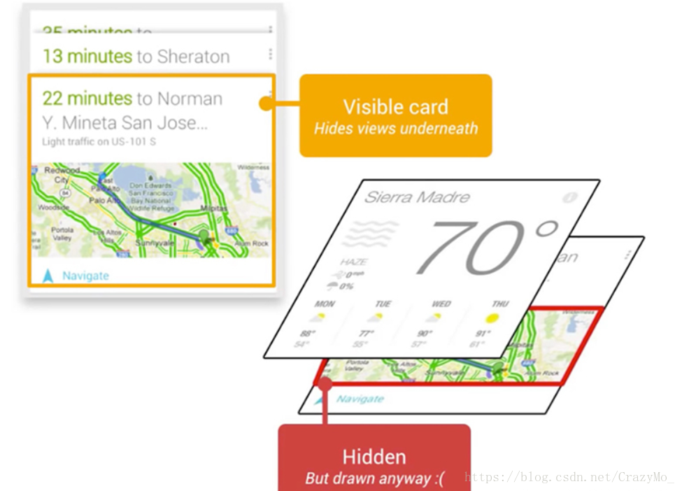
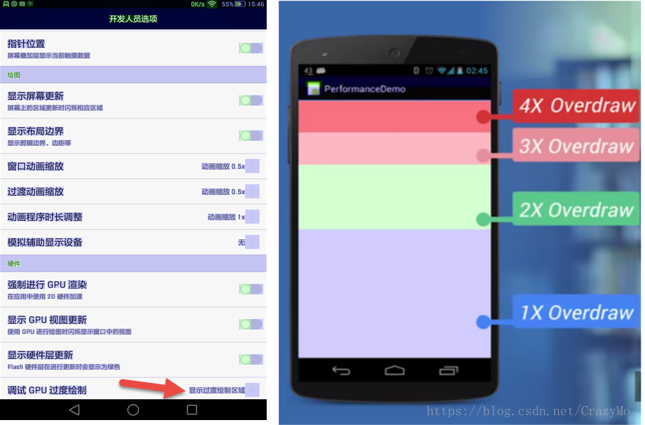
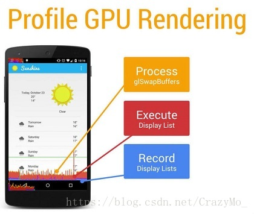
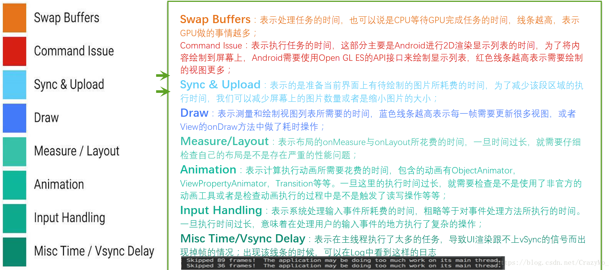
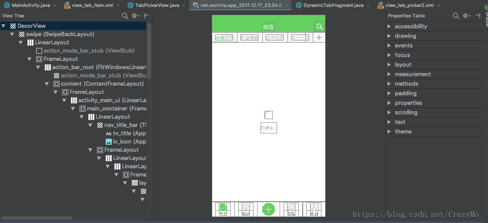
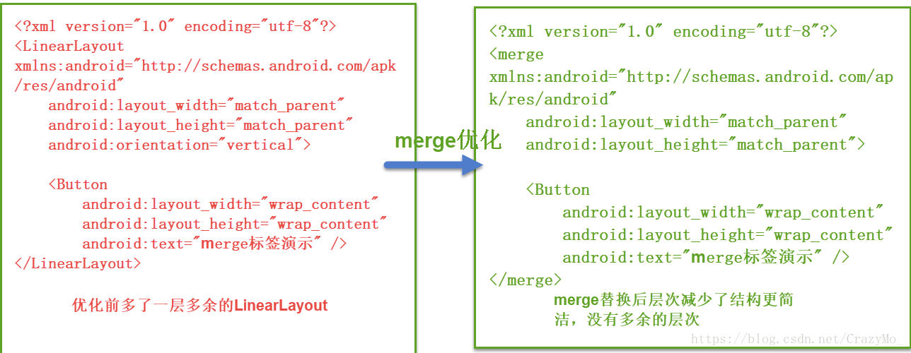

# 布局优化实战

### 1. 布局优化概述

在文章[布局渲染原理和底层机制详解](布局渲染原理和底层机制详解.md)中我们大致低明确了Android UI的渲染过程，可以主要分为系统层的渲染工作和应用层的渲染任务，作为普通APP开发者来说对于其渲染机制我们无法进行优化，那些是ROOM开发或者系统开发者层面做的事，比如说**Android GPU设计的缓冲机制**，Button等其他View元素转换成特定的矢量图形是一个时间消耗过程，再把矢量图形传递给GPU又是一个时间消耗过程，而由CPU传递给GPU同样是一个非常耗时的过程，这就意味着，GPU中进行栅格化所节省下来的时间，可能在这里被消耗大半，于是OpenGL它提供了一个类似缓存的机制：CPU上传到GPU中的资源，可以作为缓冲保存在GPU中，在下次再次利用的过程中，就节省去了CPU的格式转换和CPU上传到GPU的过程消耗。Android系统就灵活利用到了这一点，它在系统启动过程中，就将主题中的系统资源以一个单一向量图形的形式上传至GPU，以后在调用系统资源时，就可以直接在GPU中取到相应资源，而不需要转换和传递。这就是加载Android系统图片非常快速的原因。然而随着业务的复杂性各种动画、UI，GPU的缓存机制变得几乎形同虚设，因为每一个图片都是不同的，都无法服用，因此GPU的缓存资源只能通过不断被覆盖来达到相应效果，于是Android系统提供了差异化绘制机制，简单来说就是缓存的就资源与将写入的新资源进行对比，只对发生了改变的部分进行重新处理，以缓解CPU的压力，在文章[布局渲染原理和底层机制详解](布局渲染原理和底层机制详解.md)中我们有提到，有**显示列表**对CPU处理好的格式资源以及需要进行的相应的绘制指令，进行接收。这里的显示列表在特殊情况下，可以对其接受的信息进行复用，举例来说：如果一个button改变了其位置，GPU可以将显示列表中的信息可以进行复用，如果一个button改变了其大小或者其形状，表面颜色发生改变（视觉上的形体，色彩改变），GPU就无法使用之前CPU传递来的显示列表，需要通过CPU进行重新格式转换，然后将命令和转换好的资源存入一个新的显示列表当中。

为了不给APP用户造成感官上的卡顿，就必须要确保在每16ms内完成两件事：**将UI对象转换为一系列多边形和纹理**和**CPU传递处理数据到GPU**。所以显然我们要尽可能地缩短这两部分的时间，即说需要尽量**减少CPU执行xml转换成对象的时间**和**GPU减少重复绘制的时间**。


### 2. 过度绘制

#### 2.1 过度绘制概述

**理论上一个像素每次只绘制一次是最优的，但是优越重叠的布局导致一些像素会被多次绘制**，换句话说在多层次的UI结构里面，如果**不可见的UI也在做绘制**的操作或者在**自定义View的onDraw方法做了过多的重绘**，就会导致屏幕山的某个像素在同一帧的时间内被绘制了多次，浪费了比不要的CPU以及GPU资源，这种现象就是**过度绘制**，其实GPU的的绘制过程有点和刷墙类似，逐层进行且每隔16ms刷一次，所以有可能因为图层覆盖的关系导致无用的图层也进行绘制。当是在Android系统中**任何时候当VIew中的绘制内容发生变化时，都会重新执行创建显示列表，渲染显示列表，更新到屏幕上等一系列操作。**而此流程等表现性能取决于View 的复杂程度，View的复杂程度，View的状态变化以及渲染管道的执行性能，所以我们需要尽量减少过度绘制来节省CPU和GPU资源。



#### 2.2 过度绘制的检测

Android手机本身就自带过度绘制的检测工具，只需要打开**设置——>开发者选项——>调试GPU过度绘制——>显示过度绘制区域**，分别使用了四种颜色层次来代表过度绘制的程度，如下图所示



- 原色——没有过度绘制
- 蓝色——过度绘制一次
- 绿色——过度绘制二次
- 粉色——过度绘制三次
- 红色——过度绘制四次及以上

所以开发中的目标是尽量减少粉色和红色的区域，尽可能地实现更多的蓝绿色或原色区域，**但页面的3x过度绘制小于25%，Activity界面启动时间一般低于300ms**，为了也可以通过adb命令开启和关闭过度绘制工具（每次开启之后需要重新进入检测的APP）

```
//开启过度绘制检测
adb shell setprop debug.hwui.overdraw show
//关闭过度绘制检测
adb shell setprop debug.hwui.overdraw false
```

### 3. 布局优化工具的使用

#### 3.1 GPU渲染性能的工具

和过度绘制检测工具一样，Android手机本身也自带了检测GPU渲染的工具，只需要打开**设置——>开发者选项——>GPU呈现模式分析——>在屏幕上显示为条形图**，通过打开这个工具，然后再使用我们的APP，会根据GPU具体的绘制过程而呈现出不同颜色的条形图，从而大致定位问题所在。



而在Android M之后，GPU Profiling工具把渲染操作拆解成如下8个详细的步骤进行显示。



#### 3.2 Layout Inspactor

Layout Inspactor是Google新出的层级检测工具，他可以帮助我们在程序运行的时候分析布局文件（UI绘制时间与嵌套层级），从而找到性能瓶颈（需要在API>=16机子上运行），Layout Inspector只能分析出Android Studio当前正在运行的APP的视图布局结构，其他应用的视图布局结构无法显示的。使用步骤是首先运行我们的APP然后在Tools——>Android——>Layout Inspactor就可以打开了，陈工打开后看到如下界面。



> 右侧是选中View的属性，左侧则是布局层级显示

### 4. 布局优化的一般原则

众所周知我们的Android UI本质上就是一棵ViewTree结构，如果ViewGroup里面有很深的子控件层级或者有不必要的子控件，在实现业务的前提下布局结构肯定越简单越好，因为需要测量与绘制的控件越少，耗时越低，性能越好。而层级越少意味着在绘制控件的时候需要参考的父/子控件越少，而APP在开发中遇到渲染问题无非可以分为两大类：**过度绘制**和**布局冗杂**。所以布局优化普遍遵循的原则如下：

- 布局嵌套层次越少越好
- 布局中控件数越少越好
- 过度绘制的情况越低越好

### 5 .布局优化的措施

#### 5.1 减少不必要的背景绘制，降低过度绘制

包括默认主题提供的背景颜色、Activity的默认背景、View和ViewGroup的背景，如果没有必要就不要设置，其中还需要注意Activity使用的Theme可能会默认的加上背景色，不需要的情况下可以去掉。

```
//去掉Activity使用的Theme可能会默认的加上背景色
<style name="AppTheme" parent="android:Theme.Light.NoTitleBar">
    <item name="android:windowBackground">@null</item>
</style>
```

#### 5.2 减少嵌套层次及控件个数

Android的布局文件的加载时LayoutInflater利用pull方式来解析，然后根据节点名通过反射的方式创建出View对象实例，同时嵌套子View的位置受父View的影响，例如RelativeLayout、LinearLayout等经常需要measure两次才能完成，二嵌套、互相嵌套、深层嵌套等的发生会使measure次数呈指数级增长，所费时间呈线性增长，所以随着控件数量越多，布局嵌套层次越深，展开布局话费的时间几乎是线性增长，性能也就越差。

- 使用merge标签减少布局嵌套层次

merge多用于替换顶层FrameLayout或者include布局时（并非是意味着在我们缩写的XML文件中根节点是FrameLayout的才可以替换），用于消除因为引用布局导致的多余嵌套，但是只能用于根布局（注意include标签实质上对于布局优化层面来说无重大作用，它的核心思想很重要）



- 使用ConstraintLayout替代常见嵌套布局，减少布局层次

#### 5.3 使用Canvas的clipRect和clipPath方法限制View的绘制区域

一个Activity对应有一个画布Canvas，这个画布提供了很多的api，我们可以通过调用画布的API来绘图以及对画布做一些操作，clipRect方法用来裁剪画布上的一个矩形区域，该矩形区域用Rect对象来描述，调用了clipRect之后，画布的可绘制区域减小到和Rect指定的矩形区域一样大小，所有的绘制将限制在该矩形范围之内。

#### 5.4 通过imageDrawable方法进行设置避免ImageVIew的background和imageDrawable重叠

#### 5.5 借助ViewStub按需延迟加载

推迟创建对象、延迟初始化，不仅可以提高性能，也可以节省内存（初始化对象不被创建），Android定义了ViewStub类，ViewStub是轻量级且不可见的视图，它没有大小，没有绘制功能，也不参与measure和layout，资源消耗非常低，具体参见[性能优化——布局优化之借助ViewStub实现懒加载](性能优化——布局优化之借助ViewStub实现懒加载.md)。

#### 5.6 选择合适的布局类型

LinearLayout下没有设置weight属性下，仅仅会进行一次测量，相对于RelativeLayout布局会高效些，而设置了weight属性的时候布局层次更少些，在不影响层级深度的情况下，使用LinearLayout而不是RelativeLayout，可以使用RelativeLayout布局减少层级的就使用RelativeLayout布局，否则使用LinearLayout布局。因为RelativeLayout会让子View调用2次onMeasure,LinearLayout在有weight时，才会让子view调用2次onMeasure，如果非要是嵌套，那么尽量避免RelativeLayout嵌套RelativeLayout，结合自己的业务来取舍。

#### 5.7 熟悉API尽量借助系统现有的属性来实现一些UI效果

- 借助TextView的CompoundDrawable来实现类似ImageView+TextView的效果
- 灵活使用TextView的行间距lineSpacingExtra属性，默认是0，是一个绝对高度值，可用来实现类似分段的效果
- 用LinearLayout自带的分割线
- 使用Space控件定义Item之间间距

```
<?xml version="1.0" encoding="utf-8"?>
<LinearLayout
    xmlns:android="http://schemas.android.com/apk/res/android"
    android:layout_width="match_parent"
    android:layout_height="match_parent"
    android:orientation="vertical"
    android:divider="@drawable/divider"
    android:showDividers="middle|beginning|end">
    <TextView
        android:drawableLeft="@drawable/icon_2"
        android:drawableRight="@drawable/icon_4"
        android:drawablePadding="10dp"
        android:paddingLeft="10dp"
        android:paddingRight="10dp"
        android:textSize="16sp"
        android:text="我的设备"
        android:gravity="center_vertical"
        android:layout_width="match_parent"
        android:layout_height="50dp" />

    <Space
        android:layout_width="match_parent"
        android:layout_height="15dp"/>

    <TextView
        android:drawableLeft="@drawable/icon_3"
        android:drawableRight="@drawable/icon_4"
        android:drawablePadding="10dp"
        android:paddingLeft="10dp"
        android:paddingRight="10dp"
        android:textSize="16sp"
        android:text="我的订单"
        android:gravity="center_vertical"
        android:layout_width="match_parent"
        android:layout_height="50dp" />

</LinearLayout>
```


